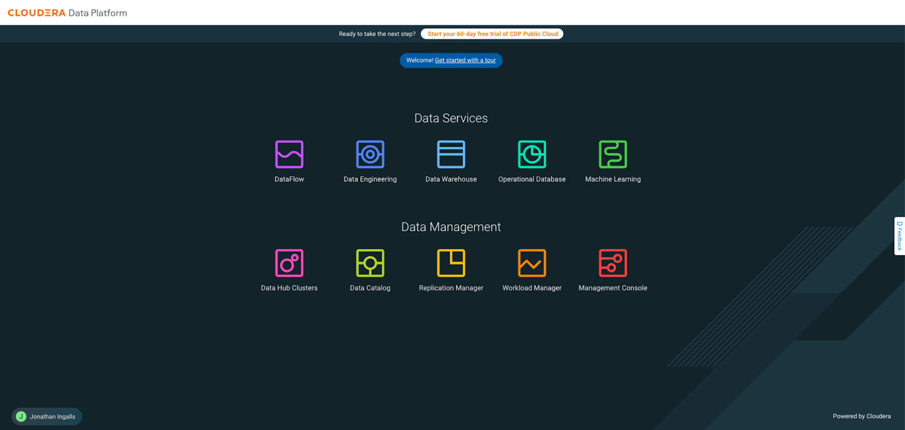
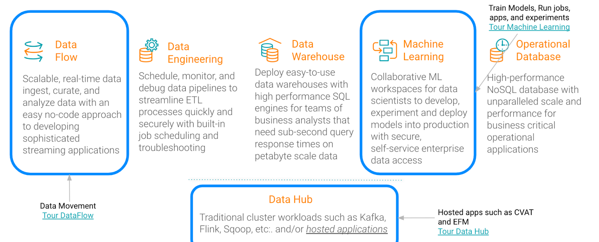

## Lab Setup

Workshop Attendees will be provided with a Login.  Please enter your details below for reference throughout these lab exercises.

- Lab Group #: \_\_\_\_\_\_\_\_\_\_\_\_\_\_\_\_ (this will be your breakout room number)

  - You will use this to replace the “**#**” within the lab exercises with the number you enter here

- URL: \_\_\_\_\_\_\_\_\_\_\_\_\_\_\_\_\_\_\_\_\_\_\_\_\_\_\_\_\_\_\_\_\_\_\_\_\_ 

  - Use Incognito Browser window

- Login: 

  - **User:** \_\_\_\_\_\_\_\_\_\_\_\_\_\_\_\_\_\_\_\_\_\_\_\_\_\_\_\_\_\_\_\_\_\_\_\_\_
  - **Password:** \_\_\_\_\_\_\_\_\_\_\_\_\_\_\_\_\_\_\_\_\_\_\_\_\_\_\_\_\_\_\_\_\_\_\_\_\_

In the labs when you see:

- ${user\_id} or \<user\_id> - this will indicate to use your User (Workload User) provided for you to login to CDP
- ${bucket} - this will indicate to use the bucket provided to you

## Get Started - Log into CDP

In this Lab you will login to CDP and complete your user setup.

1. Log in to CDP - open a browser and open the URL from the Lab Setup section

   - When prompted use the Login details from the Lab Setup section for the User/PW

2. On the HOME page of CDP you will see all of the Services available to you

- Multi-function analytics - Data Services; today we’ll just focus on the Cloudera Data Warehouse Data Service

- There are other Data Services that usually are part of an Analytic use case 

  - Data Flow - for data ingestion needs
  - Data Engineering - for ELT/ETL, transformations, data wrangling, etc.
  - Machine Learning - for Data Science teams to collaboratively build and productionalize ML/AI applications and models for the Enterprise

- However, Cloudera provides other services such as Data Catalog, Replication Manager, Workload Manager, and Management Console provide continuity and functionality throughout the platform.

Note: The platform removes the necessity to spend unnecessarily on integration tax, where other solutions combine various pieces together in the ability to provide continuity and functionality throughout an end-to-end use case but this is difficult because it introduces many moving parts.
