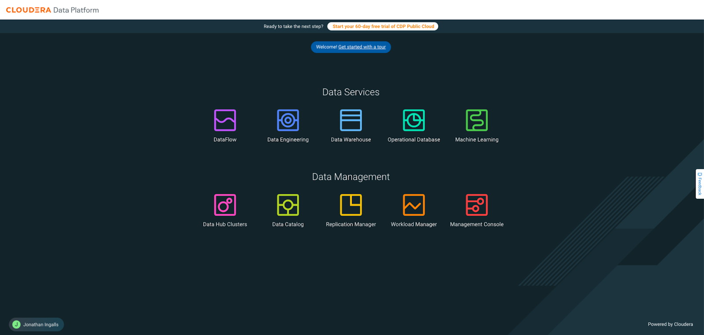
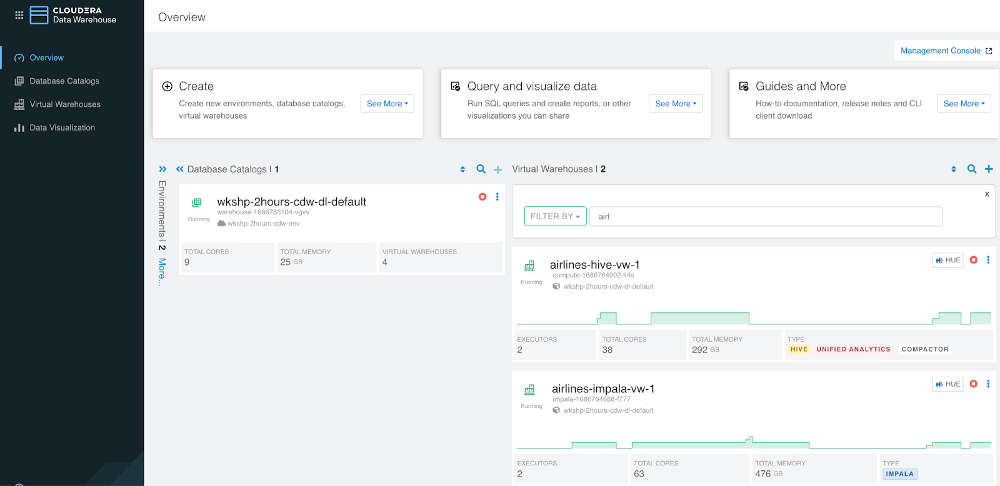
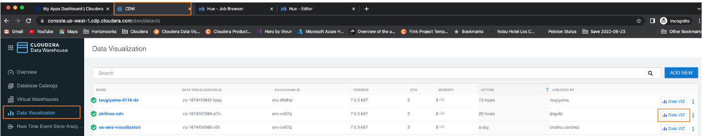
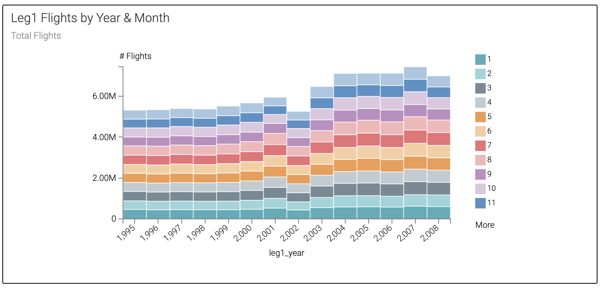
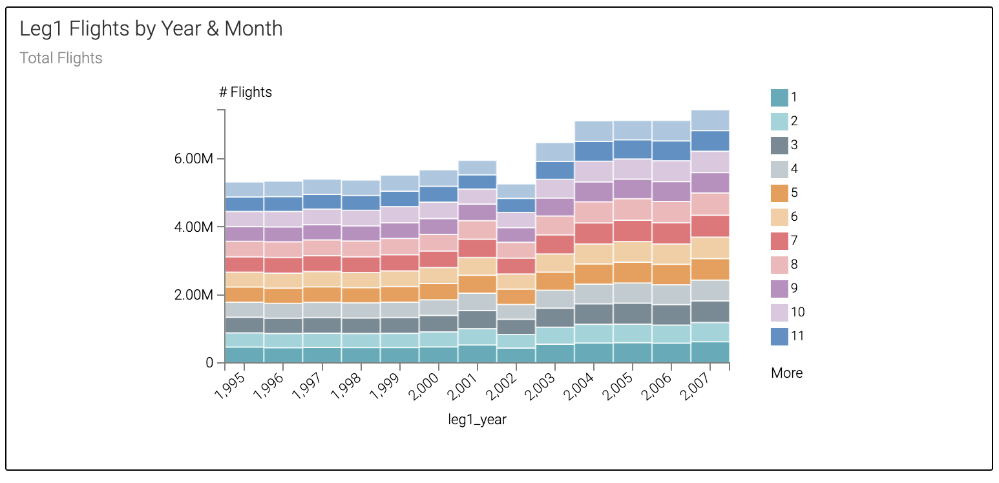

## Lab 1 - Business Analyst: Explore Completed Dashboard

In this Lab you will explore the Dashboard that will be created as the result of the Self-Service Labs you will complete shortly.

### Cloudera Data Warehouse (CDW) Data Service

1. Open Cloudera Data Visualization, which is part of the Cloudera Data Warehouse Data Service

   - First let's open Cloudera Data Warehouse (CDW) -

     - Click on the Cloudera Data Warehouse (CDW) tile

- We'll come back to this screen in Lab 2 for more details

2. Now let's open Cloudera Data Visualization (CDV) - to explore the finished product

  - Open Cloudera Data Visualization (CDV or Data Viz)

    - On the left navigation panel click "Data Visualization" - this will open a new browser tab
    - On the row with **airlines-dataviz-#**, to the right, click the Data VIZ button

- If you see the "What's New" page, you can read it, or click on the GOT IT button

### Cloudera Data Visualization (CDV) Home page

- There are 4 areas of CDV - HOME, SQL, VISUALS, DATA - these are the tabs at the top of the screen in the black bar to the right of the Cloudera Data Visualization banner

  - HOME - this is the starting point; it shows some statistics at the top, followed by some quick access details to recent content - Queries, Connections, Datasets, and Dashboards
  - SQL - allows you to manually build queries against data to perform quick discovery against the data.  Below is an example of a query that was built and Run

- VISUALS - an area for viewing/building/modifying visuals, dashboards, and applications

- DATA - interface for access to datasets (aka: metadata model) image below, connections, and the Connection Explorer

1. Click on the VISUALS tab at the top of the screen (in black banner)

- On the left side of the page make sure you have the All or Public Workspace selected

2. Click on the tile "SMG Duty Free Analysis" to open the Application (in the bottom right of the tile you will see a purple  icon identifying an Application)

  - Click the drop-down arrow next to the "Planned Layover" prompt and change it from "All Passengers" to "30+ Minutes" - since the initial questions SMG was interested in pursuing were related to passengers with "Long" planned layovers - select "90+ Minutes".

  - Next, click the drop-down arrow next to "Connection Airport" - Select a few of the Airports that are interested in this new business program

    - Scroll (or search) and click the checkbox next to - ATL, LGA, and ORD
    - Each time you select another query is being executed against the Open Data Lakehouse database tables - shows the performance of Apache Iceberg

  - From these filters (prompt selections) you gain considerable insights - look at the "Planned Layovers Greater than 90 Minutes by Carrier" visual and the answer to the question seems clear as to "Which Carriers should we partner?".

3. From this you can see what Airlines (Carriers) that we could partner with due to Long Planned Layovers and see that Delta Airlines (DL) & Atlantic Southeast (EV) have combined planned layovers for over 95% of Passengers with Planned Layovers of over 90 minutes

4. What if I wanted to see the flight details from a previous data load?  Click the drop-down arrow below "Time Travel" and select the middle value.  You will see the chart titled "Leg1 Flights by Year & Month".

Before: 

After (no 2008):

- You'll see that after you make the selection, you should see the stacked bar for year 2008 is removed from the visual.  Meaning this data was not yet loaded at the selected point in time.
- You've just performed your first **_Time Travel_** without even knowing.  Time Travel is a key feature of Apache Iceberg.

5. Please go on to the next lab but feel free if you have time to leave this tab open and come back to explore more if you have time after completing the remaining labs.

  - You could do something like the following:

    - At the bottom of the page click on the Passenger List page - now that we've filtered the data to a specific target set of Passengers that can be sent an offer, I'd like to take a look at the list of passengers who would be sent an offer.

      - Filter the list of passengers based on Layover Type - select the drop-down under "Elongated Layover Type" and select "Missed Connection"

      - Click on the checkbox next to "Exclude Selected".  This will exclude those passengers who have missed their connection.

        - For the Duty Free owner, this may not be a good target, so you might want to exclude them from the offer.  However, for partnering with the Airline, this might be something we could use to improve customer satisfaction for these 24 passengers and auto rebook these passengers for instance.

