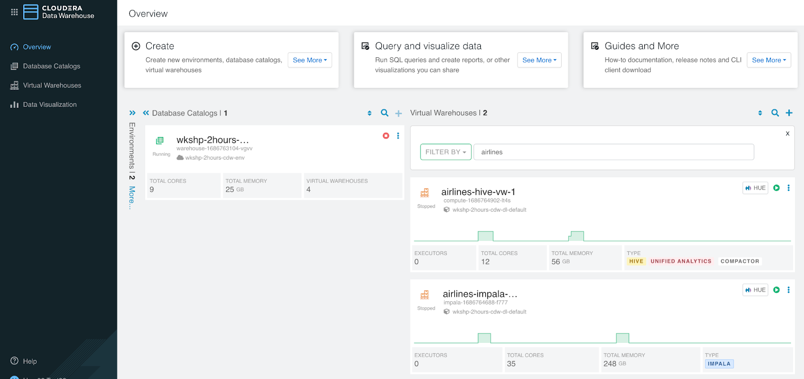
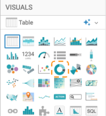

## Lab 2 - Business Analyst: Self Service (in CDW)

In this Lab you will take advantage of the Self Service capabilities within Cloudera Data Warehouse (CDW) to upload a data file and combine it with an existing Data Lakehouse.  You will then perform analytics (SQL & Visualizations) on the combined data to ensure that the burning business questions can first be answered before "productionalizing" the new data source.

### CDW Data Service Overview

1. Navigate back to CDW Overview

   - Click on the browser tab where CDW is open [](images/16.png)
   - Click on Overview in the left navigation
   

2. The following is a quick explanation of the CDW User Experience so that you have a basic knowledge of the data service.  The CDW Data Service allows you to create independent, self-service data warehouses and data marts that autoscale up and down to meet your varying workload demands. It provides isolated compute instances for each data warehouse/mart, has built-in automatic optimization, and ultimately enables you to meet SLAs - at the same time save costs.



- There are 2 areas on this screen - Database Catalogs (DBC), and Virtual Warehouses (VW), for today's lab, we will just concentrate on Virtual Warehouses or VW for short

  - Database Catalogs (DBC) - is a logical collection of table and view metadata, security permissions, and other information.  As you create databases, tables, views, etc. in the Data Warehouse, it collects the metadata.  When you activate an Environment for CDW, the CDW service will automatically create a default DBC associated with this Environment.

    - DBCs are in the middle column
[](images/19.png)

- Virtual Warehouses (VW) - is a set of compute resources running in Kubernetes to execute the queries.  This is something that can allow for Self Service capabilities or can be controlled by Administrators.  A VW binds compute and storage to execute secured queries that access tables and views of your data via the DBC.  A VW can scale automatically to ensure performance even with high concurrency, and can auto-scale down in situations of low demand.  Tools that access data via JDBC/ODBC can connect to VWs to run queries


- See options available for a VW - click on the  button on the top right corner of tile airlines-hive-vw-#


The list of options will vary slightly depending on whether this is a Hive or Impala VW. This is also where you would go to get the JDBC URL and Driver to use to connect your Business Intelligence software to this VW, and when a new version is released you could Upgrade this VW to the latest release without having to upgrade all VWs at the same time.

- **_Click on the airlines-hive-vw-# tile_** - this will highlight the Environment and DBCs that are associated with this VW.  In fact when you click on any tile within any column, it will do the same thing by showing you what it is related to, for easy understanding of the interdependence of these items.

  - These tiles will display information about current workload on a VW.  Below you will see items indicating when a VW is idle and has auto scaled so nothing is running for this VW; and where the VW needed to auto-scale up to handle incoming SQL requests handling concurrency


### Self Service Data Upload

1. **_Click on the airlines-hive-vw-# tile_** - In the upper right corner click on the HUE button to enter into the SQL Editor


2. Explore the Data Lakehouse

   - You will be using HUE for the **_airlines-hive-vw-# Virtual Warehouse_** until you get to Step 13


- Copy & paste the following SQL into the query Editor window

```
-- Run prior to importing Passenger Tickets; to ensure correct access and that everything is good to go
-- Query to find all international flights: flights where destination airport country is not the same as origin airport country
SELECT DISTINCT flightnum, uniquecarrier, origin, dest, month, dayofmonth, `dayofweek`
FROM airlines.flights f
   JOIN airlines.airports oa ON f.origin = oa.iata
   JOIN airlines.airports da ON oa.country <> da.country
WHERE f.dest = da.iata
ORDER BY month ASC, dayofmonth ASC
;
```


- Click on the [](images/27.png) to the bottom left of the SQL window to run this SQL command to test and ensure you have access to the Data Lakehouse

  - You should see the something similar to the following in the Results tab


- This validates that you have the correct permissions via the SDX security to access the Data Lakehouse

3. Upload Passenger Ticket data file - **_already completed_** for you and shown as part of the main presentation

   - If you'd like to give it a try this can be found in the Post Lab section - work with your Breakout Room moderator to set up time.
   - Below are some images that highlight the 3 steps to upload this file: 1) Open the Importer, 2) Pick a file & options for the file upload, 3) Name the table, specify table options, and provide the table metadata (column names, data types, etc.)

   1) 
   2) 
   3) 

- Since the data is already uploaded we will use the table **airlines.unique\_tickets\_1k**

### CDW Answer Burning Business Questions

1. Explore the Data Lakehouse and Passenger Tickets (unique\_tickets) data to see if it can answer the burning questions.  The Data Analyst can use a SQL Editor to perform this task by executing queries against this data.

   - Delete the current query from the SQL Window
   - Copy & paste the following SQL into the SQL Editor window

```
-- Run after Uploading the Passenger Tickets data to see if we can answer the "burning questions" to support Duty Free Stores
-- Number of passengers on the airline that have long, planned layovers for a flight (good target to send promotion to)

SELECT
   a.leg1uniquecarrier as carrier,
   count(a.leg1uniquecarrier) as passengers
FROM
   airlines.unique_tickets_1k a
WHERE
   a.leg2deptime - a.leg1arrtime > 90
GROUP BY
   a.leg1uniquecarrier
;
```

- Execute the Query by clicking on the [](images/27.png) button

  - Review the output to see the number of passenger with a long planned layover (> 90 minutes) by Airline Carrier - one of the questions we wanted to answer


- Delete the current query from the SQL Window
- Copy & paste the following SQL into the SQL Editor window

```
-- Number of passengers on airlines that have elongated layovers for a flight caused by delayed connection (potential customer satisfaction issue)

SELECT
   a.leg1uniquecarrier as carrier,
   count(a.leg1uniquecarrier) as passengers
FROM
   airlines.unique_tickets_1k a
   JOIN airlines.flights o
      ON a.leg1flightnum = o.flightnum
         AND a.leg1uniquecarrier = o.uniquecarrier
         AND a.leg1origin = o.origin
         AND a.leg1dest = o.dest
         AND a.leg1month = o.month
         AND a.leg1dayofmonth = o.dayofmonth
         AND a.leg1dayofweek = o.`dayofweek`
   JOIN airlines.flights d
      ON a.leg2flightnum = d.flightnum
         AND a.leg2uniquecarrier = d.uniquecarrier
         AND a.leg2origin = d.origin
         AND a.leg2dest = d.dest
         AND a.leg2month = d.month
         AND a.leg2dayofmonth = d.dayofmonth
         AND a.leg2dayofweek = d.`dayofweek`
WHERE o.depdelay > 60
GROUP BY
   a.leg1uniquecarrier
;
```

- Execute the Query by clicking on the [](images/27.png) button

  - Review the output to see that we can answer another burning question


- Note: this query combines both Hive table format (unique\_tickets\_1k) with Iceberg table format (flights).  This will allow you to migrate to Iceberg over time.

- Now that we've validated that we can answer the business questions, it's time to visualize the data to see the insights we can gain from combining this data

### Cloudera Data Visualization (CDV)

Visualize the Data Lakehouse and Passenger Ticket data to gain insights and communicate what we are trying to accomplish with the Admin team.

1. Click on the browser tab where CDV is open [](images/36.png)

2. To create visualization in Cloudera Data Visualization (CDV), the Business Analyst would have to do the following:

     - Create a Dataset (aka: Metadata Layer or Data Model) that will join the uploaded Passenger Tickets (unique\_tickets\_1k) table with the existing Data Lakehouse tables
     - Create Visualizations create visuals that present information so that users can gain insights to make better decisions.  A single Dashboard can have any number of visuals on it.
     - Make the Visualization available to the appropriate stakeholders - by default Dashboards will first be created and edited in the user's "Private" Workspace.  Once the Dashboard is ready, it is move to a Workspace that the appropriate users can view and interact with the Dashboard(s)

3. Create a Dataset (Metadata Layer)

     - The first step is to create a Metadata layer that joins the Data Lakehouse tables and Passenger Tickets table (unique\_tickets\_1k).  To do this we'll create what we call a Dataset.
     - On the top banner click on the DATA tab


4. Make sure the "Airlines Open Data Lakehouse" connection on the left navigation menu is selected


5. For today's labs we'll fast forward to a Dataset that has already been created to save time.

  - **_If you'd like to go through this process, please work with your Breakout Room Moderator to schedule time to walk through the Lab in the Optional Lab section_**

6. Click on `Lab 2 Self Service Open Data Lakehouse` to open the Dataset that was already created 


7. Dataset Detail page - provides information about this Metadata Model, such as the connection, tables referenced, option settings, and date information (created/updated).  Where you see the pencil icon, indicates that you can make changes.


8. Clone Dataset - click the CLONE DATASET button at the top of the page


9. Click the [](images/42.png) to the right of Dataset to Rename this Dataset


10. Replace the "Clone of" with "**\<user-id>**" (use your user id in place of \<user-id>)


11. Click the SAVE button

12. You now have created your own copy of the Dataset that can now be modified for today's lab

### CDV Edit Dataset - Data Model

1. Data Model - click on Data Model in the left navigation menu to what tables are in this Dataset


- Shows the tables, and relationships between tables in this Dataset


- Tables are dark gray and relationships (joins) are identified by the blue 


2. In this Data Model you can see that the unique\_tickets table has already been joined to several other tables that are part of the Data Lakehouse (airports, airlines, flights, etc), but there is one more relationship that needs to be defined for this to be complete - we need to get the Leg2 Airline Carrier details

3. Click the `EDIT DATA MODEL` button at the top of this page


- Click the "+" in the gray oval to the right of unique\_tickets - to add a table join
- Click the drop down below Database Name and select `airlines`
- Click the drop down below Table Name and select the `airlines` table


- Click on the SELECT button to add this table

- You will be presented with the Edit Join definition window (if not click the  button between unique\_tickets & airlines\_1)


- Click the drop down below airlines.unique\_tickets and select leg2uniquecarrier
- Click the drop down below airlines\_1 and select code


- Click the APPLY button

- This will create a join between the unique\_tickets table and the airlines table in your user database.


- To view or edit the join that was created click on  between unique\_tickets and airlines (at the bottom) Source/Target column


This will show the join type and allow you to make changes.  You can see by default it created a Left outer join which you can change by selecting any of the other types such as Inner, Outer, or Right.  This Join is exactly what we need, so no need to make any changes


- Click on the SHOW DATA button to see a preview of the data - this will run a query to combine the data from our Data Lakehouse with the data we uploaded to make sure that the data looks good.  Scroll to the right to look at all of the data from each table, and scroll down to see more data


- At the top of the page click the SAVE button


### CDV Edit Dataset - Edit fields

1. Fields - on the left navigation menu select Fields


2. Click the EDIT FIELDS button at the top of the page


3. Under Dimensions - scroll down to the airlines\_1 header


This is what was added from adding the airlines.airlines table to this Dataset.  From here we can apply business rules and context to this Dataset.

4. Rename a Field - Description to Leg2 Airline Carrier

  - Click on the [](images/61.png) button to the right of Description


   - In the Display Name text box change this to Leg2 Airline Carrier


   - Click the APPLY button

4. Hide a Field

  - The airlines\_1 code is the same values as the leg2uniquecarrier field, so no need to have this twice
  - Click the [](images/64.png) and select `Hide`


- Select Hide
- The airlines\_1 section should look like this


- Click the SAVE button at the top of the page

  - There is so much more you can do with a Dataset, including adding calculated fields, assigning default aggregations, apply formatting, and strong data types to help with building visualizations quickly.

### CDV Build a Dashboard

1. Create a Dashboard - click the NEW DASHBOARD button in the top right corner


- This will automatically build a default visual for you like this


- Let's change this to answer one of the burning questions - which airline carrier should we partner with

  - Toward the right of the screen under VISUALS and select the Pie Chart visual (3rd row in the middle)


- Under VISUALS click on the box under Dimensions - this is called a Shelf.  To add items to a Shelf you can drag and drop or in this case select it from the far right of the screen from the Dataset we just created

  - On the far right of the screen under DATA click on Leg1 Unique Carrier


- This will add this to the Dimension Shelf


- On the far right of the screen, drag & drop Record Count from under DATA > Measures > unique\_tickets to the box below Measures


- It should look like the following screen.  This will combine data from the unique\_tickets table (file upload) and the existing Data Lakehouse to display the number of passengers by each Airline


- Click the REFRESH VISUAL button

- On the left of the screen the visual is updated to this


- Add a title to the chart by clicking on "enter title..." above the chart.  Change it to `Airlines to Partner` and press enter


- Add a title (name) for the Dashboard - at the top of the visualization click on "enter title..."


- Type in `<user-id> Self Service Dashboard` (replace \<user-id> with your user id) and press enter


- Press the SAVE button at the top of the Dashboard - you have now created a Dashboard combining the uploaded data and the existing Data Lakehouse
- Click on the VISUALS tab at the top of the page


- On the right of the screen make sure you have Private selected to see the Dashboard you just created


### [OPTIONAL]

- Add another Visual to the Dashboard you just created using Natural Language Search

  - Instead of having to create a visual manually let's take a look at another way to add visuals.  Using Natural Language Search to create visuals and then add them to Dashboards eliminates the step to manually configure a visual and allows users to do this in a much more simplified way
  - Click on the SEARCH button in the top right corner of the banner


- For this I'd like to see which Airports have the highest number of flights this year and I'm interested in the visual being displayed on a Map of some sorts.  For this let's

  - In the Search box start entering - Flights by `Origin Lat` and `Origin Lon`


- You'll see below will show some helpful details to help with finishing your search.  Under Flights select the entry - Flights by `Origin Lat` and `Origin Lon` as Interactive Map this year


This visualization shows what was asked for.  From here you can continue to change what is displayed, Bookmark it to share or return to, or just continue on.

- This is displaying what I was interested in and this would be a good addition to the Dashboard.
- In the top right corner of the visual - click on thebutton and select Add to Dashboard 


- Click on `<user-id> Lab 2 Self Service Open Data Lakehouse` to expand this section (for \<user-id> look for your user id)


- Click on the Dashboard you previously created


- You should get a message indicating that this visualization was added to your dashboard

- Click on the CLOSE button in the bottom right corner of the Search window

- Now let's view the updated Dashboard

  - Click on the `<user-id> Self Service Dashboard` tile


- You should now see the following - we just now asked a question and created a Dashboard from it


