## Lab 3 - Administrator: "Productionalize" the Open Data Lakehouse

In this Lab you will be an Administrator and will use CDW to create and build an Open Data Lakehouse and take advantage of some of the key features with this approach.

### Create Airlines Database
Create a Database that will be used for creating our Data Lakeouse.  In this section of the lab you will create a table to simulate an existing Data Warehouse and later we will explore how to convert this table to an Iceberg table.  Execute the following SQL/DDL/DML statements.

1. Stay in HUE for the CDW **Hive** Virtual Warehouse - **airlines-hive-vw-#**

   - There should be an open CDW Browser tab, open the [](images/16.png) browser tab

2. Create a user Database to store all of the tables you will create in the following lab steps

   - In the SQL Editor window create a database for the remaining lab exercises, execute the following.

      - Delete the current query from the SQL Window
      - Copy & paste the SQL below

```
CREATE DATABASE ${user_id}_airlines;
```

   - The "${...}" notation is a hint to HUE to create a parameter.  As you copy/paste in this you will see that HUE determined that there is a parameter that needs to be entered.

   - In the "user\_id" parameter box, enter your user id (see Lab Setup section)


   - Execute the Query by clicking on the [](images/27.png) button

3. Check to see if the Database was created

   - Delete the current query from the SQL Window
   - Copy & paste the SQL below

```
SHOW DATABASES;
```

   - Execute the Query by clicking on the [](images/27.png) button to see that the database was created

**Results:**

| DATABASE_NAME |
| ------------- |
| ... |
| user001_airlines |
| ... |
| <user_id>_airlines |
| ... |
| user100_airlines |


   * There may be many databases, scroll & look for the one that starts with your \<user\_id>

4. Let's simulate existing tables in our Data Lakehouse

   - Create planes table in _Hive Table Format_, stored in Parquet file format
      - Delete the current query from the SQL Window
      - Copy & paste the SQL below

```
-- CREATE HIVE TABLE FORMAT STORED AS PARQUET
drop table if exists ${user_id}_airlines.planes;

CREATE EXTERNAL TABLE ${user_id}_airlines.planes (
   tailnum STRING, owner_type STRING, manufacturer STRING, issue_date STRING,
   model STRING, status STRING, aircraft_type STRING, engine_type STRING, year INT
    )
STORED AS PARQUET
TBLPROPERTIES ('external.table.purge'='true');

INSERT INTO ${user_id}_airlines.planes

SELECT * FROM airlines_csv.planes_csv;
```

   - Select all of the content in the SQL Editor
   - Execute the Query by clicking on the [](images/27.png) button

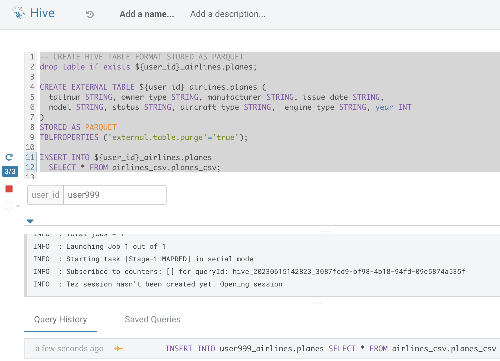

5. View tables that have been created in your user Database

   - Switch Database to your user Database - on the left side of the SQL Editor, click on the < arrow next to default

[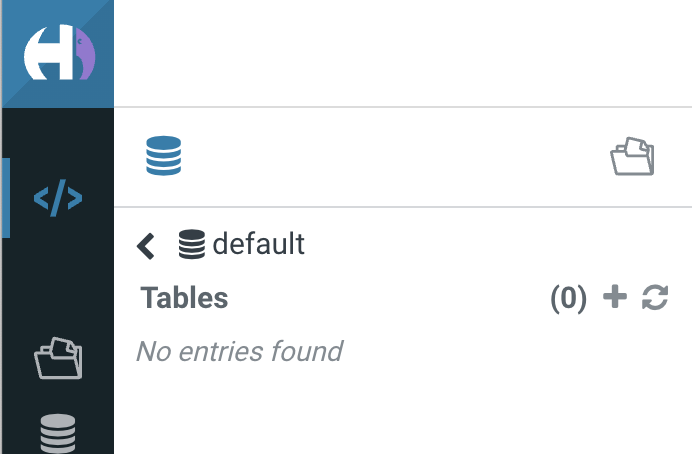](images/95.png)

[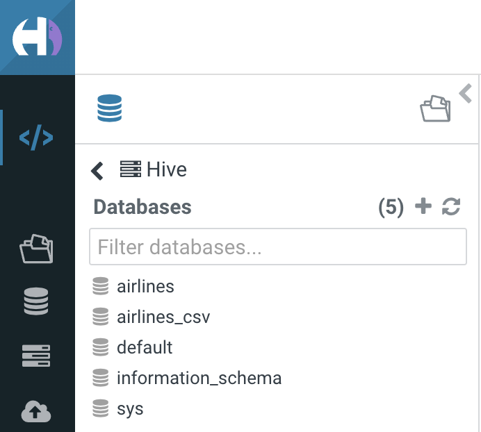](images/96.png)

   - To the right of Databases click on the [](images/97.png) button to refresh the list of Databases
[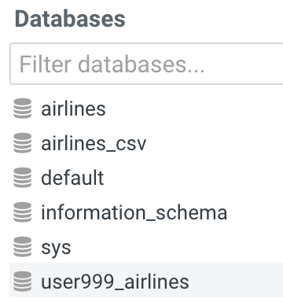](images/98.png)

   - Click on your \<user-id>\_airlines Database - this will allow you to track what has been created in your database through the next steps
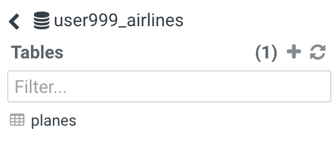

6. See Planes table properties to see that it is in Hive Table format
   - Delete the current query from the SQL Window
   - Copy & paste the SQL below

```
DESCRIBE FORMATTED ${user_id}_airlines.planes;
```

- Execute the Query by clicking on the [](images/27.png) button

  - In the output look for the following fields - scroll down to look for the following properties: Location, Table Type, and SerDe Library (this value should reflect the ParquetHiveSerDe, indicating this is a Hive Table Format)
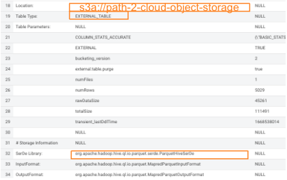


### Build the Data Lakehouse
In this section we will build the Data Lakehouse which is powered by Apache Iceberg.

1. Stay in HUE for the CDW Hive Virtual Warehouse - airlines-hive-vw.

2. Migrating Hive Table Format to Iceberg Table format - If you already have created a Data Warehouse using the Hive Table Format, but would like to take advantage of the features offered in the Iceberg Table Format, you have two (2) options: 1) Utilize the in-place table Migration feature; or 2) Use Create Table as Select (CTAS)

   - Option 1: Migrate the planes table in our Data Lakehouse from Hive Table Format to Iceberg Table Format using the Migration Utility.

      - Delete the current query from the SQL Window
      - Copy & paste the SQL below

```
ALTER TABLE ${user_id}_airlines.planes

SET TBLPROPERTIES ('storage_handler'='org.apache.iceberg.mr.hive.HiveIcebergStorageHandler');

DESCRIBE FORMATTED ${user_id}_airlines.planes;
```

   - x
      - Select all of the content in the SQL Editor

      - Execute the Query by clicking on the [](images/27.png) button

      - This migration to Iceberg happened in-place, there was **no** rewriting of data that occurred as part of this process.  It retained the File Format of Parquet for the Iceberg table as well.  There was a Metadata file that is created, which you can see when you run the DESCRIBE FORMATTED.

      - In the output look for the following fields - scroll down to look for the following properties: look for the following (see image with highlighted fields) key values: Table Type, Location (location of where table data is stored), SerDe Library, and in Table Parameters look for properties MIGRATE\_TO\_ICEBERG, storage\_handler, metadata\_location, and table\_type

         - Location - Data is stored in cloud storage in this case S3 in the same location as the Hive Table Format
         - Metadata\_location - Since there is no need to regenerate data files with in-place table migration, you save time generating Iceberg tables. Only metadata is regenerated, which points to source data files.  Removes Hive Metastore as bottleneck.
         - Table\_type - indicates "ICEBERG" table format
         - Storage\_handler & SerDe Library - indicate what Serializer/Desearializer to use when reading/writing data in this case the "HiveIcebergSerDe"
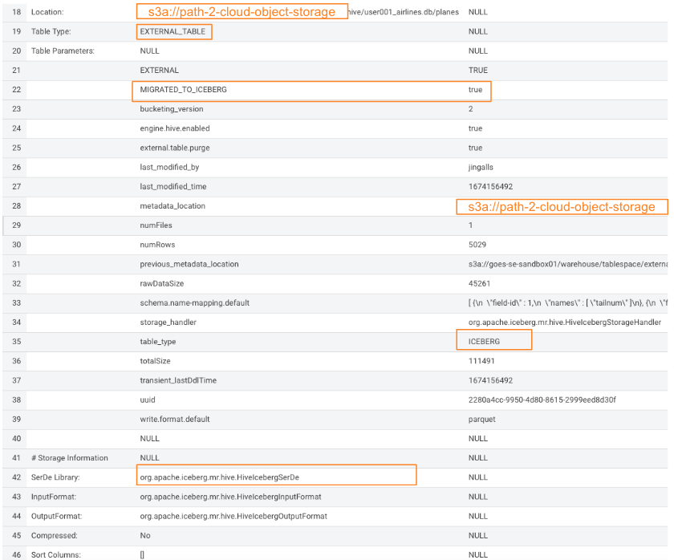

   - Option 2: Create airports table in _Iceberg Table Format_, using Create Table As Select (CTAS).  Notice the syntax to create an Iceberg Table within Hive is "**_Stored by Iceberg_**"

      - Delete the current query from the SQL Window
      - Copy & paste the SQL below

```
drop table if exists ${user_id}_airlines.airports;

CREATE EXTERNAL TABLE ${user_id}_airlines.airports
STORED BY ICEBERG AS
   SELECT * FROM airlines_csv.airports_csv;

DESCRIBE FORMATTED ${user_id}_airlines.airports;
```

      - Select all of the content in the SQL Editor

      - Execute the Query by clicking on the [](images/27.png) button

      - In the output - look for the following key values (just like previously): Table Type, Location (location of where table data is stored), SerDe Library, and in Table Parameters look for properties MIGRATE\_TO\_ICEBERG, storage\_handler, metadata\_location, and table\_type
      - On the left you should see the airports table added to the list of Tables for your user Database

3. Slowly changing dimension table airlines

   - Iceberg is fully ACID compliant and can execute Insert, Update, Delete, and Merge Into statements
   - Delete the current query from the SQL Window
   - Copy & paste the SQL below

```
-- SLOWLY CHANGING DIMENSION TABLE USE ACID CAPABILTIES OF ICEBERG

drop table if exists ${user_id}_airlines.airlines;

CREATE EXTERNAL TABLE ${user_id}_airlines.airlines (
   code string,
   description string
)
STORED BY ICEBERG
STORED AS PARQUET
tblproperties('format-version'='2');

-- LOAD DATA
INSERT INTO ${user_id}_airlines.airlines
   SELECT * FROM airlines_csv.airlines_csv;

-- Check data to see a few records

SELECT *
FROM ${user_id}_airlines.airlines
WHERE code IN ("04Q", "05Q");
```

   - Select all of the content in the SQL Editor

   - Execute the Query by clicking on the [](images/27.png) button

   - This will create the Iceberg Table, load initial data, and display a few rows that will be modified in the next step

- Delete the current query from the SQL Window
- Copy & paste the SQL below

```
-- SLOWLY CHANGING DIMENSION TABLE USE ACID CAPABILITIES OF ICEBERG

MERGE INTO ${user_id}_airlines.airlines AS t
   USING airlines_csv.airlines_csv s ON t.code = s.code
      WHEN MATCHED AND t.code = "04Q" THEN DELETE
      WHEN MATCHED AND t.code = "05Q" THEN UPDATE SET description = "Comlux Aviation"
      WHEN NOT MATCHED THEN INSERT VALUES (s.code, s.description);

-- Check data to see records were deleted or updated
SELECT *
FROM ${user_id}_airlines.airlines
WHERE code IN ("04Q", "05Q");
```

- Select all of the content in the SQL Editor

- Execute the Query by clicking on the [](images/27.png) button

  - The Merge Into statement will check to see if a record needs to be Deleted (when the record key matches and the code = 04Q), when a new record needs to be Inserted (key doesn't match), and when an Update is needed (when the key matches and the code = 05Q)
  - Compare the output to see that only one record is returned with the description set to "Comlux Aviation"

- Creating an Iceberg Table - for this step create a partitioned table, in Iceberg Table Format, stored in Parquet File Format.  Optionally, you could specify other File Formats, the supported formats for Iceberg are: Parquet, ORC, and Avro.

  - Delete the current query from the SQL Window
  - Copy & paste the SQL below

```
drop table if exists ${user_id}_airlines.flights;

CREATE EXTERNAL TABLE ${user_id}_airlines.flights (
   month int, dayofmonth int,
   dayofweek int, deptime int, crsdeptime int, arrtime int,
   crsarrtime int, uniquecarrier string, flightnum int, tailnum string,
   actualelapsedtime int, crselapsedtime int, airtime int, arrdelay int,
   depdelay int, origin string, dest string, distance int, taxiin int,
   taxiout int, cancelled int, cancellationcode string, diverted string,
   carrierdelay int, weatherdelay int, nasdelay int, securitydelay int,
   lateaircraftdelay int
)
PARTITIONED BY (year int)
STORED BY ICEBERG
STORED AS PARQUET
tblproperties ('format-version'='2');

SHOW CREATE TABLE ${user_id}_airlines.flights;
```

- Select all of the content in the SQL Editor
- Execute the Query by clicking on the [](images/27.png) button

- Looking at the SHOW CREATE TABLE output, scroll down and notice the output is the unformatted version of the Describe Formatted as we would expect.  The main item to pay attention to here is the PARTITIONED BY SPEC, currently we've partitioned by just the "year" column
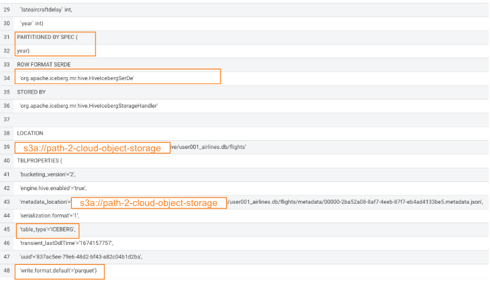

- When we insert data into this table it will write data together within the same partition (ie. all 2006 data is written to the same location, all 2005 data is written to the same location, etc.)

  - Delete the current query from the SQL Window
  - Copy & paste the SQL below

```
INSERT INTO ${user_id}_airlines.flights
   SELECT * FROM airlines_csv.flights_csv
   WHERE year <= 2006;

SELECT year, count(*)
FROM ${user_id}_airlines.flights
GROUP BY year
ORDER BY year desc;
```

- Select all of the content in the SQL Editor

- Execute the Query by clicking on the [](images/27.png) button

  - The Insert will insert data from years 1995 to 2006
  - Notice that each of the years have a range of data within a few million flights (each record in the flights table counts as a flight)
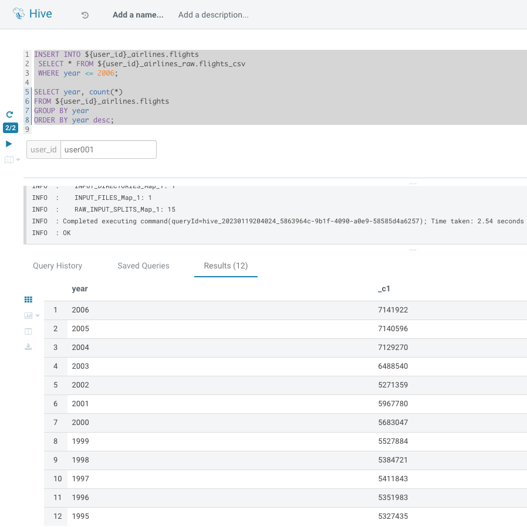

### Improve Performance

1. Performance improvements

    - Check that you created the tables for the Data Lakehouse - on the list of tables to the left of the Editor window you should see the following tables
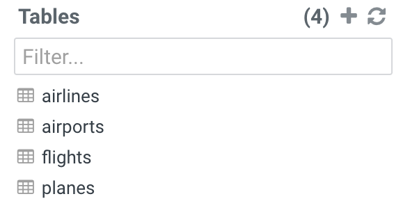

- Iceberg in-place Partition Evolution \[Performance Optimization]

  - One of the key features for Iceberg tables is the ability to evolve the partition that is being used over time

    - Delete the current query from the SQL Window
    - Copy & paste the SQL below

```
ALTER TABLE ${user_id}_airlines.flights
   SET PARTITION spec ( year, month );

SHOW CREATE TABLE ${user_id}_airlines.flights;
```

- Select all of the content in the SQL Editor

- Execute the Query by clicking on the [](images/27.png) button

  - This was an in-place Partition Evolution, meaning that the existing data is not rewritten as part of the ALTER TABLE execution.  What will happen is the next data that is loaded will use the new Partition definition.
  - In the output scroll to see the PARTITIONED BY SPEC to see that it is now both year and month


2. Performance Improvements - Open HUE for the CDW **Impala** Virtual Warehouse - airlines-impala-vw.

    - There should be an open CDW Browser tab, open the [](images/16.png) browser tab

    - Click on the airlines-impala-vw-# tile

      - In the upper right corner click on the HUE button to enter into the SQL Editor
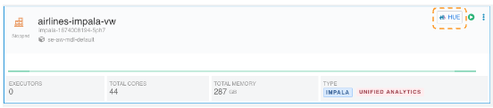

- Load new data into the flights table using the NEW partition definition - this will load new data to take advantage of the new partition specification.  This also shows how Iceberg also supports multiple engines by allowing both Hive & Impala to create, load, query, and or modify Iceberg tables.
- Copy & Paste the following in the SQL Editor window

```
INSERT INTO ${user_id}_airlines.flights
   SELECT * FROM airlines_csv.flights_csv
   WHERE year = 2007;
```

- Execute the Query by clicking on the [](images/27.png) button

- Run Explain Plans against some typical analytic queries we might run to see what happens with this new Partition definition.

  - In Impala we are in another engine which is another key feature of Iceberg - multi-function (or multiple engine) analytics.  No need to copy the data or do more work to allow access to the same data.
  - Copy/paste the following in the Editor, but do not execute the query

```
SELECT year, month, count(*)
FROM ${user_id}_airlines.flights
WHERE year = 2006 AND month = 12
GROUP BY year, month
ORDER BY year desc, month asc;
```

- In the "user\_id" parameter box, enter your user id (see Lab Setup section)
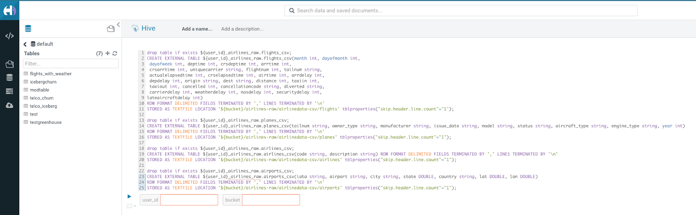

- Instead select (highlight) the statement click on the drop down arrow to the left of the user_id prompt [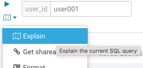](images/123.png) button, which is right below the Execute ([](images/27.png)) button and select `Explain`
[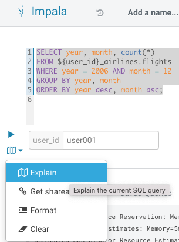](images/119.png)

- In the output notice the amount of data that needs to be scanned for this query (it would represent the volume of 1 years worth of data - about 139MB).  Up to this point the data was loaded using the Partition of just a year.
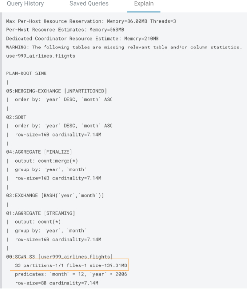

- Copy/paste the following in the Editor, but do not execute the query

```
SELECT year, month, count(*)
FROM ${user_id}_airlines.flights
WHERE year = 2007 AND month = 12
GROUP BY year, month
ORDER BY year desc, month asc;
```

- Instead select (highlight) the statement click the click on the drop down arrow to the left of the user_id prompt [](images/123.png) button, which is right below the Execute ([](images/27.png)) button and select Explain

[](images/119.png)

- In the output notice the amount of data that needs to be scanned for this query, about 10MB, is significantly less than that of the first, 138MB.  This shows an important capability, Partition Pruning.  Meaning that much less data is being scanned for this query and only the selected month of data is being scanned vs scanning the entire year of data.  This should result in much faster query execution times.


### Time Travel

Iceberg Snapshots and Time Travel - in the previous steps we have been loading data into the flights Iceberg table.

  - Each time data was changed in our Iceberg tables, a Snapshot is automatically captured.  This is important for many reasons but the main point of the Snapshot is to ensure eventual consistency and allow for multiple reads/writes concurrently (from various engines or the same engine).

1. Show snapshots

   - Delete the current query from the SQL Window
   - Copy & paste the SQL below

```
DESCRIBE HISTORY ${user_id}_airlines.flights;
```

- Execute the Query by clicking on the [](images/27.png) button

   * In the output there should be 2 Snapshots, in the example below there are 3 snapshots as this example shows that data was also loaded vie Impala and not just Hive.  Also, keep in mind we have been reading/writing data from/to the Iceberg table from both Hive & Impala which is indicated by the () in the callouts below.  This is important aspect of Iceberg Tables is that they support multi-function analytics - ie. many engines can work with Iceberg tables (Cloudera Data Warehouse \[Hive & Impala], Cloudera Data Engineering \[Spark], Cloudera Machine Learning \[Spark], Cloudera DataFlow \[NiFi], and DataHub Clusters)
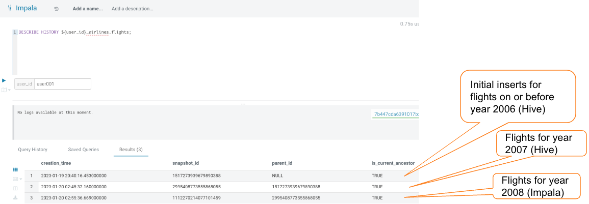

2. Get Details for Snapshots - open a text editor/notepad
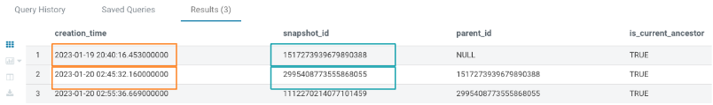

   - Text Editor - copy in a couple creation\_time's and snapshot\_id's
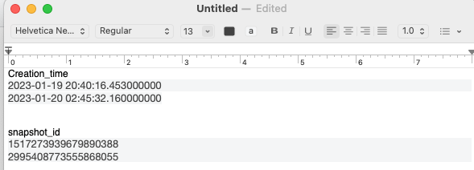

3. Iceberg Time Travel \[Table Maintenance] - copy/paste the following data into the Impala Editor, but do not execute.

  - Delete the current query from the SQL Window
  - Copy & paste the SQL below

```
-- SELECT DATA USING TIMESTAMP FOR SNAPSHOT
SELECT year, count(*)
FROM ${user_id}_airlines.flights
   FOR SYSTEM_TIME AS OF '${create_ts}'
GROUP BY year
ORDER BY year desc;

-- SELECT DATA USING TIMESTAMP FOR SNAPSHOT
SELECT year, count(*)
FROM ${user_id}_airlines.flights
   FOR SYSTEM_VERSION AS OF ${snapshot_id}
GROUP BY year
ORDER BY year desc;
```

- Once you copy this SQL into the Editor you will see 2 new parameters - create\_ts and snapshot\_id


- The first SELECT statement will use the create\_ts

  - In the create\_ts parameter box enter a date/time (this can be relative or specific timestamp).  From your Text Editor copy the second entry under creation\_time, paste it into the create\_ts parameter.  For this Time Travel you can use relative time periods and don't have to enter the specific timestamp for the Snapshot.
  - Highlight the first SELECT statement, and execute it
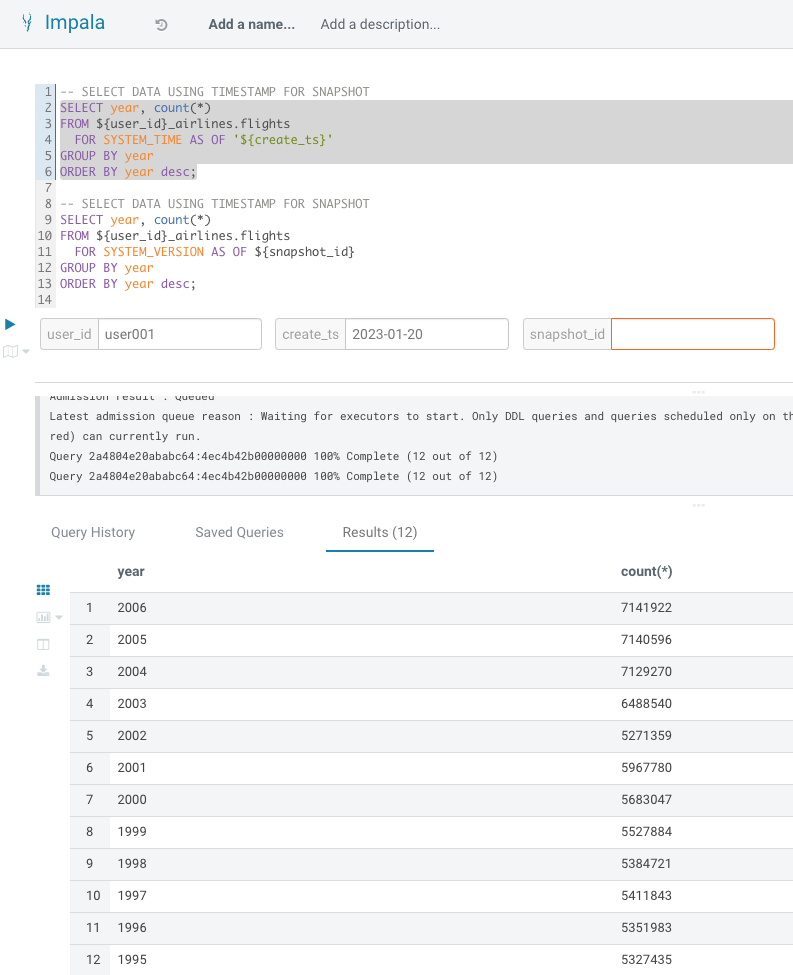

- This returned the the data as it was in our initial load

- The second SELECT statement will use the snapshot\_id

  - From your Text Editor copy the second entry under snapshot\_id, paste it into the snapshot\_id parameter box

    - Highlight the second SELECT statement, and execute it
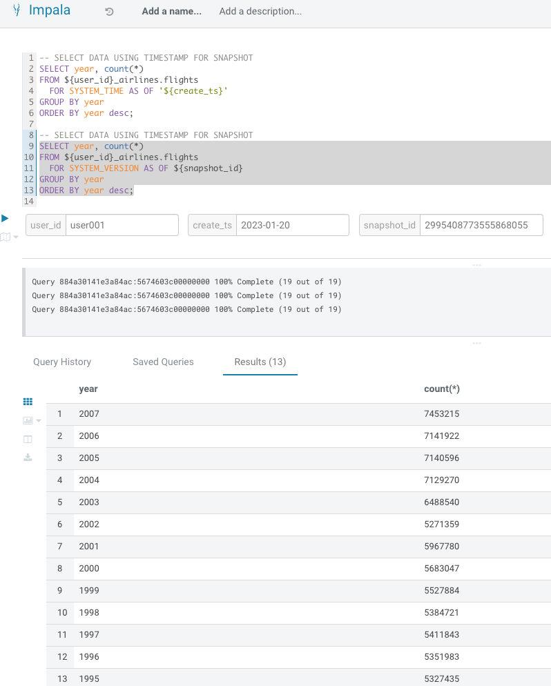

- This returns the data for the specific Snapshot ID that was specified in the query which was the data for the initial insert for data up to year 2006 and the insert for data for year 2007

### Fine Grain Access Contorl

Security & Governance - Now that performance has been optimized, we are almost ready to release this to the users.  Before we do that we need to apply security - Security is always on and can be defined with fine grained access control.  **_To learn more about Security & Governance in CDP - work with your Breakout Room Moderator to schedule time to go thru the Optional Lab at the end of this document_**

1. A security policy has already been created.  This is how it is defined
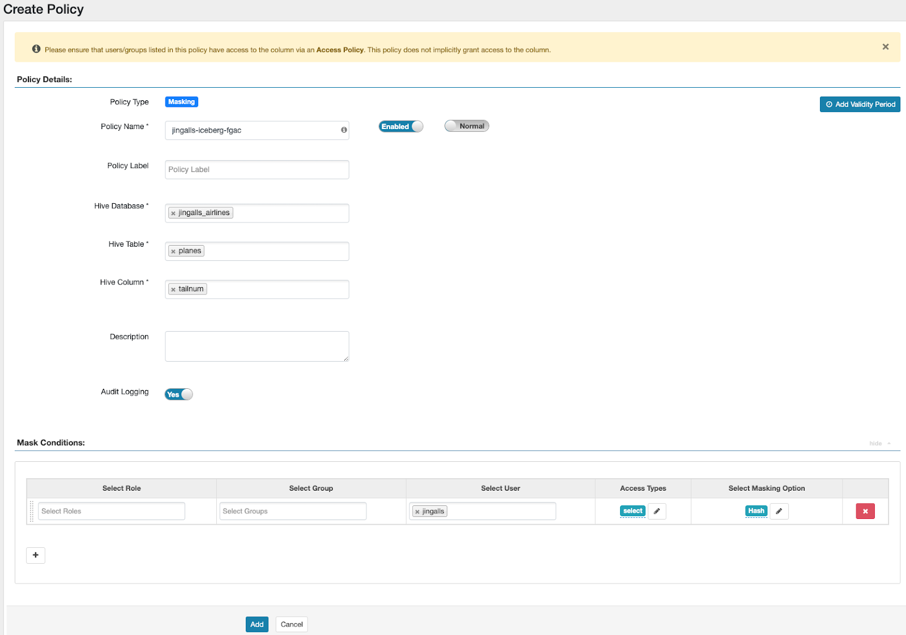


2. Delete the current query from the SQL Window
- Copy & paste the SQL below Select all of the content in the SQL Editor
- Execute the Query by clicking on the [](images/27.png) button
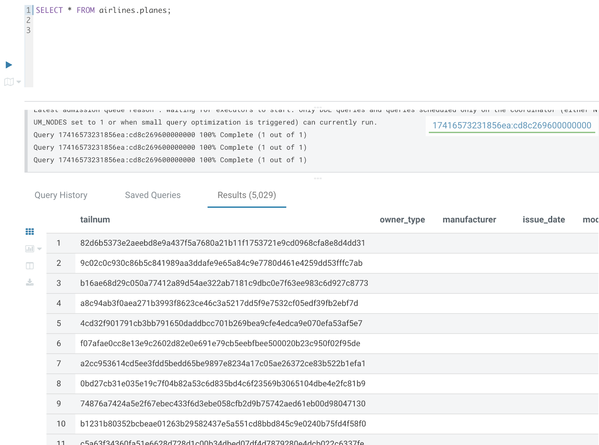

   - You will see that the "tailnum" column is masked so you are unable to see the actual plane's tail number, instead you see the Hashed value of the tailnum
