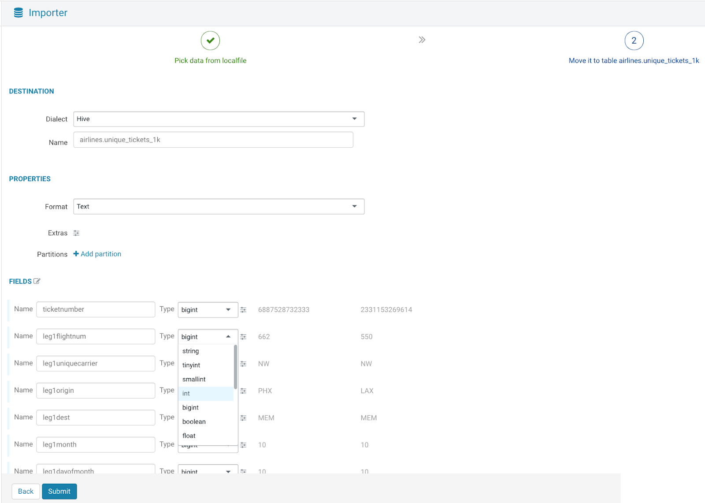
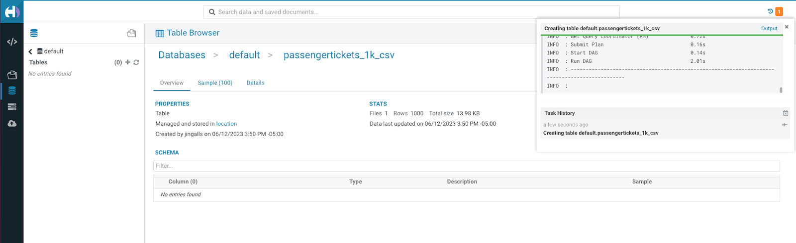
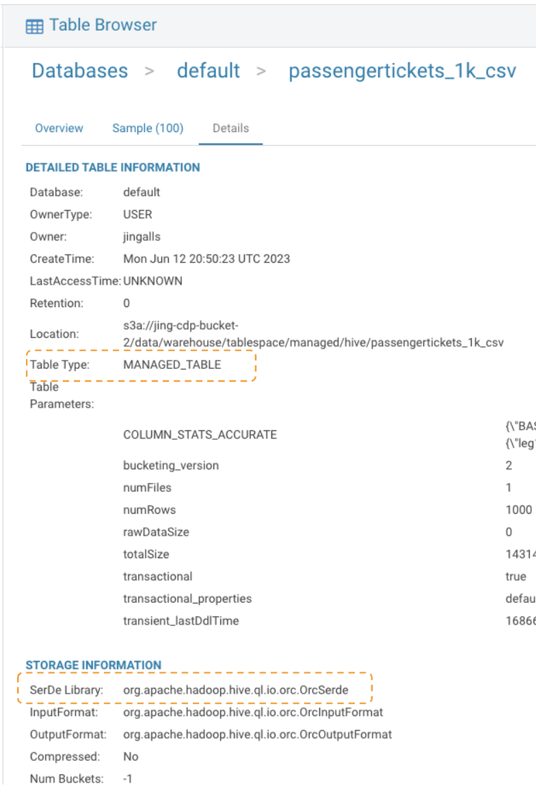

## Optional Lab 2 - Self Service File Upload

In this lab you will learn how to upload a small file to run SQL queries against where you could join to existing data in your Data Lakehouse.

### Upload Passenger Ticket Data File

Below highlights the 3 steps to upload this file, followed by detailed step-by-step instructions:
    
- Open the Importer

  

- Pick a file & options for the file upload

  

- Name the table, specify table options, and table metadata (column names, data types, etc.)

  

#### Step-By-Step Instructions: Upload Passenger Ticket Data File

1. To begin, click the  button in the left navigation menu, then select `Importer`

    

2. On the ***Pick Data from Local File*** page, choose `Small Local File` for the `Type` (Note: it should be the default value)

    

3. Click the  button, and browse to the `passengertickets_1k.csv` file

    

    - Ensure that the PREVIEW looks good. Note: You can make changes to the CSV options or import other file types like JSON using this Importer. 

4. Click the  button

5. On the ***Move it to table airlines_unique_tickets_1k*** page, Under the **DESTINATION** section, change the `Name` value to `<user-id>_airlines.unique_tickets`, replacing `<user-id>` with the User ID you logged in with.

    

6. Under FIELDS, change data types with `bigint` to `int` for all the fields ***except*** the `ticketnumber` field (it can remain a bigint data type).

    

  - The final fields section should look like the following:

    

7. Click the  button. This will create a new table in your database named `unique_tickets` in a Hive table format. Later in the labs, you will learn how to migrate this to an Iceberg table. 

    You will be taken to the Table Browser and see a status like the following screen (top right):

    

8. Once the table is created, click on the  tab of the Table Browser to see the table type and other information on this table. The following highlighted pieces of information show that this table is a Managed Table that is in using a ***SerDe*** that shows this is an ***ORC*** File Format & in ***Hive*** Table Format

    

- You can also view a sample of the data in this table by clicking on the  tab