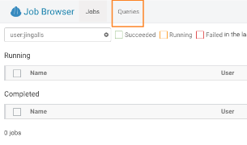
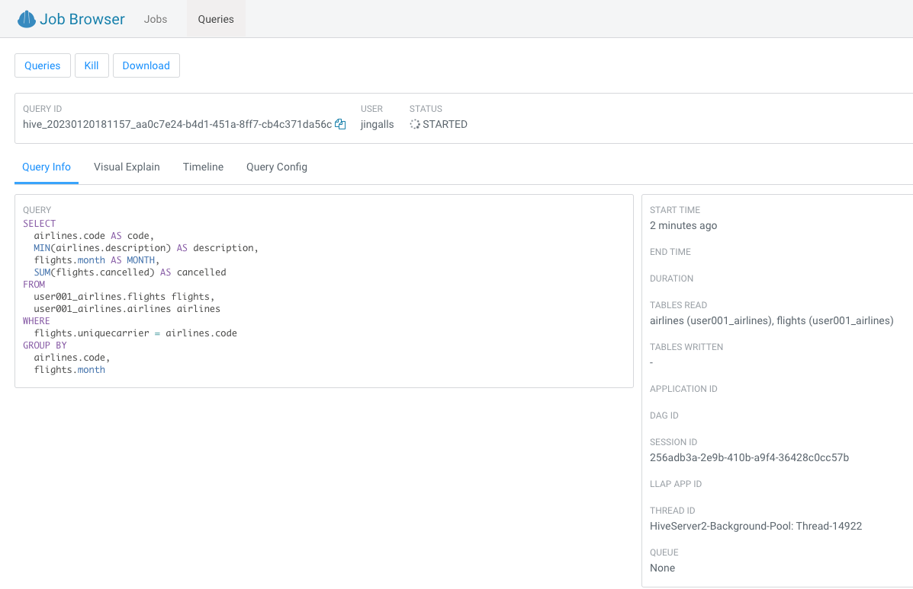
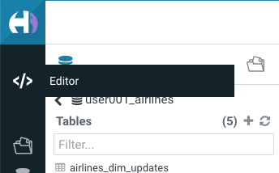
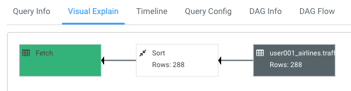

## Optional Lab 3 - Performance Optimizations (Impala VW)

In this Lab we will take a look at some of the performance optimization and table maintenance tasks that can be performed to ensure the best possible TCO, while ensuring the best performance.

1. Materialized Views \[Performance Optimization] - this can be used for both Iceberg tables and Hive Tables to improve performance

    - Open HUE for the CDW **Hive** Virtual Warehouse - airlines-hive-vw.  Copy/paste the following, make sure to highlight the entire block, and execute the following

```
SET hive.query.results.cache.enabled=false;

drop table  if exists ${user_id}_airlines.airlines;

CREATE EXTERNAL TABLE ${user_id}_airlines.airlines (code string, description string) STORED BY ICEBERG STORED AS ORC TBLPROPERTIES ('format-version' = '2');

INSERT INTO ${user_id}_airlines.airlines SELECT * FROM ${user_id}_airlines_raw.airlines_csv;

SELECT airlines.code AS code,  MIN(airlines.description) AS description,

  flights.month AS month,

  sum(flights.cancelled) AS cancelled

  FROM ${user_id}_airlines.flights flights , ${user_id}_airlines.airlines airlines 

  WHERE flights.uniquecarrier = airlines.code

  group by airlines.code, flights.month;
```

- Hive has built in performance improvements, such as a Query Cache that stores results of queries run so that similar queries don’t have to retrieve data, they can just get the results from the cache.  In this step we are turning that off using the “SET” statement, this will ensure when we look at the query plan we will not retrieve the data from the cache.

- Note: with this query you are combining an Iceberg Table Format (flight table) with a Hive Table Format (airlines\_orc table) in the same query.


2. Let’s take a look at the Query Plan that was used to execute this query

  - On the left menu select Jobs


- This will take you to the Jobs Browser, select the Queries tab to the right of the Job Browser header 



- This is where an Admin will go when - a query has run amok and then figures out what to do next.  In our case for this lab we’d like to look at the query we just executed to see how it ran and the steps taken to execute the query.  Administrators would also be able to perform other monitoring and maintenance tasks for what is running (or has been run).  Monitoring and maintenance tasks could include: cancel (kill) queries, see what is running, analyze whether queries that have been executed are optimized, etc.

  

3. Hover over and click on the Query we just executed (it should be the first row)

    

4. This is where you can analyze queries at a deep level. For this lab let’s take a look at the Explain details, click on Visual Explain tab

    

- This plan shows that this query needs to Read flights (86M rows) and airlines (1.5K rows) with hash join, group and sort.  This is a lot of data processing and if we run this query constantly it would be good to reduce the time this query takes to execute.

  

5. Click on the \</> button on the left menu, and click Editor, to return the Editor Window

    

6. Create Materialized View (MV) - queries will transparently be rewritten, when possible, to use the MV instead of the base tables.  Copy/paste the following, highlight the entire block, and execute

    ```
    DROP MATERIALIZED VIEW IF EXISTS ${user_id}_airlines.traffic_cancel_airlines;

    CREATE MATERIALIZED VIEW ${user_id}_airlines.traffic_cancel_airlines

    as SELECT airlines.code AS code,  MIN(airlines.description) AS description,

      flights.month AS month,

      sum(flights.cancelled) AS cancelled,

      count(flights.diverted) AS diverted

      FROM ${user_id}_airlines.flights flights JOIN ${user_id}_airlines.airlines airlines ON (flights.uniquecarrier = airlines.code)

      GROUP BY airlines.code, flights.month;

      -- show MV

      SHOW MATERIALIZED VIEWS in ${user_id}_airlines;
    ```

  - The Materialized View traffic\_cancel\_airlines will be displayed in Results and in the left table/view list with a (View) icon to the left of the MV

    

7. Run Dashboard Query again to see usage of the MV - Copy/paste the following, make sure to highlight the entire block, and execute the following.  This time an Order By was added to make this query have to do more work.

    ```
    SET hive.query.results.cache.enabled=false;

    SELECT airlines.code AS code,  MIN(airlines.description) AS description,

      flights.month AS month,

      sum(flights.cancelled) AS cancelled

    FROM ${user_id}_airlines.flights flights , ${user_id}_airlines.airlines airlines 

    WHERE flights.uniquecarrier = airlines.code

    GROUP BY airlines.code, flights.month

    ORDER BY airlines.code;
    ```

8. Let’s take a look at the Query Plan that was used to execute this query

    - On the left menu select Jobs

    - On the Jobs Browser - select the Queries tab to the right of the Job Browser header

    - Hover over & click on the Query just executed (should be the first row)

    - Click on Visual Explain tab - With query rewrite the **materialized view** is used and the new plan just reads the MV and sorts the data vs. reading flights (86M rows) and airlines (1.5K rows) with hash join, group and sorts.  This results in significant reduction in run time for this query.

    

    - Materialized views also support incremental refreshes when the data from the tables used for the MVs is updated. Please visit the CDW documentation for more information.

9. Return to Query Editor - click on the \</> button on the left menu, and click Editor, to return the Editor Window
