## Optional Lab 4 - Data Visualization

In this lab you will build a Logistics Dashboard using Cloudera Data Visualization.  The Dashboard will include details about flight delays and cancellations.  This will be a completely new use case independent of the SMG Use Case, the analysis could be a catalyst to lead to a Data Science application to predict the probability of a flight being canceled or not.

21. Open Cloudera Data Visualization (CDV or Data Viz)

    - Go to browser tab with CDW open
    - On the left navigation panel click “Data Visualization”
    - On the row with airlines-cdv, click the Data VIZ button

- If you see the “What’s New” page, you can read it, or click on the GOT IT button

22. Home page

- There are 4 areas of CDV - HOME, SQL, VISUALS, DATA - these are the tabs at the top of the screen in the black bar to the right of the Cloudera Data Visualization banner

  - Home - this is the starting point; it shows some statistics at the top, followed by some quick access details to recent content - Queries, Connections, Datasets, and Dashboards
  - SQL - allows you to manually build queries against data to perform quick discovery against the data.  Below is an example of a query that was built and Run

- Visuals - an area for viewing/building/modifying visuals, dashboards, and applications

- Data - interface for access to datasets, connections, and the Connection Explorer

23. Build a Dataset (aka. Metadata Layer or Data Model) - click on DATA in the top banner.  A Dataset is a Semantic Layer where you can create a business view on top of the data - data is not copied; this is just a logical layer

- Create a connection - click on the NEW CONNECTION button on the left menu

- Connection type - select CDW Impala
- Name - **\<user\_id>**-airlines-lakehouse
- CDW Warehouse - select drop down and pick the airlines-impala-vw
- For this lab each participant will create their own connection in the same Data Viz instance, this would not be normal, you would only have to create a single connection to the same Virtual Warehouse
- Click on the Advanced tab  in the middle of the screen, you can see that the details are already populated, there is nothing more to do.  If certain settings were required you could change them here.
- Click CONNECT button, to create the Connection
- You will see your connection in the list of connections on the left menu

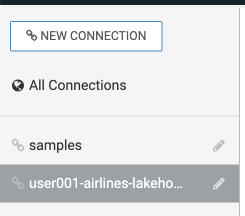

- On the right side of the screen you will see Datasets and the Connection Explorer

- Create a new Dataset (aka. Metadata Layer or Data Model)

  - Click on NEW DATASET button

- Dataset title - **airline\_logistics**
- Dataset Source - select From Table (however, you could choose to directly enter a SQL statement instead)
- Select Database - **\<user\_id>**\_airlines
- Select Table - flights
- Click CREATE

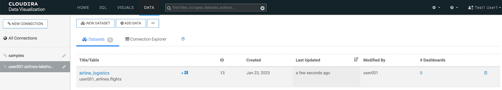

- Edit the Dataset - click on airline\_logistics on the right of the screen.  This will open the details page, showing you information about the Dataset, such as connection details, and options that are set

- On the left menu click on Fields - let’s quickly see what was created by adding the flights table to the Dataset.  When this table was added it took the table’s metadata and add the columns as Fields.  (we’ll come back to this later)

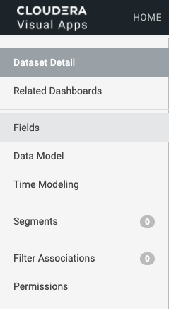     

- Click on Data Model - for our Dataset we need to join additional data to the flights table including the planes, airlines, and airports tables
- Click on EDIT DATA MODEL button

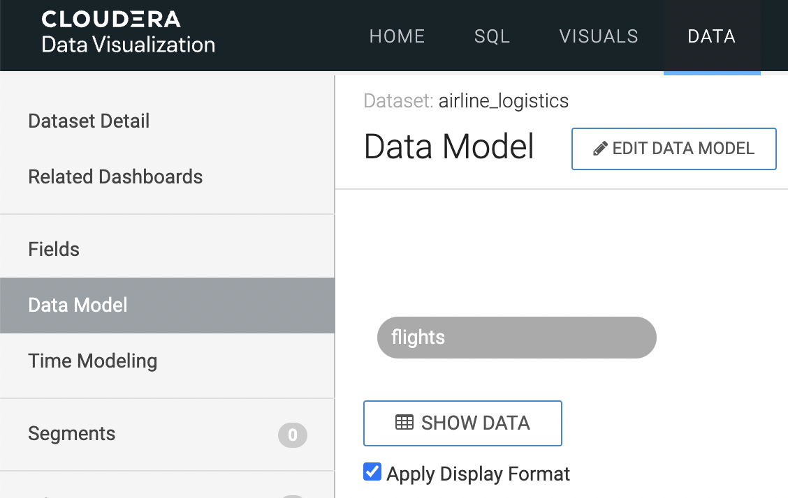

- Join planes - click the “+” button next to flights

Database Name - **\<user\_id>**\_airlines

Table Name - planes

Click SELECT button

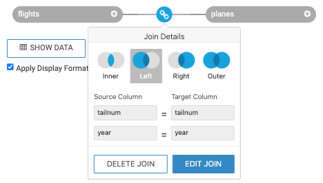

Click the  (JOIN) between flights and planes to see the join that was created

Click EDIT JOIN to modify the join as there is an extra join of year=year

Click on the - to the right of the year=year join and click the APPLY button

 should be >>> 

- Join airlines - click the “+” button next to flights

Database Name - **\<user\_id>**\_airlines

Table Name - airlines

Click SELECT button

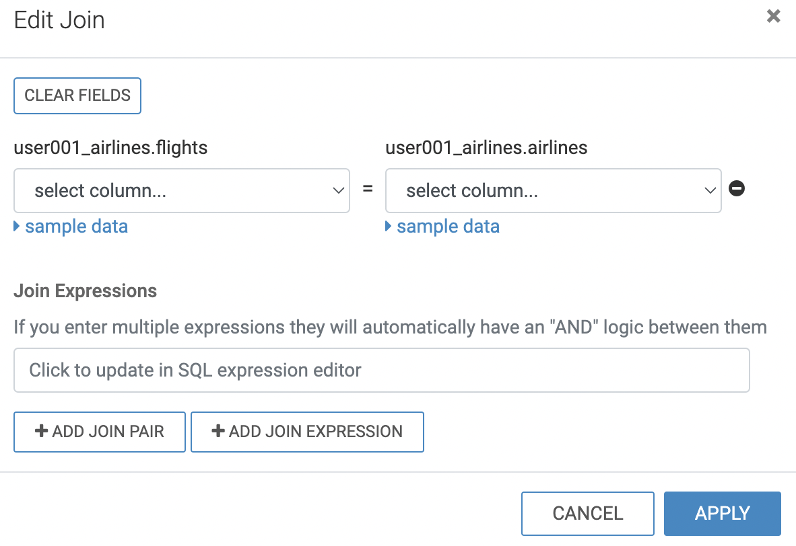 >>> 

Click the  (JOIN) between flights and airlines to see the join that was created

Click EDIT JOIN to modify the join

Click on uniquecarrier under flights & code under airlines and click the APPLY button

- Join airports (origin airport) - click the “+” button next to flights

Database Name - **\<user\_id>**\_airlines

Table Name - airports

Click SELECT button

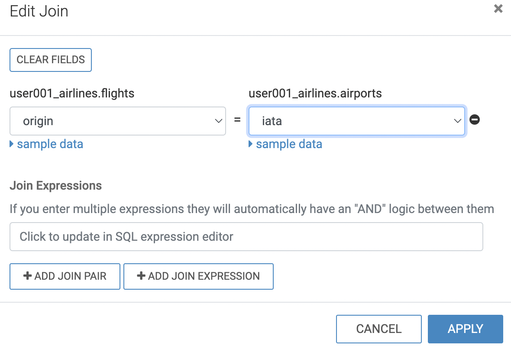

Click the  (JOIN) between flights and airports to see the join that was created

Click EDIT JOIN to modify the join

Click on origin under flights & iata under airports and click the APPLY button

- Join airports (destination airport) - click the “+” button next to flights

Database Name - **\<user\_id>**\_airlines

Table Name - airports

Click SELECT button

Click the  (JOIN) between flights and airports\_1 to see the join that was created

Click EDIT JOIN to modify the join

Click on the dest under flights & iata under airports and click the APPLY button

- The final Data Model will look like the following…

- Click on the SHOW DATA button to preview the data that will be returned by the model created so far

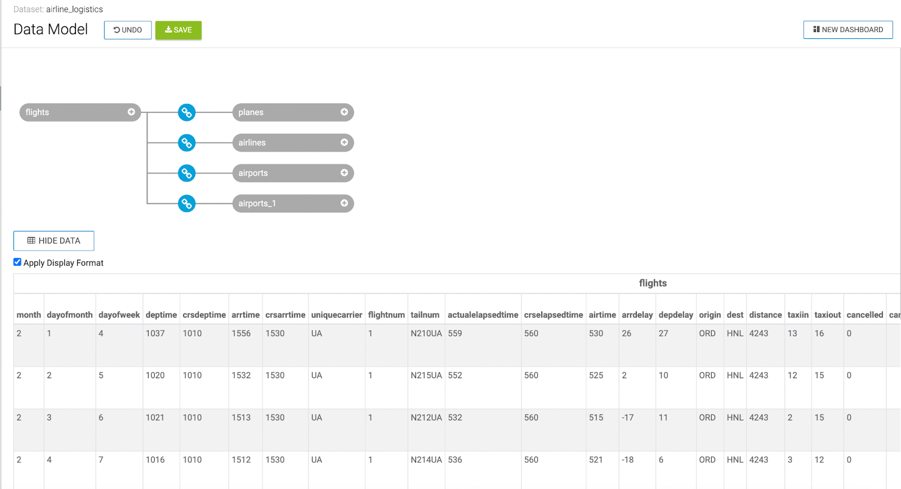

- Click on the SAVE button

<!---->

- Modify Fields - click on Fields in the left menu

- Click on the EDIT FIELDS button; you will see this new tool bar

- Click on the TITLE CASE button to format the display names of the fields
- Under the Measures section, click on the Mes button next to month.  This changes this to a Dimension.

- Each Field is assigned a Category (Measure or Dimension) - this is important because the type is used when creating visuals.  CDV will use the data type to determine this Category.  Make sure that Fields fall into the correct Category.  This is important because this is used when creating visuals.  The way to look at choosing the Category is to use this simple method - if you need to Aggregate (sum, average, etc.) then the Field should be a Measure.  The quickest way to change the Category is to use the toggle

<!---->

- Under the Measures section, click on the Mes button next to the following Fields:

  - Under Measures > flights

    - Dayofmonth
    - Dayofweek
    - Deptime
    - Crsdeptime
    - Arrtime
    - Crsarrtime
    - Flightnum
    - Year

  - All Fields under Measures > planes

  - All Fields under Measures > airports

  - All Fields under Measures > airports\_1

- **Note:** Normally, we would make sure that all Fields fall into the correct Category, instead let’s move ahead

- Edit a Field

  - Click the pencil next to Depdelay under the Measures section to edit the field

<!---->

- Change the Display Name to Dep Delay & change the Default Aggregation to Average

- Click on the Display Format tab

  - Select Category of Integer and click on Use 1000 separator

- Click APPLY button to save the changes

<!---->

- Add a new Field

  - Clone the Origin Field - click the down arrow next to Origin, select Clone

- Click the pencil next to Clone of Origin to edit the field
- Change Display Name to Route
- Click on the Expression tab - enter the following into the Expression window

<!---->

    concat([Origin], '-', [Dest])

- Click APPLY - since the “Save expression only after validation succeeds” is checked the Field will first be validated to ensure there are no errors then if it is valid will be saved

<!---->

- Click the SAVE button

24. Create Dashboard - in the top right corner click on the NEW DASHBOARD button

New Dashboard

- Quick Overview the the interface

  - On the right side of the screen there will be a VISUALS menu.  At the top of this menu, there is a series of Visual Types to choose from.  There will be 30+ various visuals to choose from.  Below the Visual Types you will see what are called Shelves.  The Shelves that are present depend on the Visual Type that is selected.  Shelves with a “\*” are required, all other Shelves are optional.  On the far right of the page there is a DATA menu, which identifies the Connection & Dataset used for this visual.  Underneath that is the Fields from the Dataset broken down by Dimensions and Measures.  With each of these Categories you can see that it is subdivided by each Table in the Dataset.

|                                                                                                                                                                                                                   |                                                                                                                                                                                                              |                                                                                                                                                                                                                                                                                                                                                                                                             |
| ----------------------------------------------------------------------------------------------------------------------------------------------------------------------------------------------------------------- | ------------------------------------------------------------------------------------------------------------------------------------------------------------------------------------------------------------ | :---------------------------------------------------------------------------------------------------------------------------------------------------------------------------------------------------------------------------------------------------------------------------------------------------------------------------------------------------------------------------------------------------------: |
| **Visual Types** | **Shelves** | **DATA**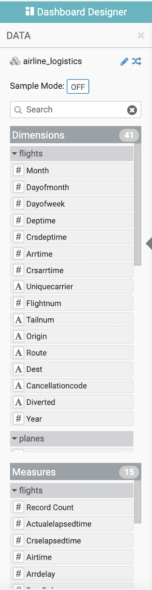  |

- 1st Visual - Top 25 Routes by Avg Departure Delay; are there certain Routes with excessive Delays

  - CDV will add a Table visual displaying a sample of the data from the Dataset as the default visualization when you create a new Dashboard or new Visuals on the Dashboard (see New Dashboard screen above).  The next step is to modify (Edit) the default visualization to suit your needs.  
  - Pick the Visual Type - select the Stacked Bar chart visual

- Edit the Shelves (two (2) ways to add items to a Shelf, you will use both here; for the remainder of this lab you can pick & choose which you use)

- Option 1: Add Route to the X Axis

  - Click in the X Axis Shelf to select it
  - In the DATA menu find Route under Dimensions > fights

- Option 2: Add Dep Delay to the Y Axis

  - In the DATA menu find Dep Delay under Measures > flights, Drag & Drop this Field in the Y Axis Shelf

- So the two (2) options for adding items to Shelves is 1) select Shelf and click to add Field; or 2) Drag & Drop Field to Shelf

<!---->

- Modify Properties for Dep Delay - click on the > in the Y Axis Shelf to the right of avg(Dep Delay) to access the Properties for this Shelf

- Click on the down arrow to the left of Aggregates - in CDV you have control over any behavior, in the Dataset we set the default aggregation for this Field to be Average, however, on any visual you can override this by changing it here.  For now, leave this alone.

- Click the down arrow to the left of Order and Top K - to show the 25 Routes with the highest Average Dep Delay enter 25 into the box for “Top K”

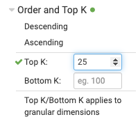

- Click the down arrow to the left of Alias - to change the display name for this Field.  In the box enter Avg Dep Delay

- The finished Y Axis Shelf should look like this

- Click the  button to update the Visual

- Change the Title & Subtitle for this Visual

  - Click in the enter Title above the chart and enter - Routes with Highest Avg Departure Delays, hit enter
  - Click in the Subtitle and enter - In Minutes, hit enter

-

<!---->

- Add Title & Subtitle for the Dashboard

  - Click in the enter Title right below the banner and enter - **\<user\_id>** Logistics Dashboard
  - Click in the Subtitle and enter - CDW Workshop

- Click on the SAVE button to save this Dashboard, this Dashboard is now named **\<user\_id>** Logistics Dashboard

<!---->

- 2nd Visual - Relationship between flight Cancellation reason and Carrier; are there Carriers or Reasons that need to be addressed?

  - Click on +Visuals - on the far right of the screen you will see the DASH. menu.  This menu allows you to add new visuals and change settings for the Dashboard or Visual such as formatting, style, and anything related to the presentation of the data.

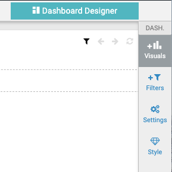

- Under ADD VISUALS - leave the  (Connection) as \<user\_id>-airlines-lakehouse and  (Dataset) as airlines\_logistics.  However, a Dashboard can have any number of connections and Datasets for various visuals on a Dashboard.

- This will add a default visual to the canvas
- Click on the  button, next to the Table .  Instead of manually building this visual, we will use the Visual helper

- Select Uniquecarrier and Cancellationcode under Dimensions; select Cancelled under Measures.  As you select items from the Fields you will see the Possible Visuals change - helping you quickly select the visual based on what you have selected.

- Click on SEE ALL VISUALS> button - to preview the Possible Visuals with actual data plotted
- Click on the Correlation flow visual - Scroll thru until you see the Correlation flow visual tile

<!---->

- Drag & Drop Cancelled from DATA menu under Measures > flights to the Filter Shelf - There are several ways to apply filters to visuals within the Dashboard, this is one

  - When the dialog box comes up

- This will filter this chart to only return flights that have been cancelled, and will not return any other data
- Click the REFRESH VISUAL button

- **NOTICE**: Since there is a security policy still in effect, you will only see “UA” showing up in this visual.  To see all of the Carriers, you could disable the security Policy and Refresh the Visual.

<!---->

- Click in the bottom right corner of the Correlation flow visual and drag it down to resize this chart (make it a bit larger to your liking)

- Click the enter Title and enter Cancellation Correlation, and hit enter
- Click the SAVE button to save the Dashboard

<!---->

- Add prompts - allow dashboard to be sliced & diced; this is another way to filter on multiple charts at the same time in your Dashboard

  - On the DASH. menu (far right) click on +Filters button

- Click on Engine Type under Dimensions > planes, to add this Field as a filter; you continue to select other Fields that you want to create Filters for and these will also be added

- Click the drop down arrow next to Engine Type and select any value - the filter(s) are added to the Filter shelf for the Dashboard which is between the Dashboard Title and the Visuals you have been creating.  When you are selecting values from this Filter, the visuals will change to reflect information for just flights where this Engine Type was in the plane for the flight

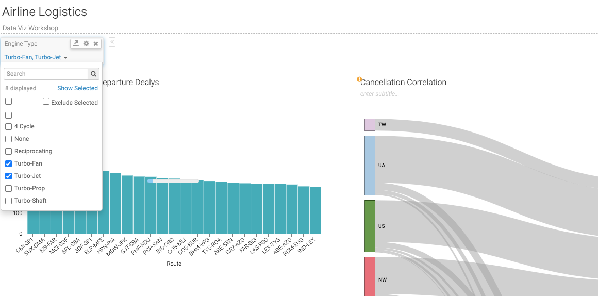

- Click the SAVE button to save the Dashboard

<!---->

- \[optional] View Dashboard from Visuals page

  - Click Visuals in the top banner
  - Dashboards can be shared with other users - use Workspaces to organize and secure content that is created
  - Create Applications - combine multiple Dashboards to produce an application that allows users to make better decisions

-

***