## Optional Lab 4 - Cloudera Data Visualization (CDV)

In this lab you will build a Logistics Dashboard using Cloudera Data Visualization. The Dashboard will include details about flight delays and cancellations. This will be a completely new use case, independent of the SMG use case. The analysis could be a catalyst, leading to a Data Science application and predicting the probability of a flight being canceled or not.

### Open the CDV Application

1. Open the web browser tab with CDW open

2. On the left navigation panel, click `Data Visualization`
  
3. On the row with airlines-cdv, click the Data ViZ button to the right

  

4. If you see the `What’s New` page, you can read it, or click on the `GOT IT` button to continue

### Getting Familiar with the CDV Home Page

Once you haves successfully opened a CDV instance, you should see the following CDV home page.

  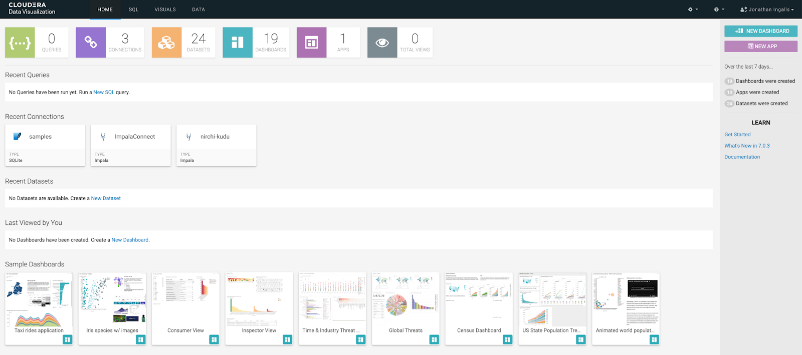

There are 4 main areas of CDV, shown as tabs at the top of the screen in the black bar to the right of the Cloudera Data Visualization banner:
  
  - HOME
  - SQL
  - VISUALS
  - DATA 

**HOME** - this is the starting point; it shows some statistics at the top, followed by some quick access details to recent content - Queries, Connections, Datasets, and Dashboards
  
**SQL** - allows you to manually build queries against data to perform quick discovery against the data.  Below is an example of a query that was built and Run

  

**VISUALS** - an area for viewing/building/modifying visuals, dashboards, and applications


**DATA** - interface for access to datasets, connections, and the Connection Explorer

### Build a Dataset (aka. Metadata Layer or Data Model)

1. Click on DATA in the top banner. A Dataset is a Semantic Layer where you can create a business view on top of the data - data is not copied; this is just a logical layer

    

2. Create a connection - click on the `NEW CONNECTION` button on the left menu and enter the following:

    - **Connection type:** `CDW Impala`

    - **Name:** `<user_id>-airlines-lakehouse`

    - **CDW Warehouse:** `airlines-impala-vw`

    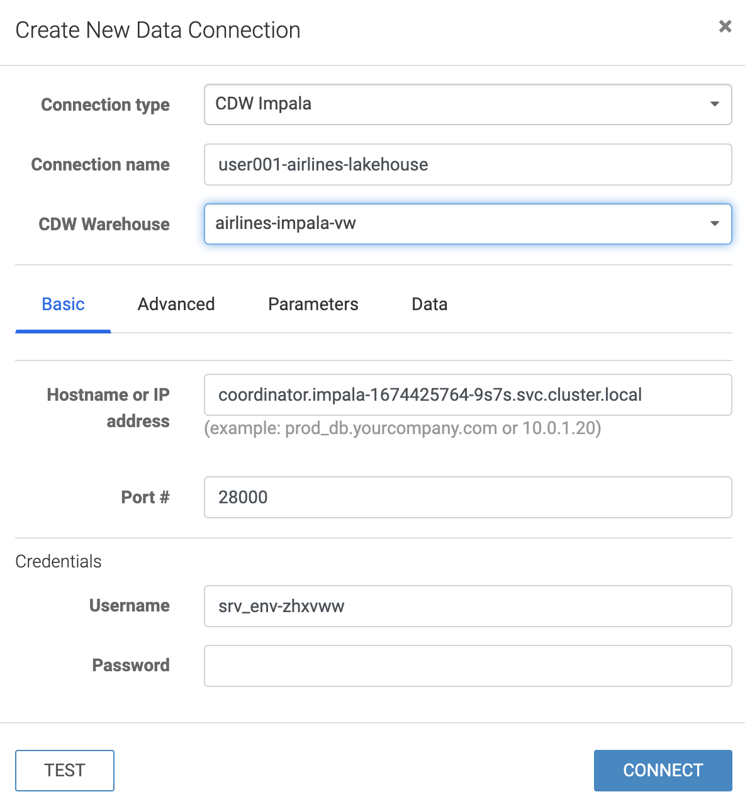

  - For this lab, each participant will create their own connection in the same Data Viz instance. Normally, you would only have to create a single connection to the same Virtual Warehouse.

3. Click on the `Advanced` tab in the middle of the screen. As you can see, the details are already populated and there is nothing more to do. If certain settings were required, you could change them here.

4. Click the `CONNECT` button to create the Connection

    - You will see your connection in the list of connections on the left menu

      

    - On the right side of the screen you will see Datasets and the Connection Explorer

      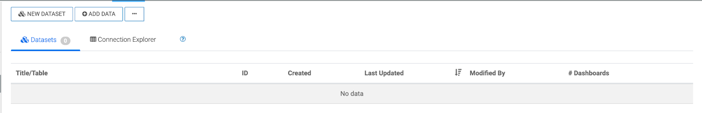

5. Click on the `NEW DATASET` button to create a new Dataset (aka. Metadata Layer or Data Model) and enter the following into the form:

    - **Dataset title:** `airline_logistics`

    - **Dataset Source:** `From Table` (Note: You could choose to directly enter a SQL statement instead)

    - **Select Database:** `<user_id>_airlines`

    - **Select Table:** `flights`
    
    - Click the `CREATE` button

    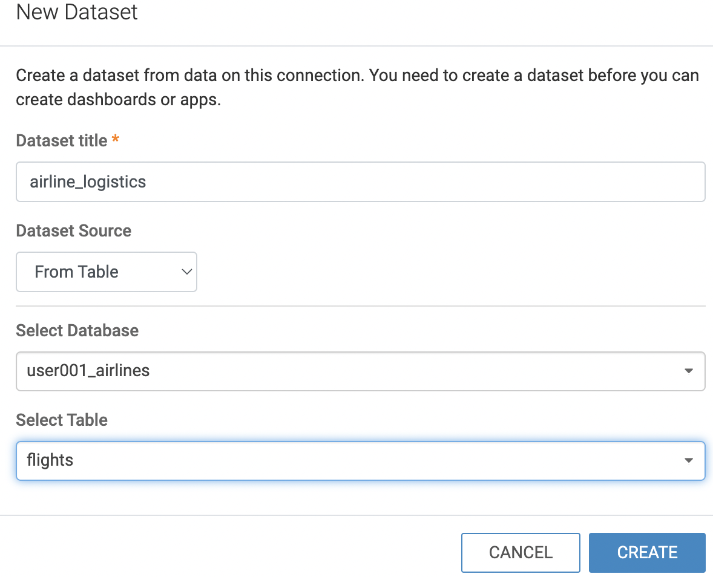

  - Once created, your new dataset will now be listed.

    

### Edit the Dataset

1. Click on `airline_logistics` on the right of the screen. This will open the details page, showing you information about the Dataset, such as connection details, and options that are set.

    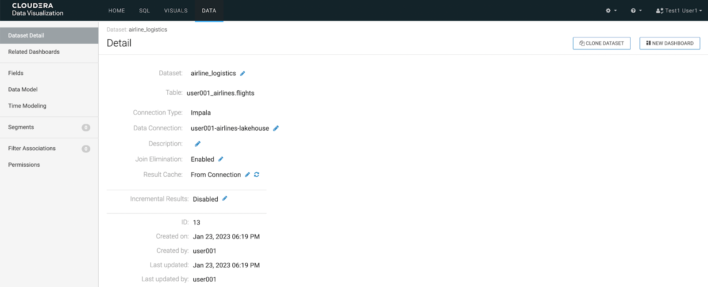

2. Click on `Fields` in the left navigation menu

    - Let’s quickly see what was created by adding the flights table to the Dataset.

    - When this table was added, it took the table’s metadata and add the columns as Fields (More on this later)

    
    
    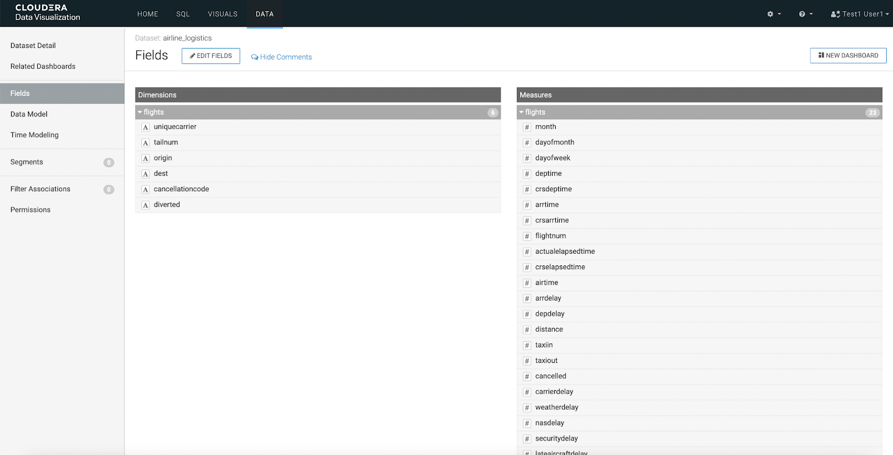

3. Click on `Data Model` in the left navigation menu

    - For our Dataset, we need to join additional data to the flights table, including the planes, airlines, and airports tables

4. Click on the `EDIT DATA MODEL` button

    

5. Click the `+` button next to `flights`. We are going to join the `planes` table to the `flights` table

    - Select the following in the **Table Browser** form: 

      - **Database Name:** `<user_id>_airlines`

      - **Table Name:** `planes`

      - Click the `SELECT` button

       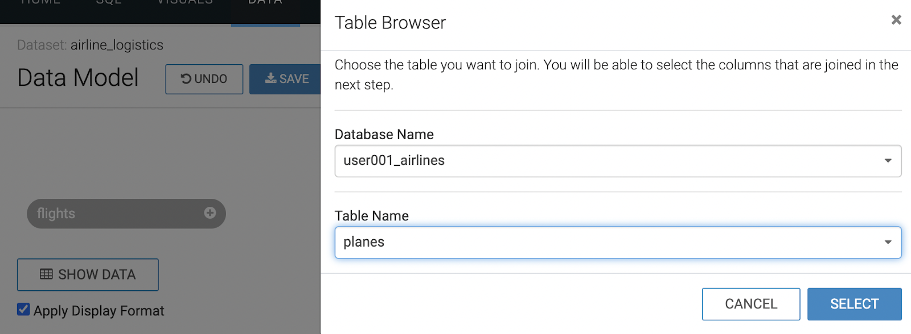

6. Click the  (JOIN) between `flights` and `planes` to see the join that was created 

    

7. Click `EDIT JOIN` to modify the join as there is an extra join of year=year

8. Click on the `-` (MINUS) to the right of the year=year join, then click the `APPLY` button

    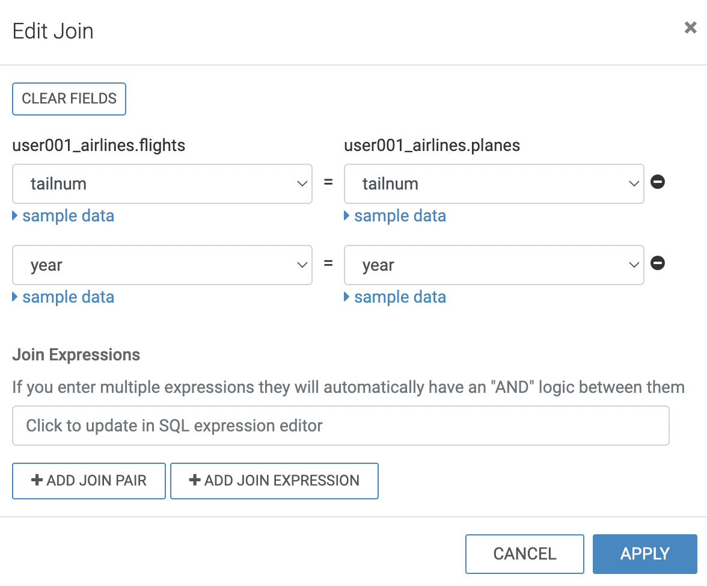

    - Removing the `year=year` join should look like   

      

9. Click the `+` button next to `flights`. We are going to join the `airlines` table to the `flights` table.

    - Select the following in the **Table Browser** form: 

      - **Database Name:** `<user_id>_airlines`

      - **Table Name:** `airlines`

      - Click the `SELECT` button

      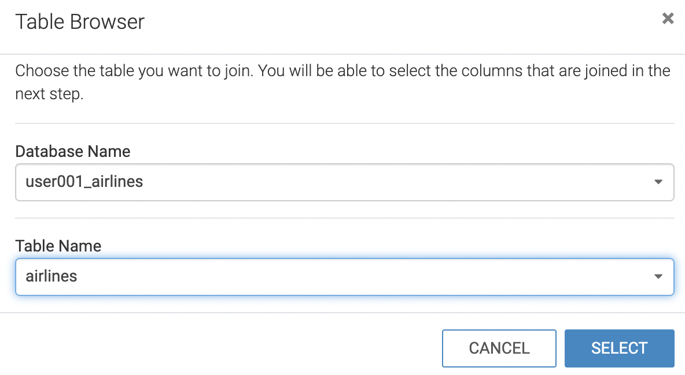

10. Click the  (JOIN) between `flights` and `airlines` to see the join that was created

11. Click `EDIT JOIN` to modify the join

    

12. Select `uniquecarrier` under `<user_id>_airlines.flights` and `code` under `<user_id>_airlines.airlines`, then click the `APPLY` button

    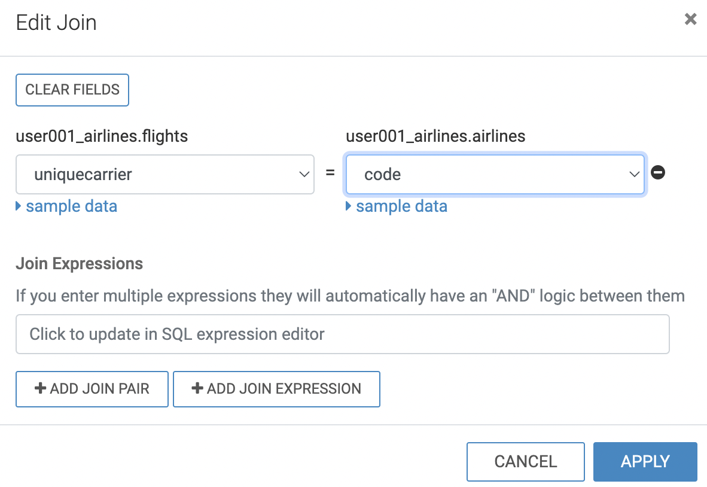

13. Click the `+` button next to `flights`. We are going to join the `airports` table to the `flights` table.

    - Select the following in the **Table Browser** form: 

      - **Database Name:** `<user_id>_airlines`

      - **Table Name:** `airports`

      - Click the `SELECT` button

    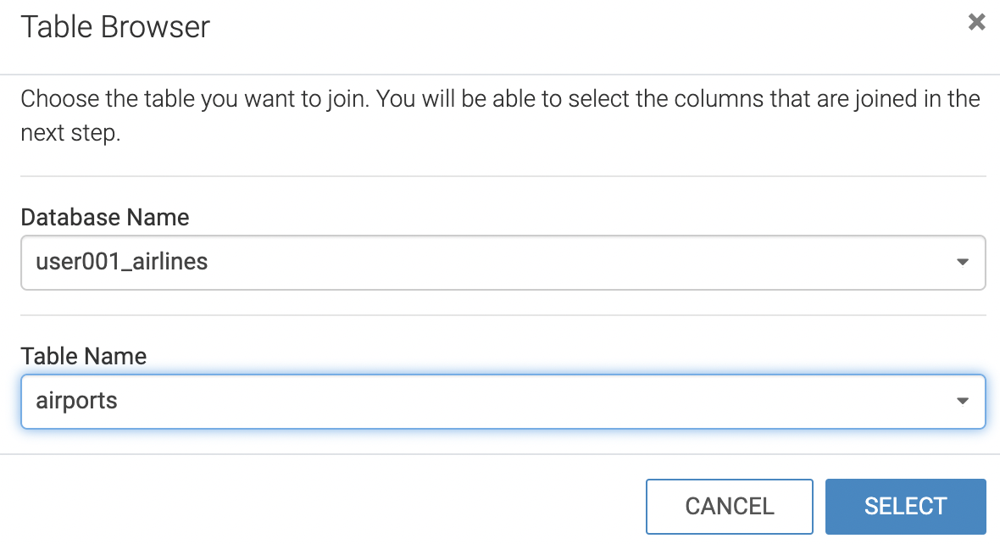

14. Click the  (JOIN) between `flights` and `airports` to see the join that was created

15. Click `EDIT JOIN` to modify the join

16. Select `origin` under `<user_id>_airlines.flights` & `iata` under `<user_id>_airlines.airports`, then click the `APPLY` button

    

17. Click the `+` button next to `flights`. We are going to join the `airports` table (destination) to the `flights` table.

    - Select the following in the **Table Browser** form: 

      - **Database Name:** `<user_id>_airlines`

      - **Table Name:** `airports`

      - Click the `SELECT` button

    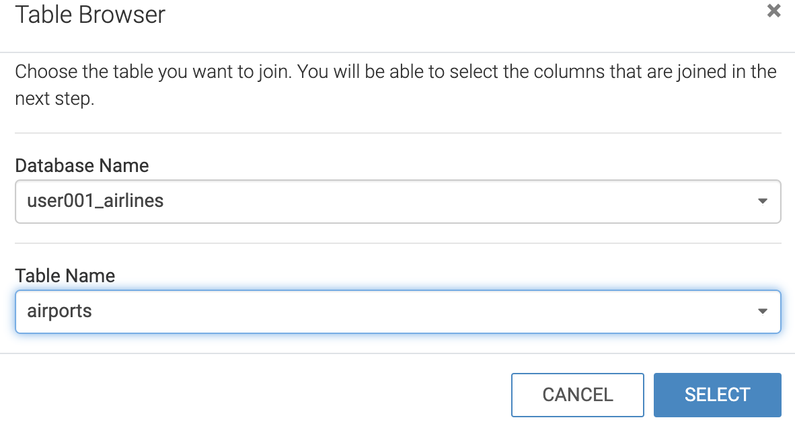

18. Click the  (JOIN) between `flights` and `airports_1` to see the join that was created

19. Click `EDIT JOIN` to modify the join

20. Select `dest` under `<user_id>_airlines.flights` and `iata` under `airports_1`, then click the `APPLY` button.

    

  - The final Data Model will look like the following

      

21. Click on the `SHOW DATA` button to preview the data that will be returned by the model created so far

    

22. Click on the SAVE button

### Modify Fields

1. Click on `Fields` in the left navigation menu

    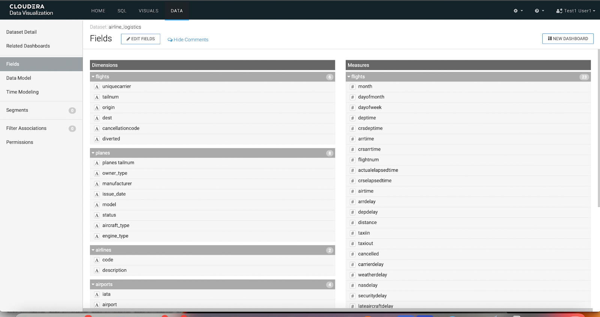

2. Click on the `EDIT FIELDS` button; you will see this new toolbar

    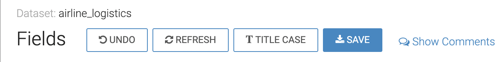

3. Click on the `TITLE CASE` button to format the display names of the fields

4. Click on the `Mes` button next to `Month` under the **Measures** section, changing the field to a Dimension (Dim).

    

    - Each Field is assigned a Category (Measure or Dimension). This is important because the type is used when creating visuals.

    - CDV will use the data type to determine this Category. Make sure that Fields fall into the correct Category. This is important because this is used when creating visuals.

    - The way to look at choosing the Category is to use this simple method - if you need to Aggregate (sum, average, etc.) then the Field should be a Measure. The quickest way to change the Category is to use the toggle

5. Click on the `Mes` button next to the following Fields under the **Measures** section:

    - Under `Measures` > `flights`

      - Dayofmonth
      - Dayofweek
      - Deptime
      - Crsdeptime
      - Arrtime
      - Crsarrtime
      - Flightnum
      - Year

    - All Fields under `Measures` > `planes`

    - All Fields under `Measures` > `airports`

    - All Fields under `Measures` > `airports_1`

  - **Note:** Normally, we would make sure that all Fields fall into the correct Category, instead let’s move ahead

### Edit a Field

1. Click the pencil icon next to `Depdelay` under the **Measures** section to edit the field

2. Change the **Display Name** to `Dep Delay` and change the **Default Aggregation** to `Average`

    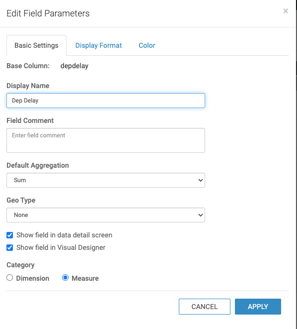

3. Click on the **Display Format** tab

4. Select a **Category** of `Integer` and check the `Use 1000 separator` checkbox

    

5. Click `APPLY` button to save the changes

### Add a New Field

1. Click the down arrow next to `Origin` and select `Clone` to clone the `Origin` field.

    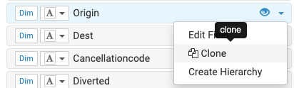

2. Click the pencil icon next to `Clone of Origin` to edit the field

3. Change **Display Name** to `Route`

4. Click on the **Expression** tab and enter the following into the **Expression** window

    ```
    concat([Origin], '-', [Dest])
    ```

    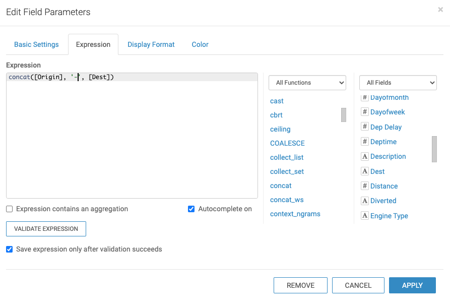

5. Click the `APPLY` button

    - Since the `Save expression only after validation succeeds` is checked, the Field will first be validated to ensure there are no errors; then, if it is valid, it will be saved.

6. Click the `SAVE` button

### Create Dashboard

1. Click on the `NEW DASHBOARD` button in the top right corner. 

    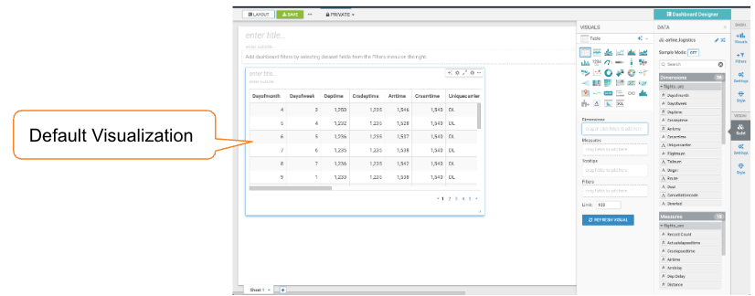

    Quick Overview of the **New Dashboard* interface

    - On the right side of the screen there will be a `VISUALS` menu.
    
    - At the top of this menu, there is a series of `Visual Types` to choose from (30+ visuals).
    
    - Below the `Visual Types`, you will see what are called ***Shelves***.
    
      - The Shelves that are present depend on the Visual Type that is selected.
      
      - Shelves with a `*` are required, while all other Shelves are optional.
      
    - On the far right of the page there is a `DATA` menu, which identifies the Connection & Dataset used for this visual.
    
    - Underneath the DATA menu are the Fields from the Dataset broken down by Dimensions and Measures.
    
      - With each of these Categories, you can see that it is subdivided by each Table in the Dataset.

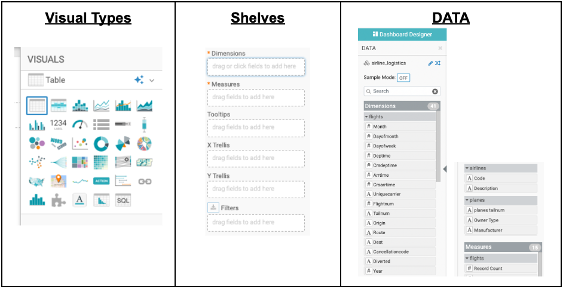

### 1st Visual - Top 25 Routes by Avg Departure Delay

  - There are there certain flight routes with excessive delays

  - CDV will add a Table visual displaying a sample of the data from the Dataset as the default visualization when you create a new Dashboard or new Visuals on the Dashboard (see New Dashboard screen above). The next step is to modify (Edit) the default visualization to suit your needs.  
    
1. Choose the **Visual Type** by selecting the `Stacked Bar chart` visual

    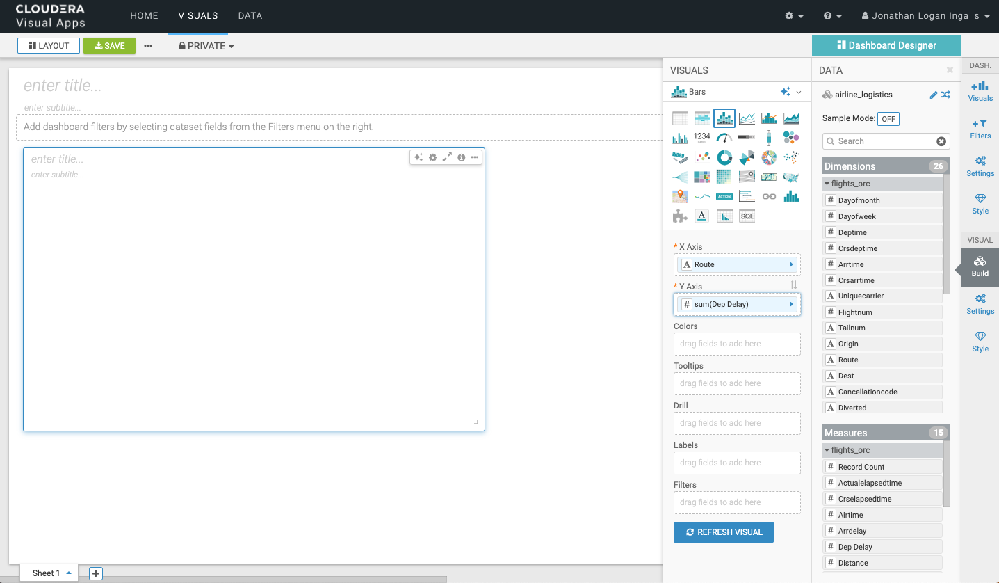

2. Edit the Shelves

  - There are two (2) ways to add items to a Shelf. You will use both here. 
  - Note: For the remainder of this lab you can pick and choose which you use.

    

    

**Option 1:** Add Route to the X Axis

  - Click in the **X Axis Shelf** to select it

  - In the **DATA** menu,find `Route` under `Dimensions` > `flights`

**Option 2:** Add Dep Delay to the Y Axis

  - In the **DATA** menu, find `Dep Delay` under `Measures` > `flights``, then Drag & Drop this Field in the **Y Axis Shelf**

To summarize, the two (2) options for adding items to Shelves are:

  1. select Shelf and click to add Field, or
  2. Drag & Drop Field to Shelf

### Modify Properties for Dep Delay

1. Click on the `>` in the **Y Axis Shelf** to the right of `avg(Dep Delay)` to access the Properties for this Shelf

    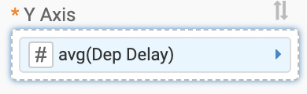

2. Click on the down arrow to the left of **Aggregates**.

    - In CDV you have control over any behavior
    
    - In the Dataset, we set the default aggregation for this Field to be `Average`; however, on any visual you can override this by changing it here. For now, leave this alone.

    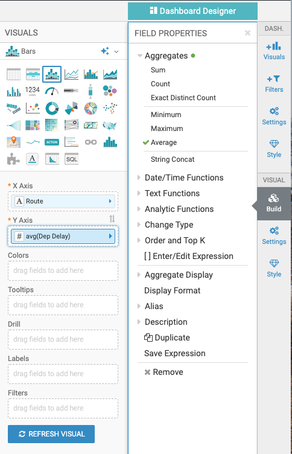

3. Click the down arrow to the left of `Order and Top K`

4. To show the 25 Routes with the highest **Average Dep Delay**, enter `25` into the box for **Top K**

    

5. Click the down arrow to the left of **Alias**

6. To change the display name for this Field, enter `Avg Dep Delay` into the **Alias** box.

    

  - The finished Y Axis Shelf should look like this

    

7. Click the 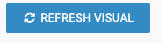 button to update the Visual

    

### Change Titles and Subtitles

1. Change the **Title** for the visual by clicking on `enter Title` above the chart and entering `Routes with Highest Avg Departure Delays`, then hit Enter

2. Change the **Subtitle** for the visual by clicking on `enter Subtitle` below the title and entering `In Minutes`, then hit Enter.

    

3. Change the **Title** for the dashboard by clicking on `enter Title` right below the top banner and entering `<user_id> Logistics Dashboard`

4. Change the **Subtitle** for the dashboard by clicking on the Subtitle and entering `CDW Workshop`

    

5. Click on the `SAVE` button to save this Dashboard

    - This Dashboard is now named `<user\_id> Logistics Dashboard`

### 2nd Visual - Relationship between flight Cancellation reason and Carrier

Are there Carriers or Reasons that need to be addressed?

1. Click on `+Visuals`

    - On the far right of the screen you will see the `DASH.` menu.
  
    - This menu allows you to add new visuals and change settings for the Dashboard or Visual such as formatting, style, and anything related to the presentation of the data.

      

2. Under **ADD VISUALS**, leave the 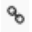 (Connection) as `<user_id>-airlines-lakehouse` and 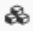 (Dataset) as airlines\_logistics.  

    - This will add a default visual to the canvas

    - Note: A Dashboard can have any number of connections and Datasets for various visuals on a Dashboard.

    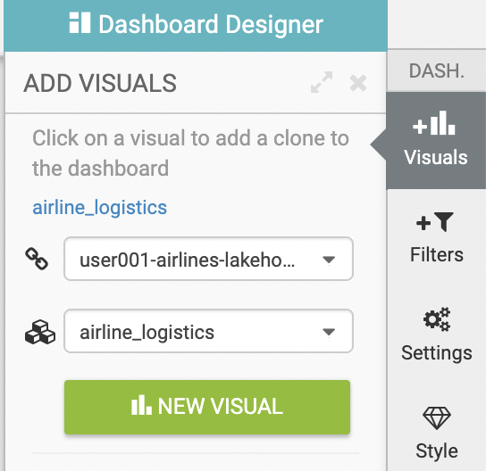

3. Click on the 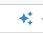 button next to the Table.

    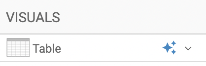

  - Instead of manually building this visual, we will use the Visual helper

    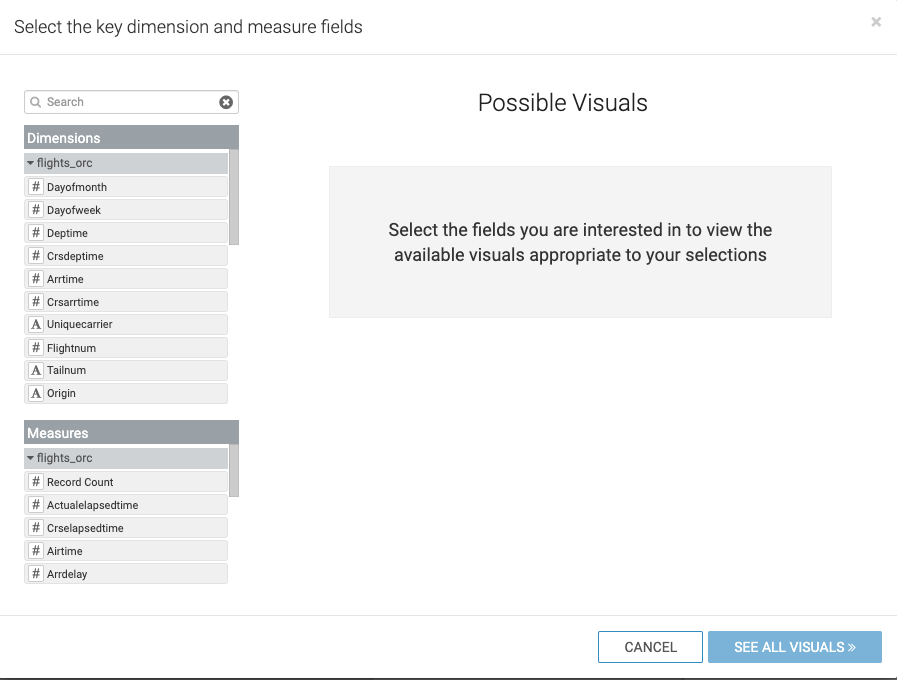

4. Select `Uniquecarrier` and `Cancellationcode` under **Dimensions**, and select `Cancelled` under **Measures**.

    - As you select items from the Fields you will see the Possible Visuals change - helping you quickly select the visual based on what you have selected.

    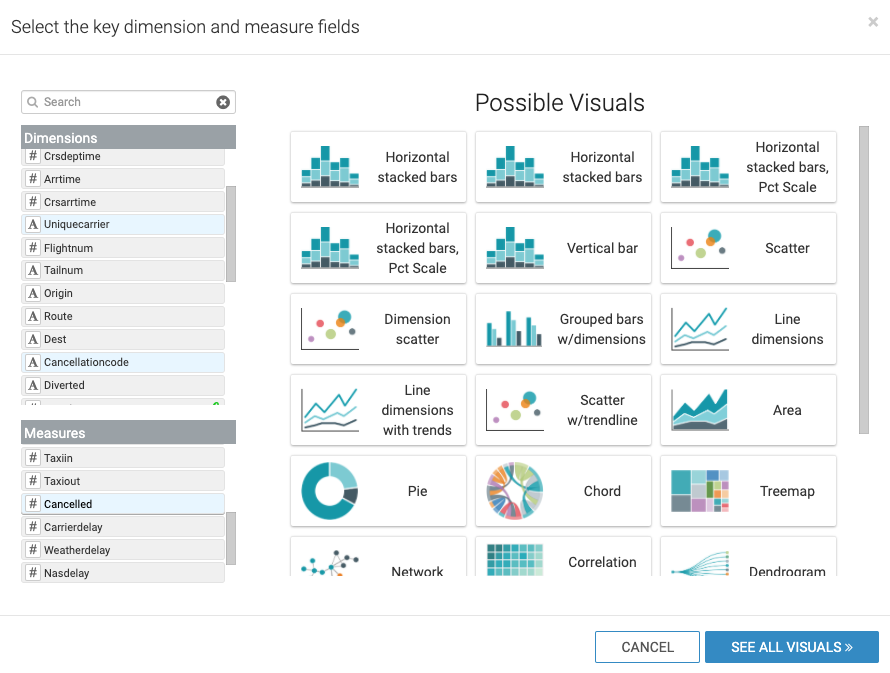

5. Click on `SEE ALL VISUALS>` button to preview the Possible Visuals with actual data plotted.

6. Click on the **Correlation flow** visual, then scroll thru until you see the Correlation flow visual tile

7. Drag & Drop `Cancelled` from **DATA** menu under `Measures` > `flights` to the Filter Shelf

    - There are several ways to apply filters to visuals within the Dashboard, this is one

    - When the dialog box comes up:

    

    - This will filter this chart to only return flights that have been cancelled and will not return any other data

8. Click the `REFRESH VISUAL` button

    

  - **NOTICE**: Since there is a security policy still in effect, you will only see `UA` showing up in this visual. To see all of the Carriers, you could disable the security Policy and Refresh the Visual.

9. Click 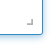 in the bottom right corner of the Correlation flow visual and drag it down to resize this chart to make it a bit larger

    

10. Click the `enter Title` and enter `Cancellation Correlation`, then hit Enter

11. Click the `SAVE` button to save the Dashboard

### Add prompts - Allow the Dashboard to be Sliced & Diced

This is another way to filter on multiple charts at the same time in your Dashboard

1. On the **DASH.** menu (far right), click on `+Filters` button

    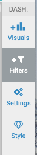

2. Click on `Engine Type` under `Dimensions` > `planes` to add this Field as a filter.

  - Typically, you could continue to select other Fields that you want to create Filters for and these will also be added.

    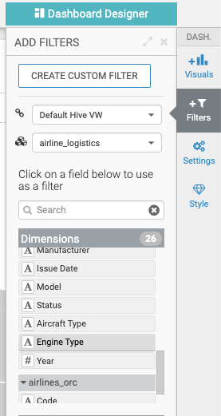

3. Click the drop down arrow next to **Engine Type** and select any value

  - The filter(s) are added to the Filter shelf for the Dashboard which is between the Dashboard Title and the Visuals you have been creating.
  
  - When you are selecting values from this Filter, the visuals will change to reflect information for just flights where this Engine Type was in the plane for the flight

    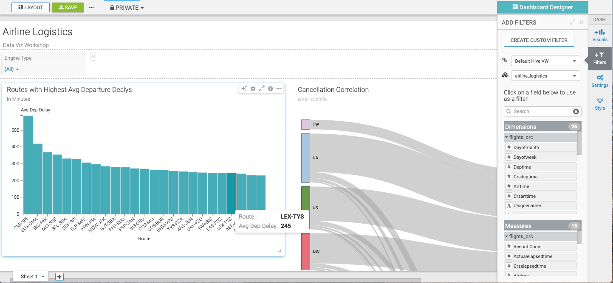

    

4. Click the `SAVE` button to save the Dashboard

### View the Dashboard from the Visuals Page [Optional]

1. Click `Visuals` in the top banner

  - Dashboards can be shared with other users, using Workspaces to organize and secure content that is created

  - Create Applications to combine multiple Dashboards, producing an application that allows users to make better decisions