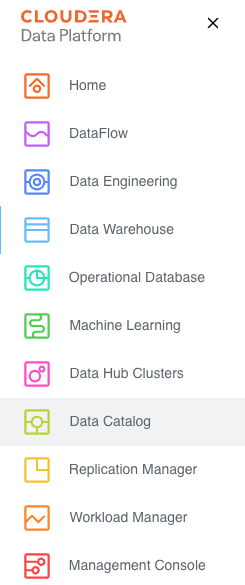
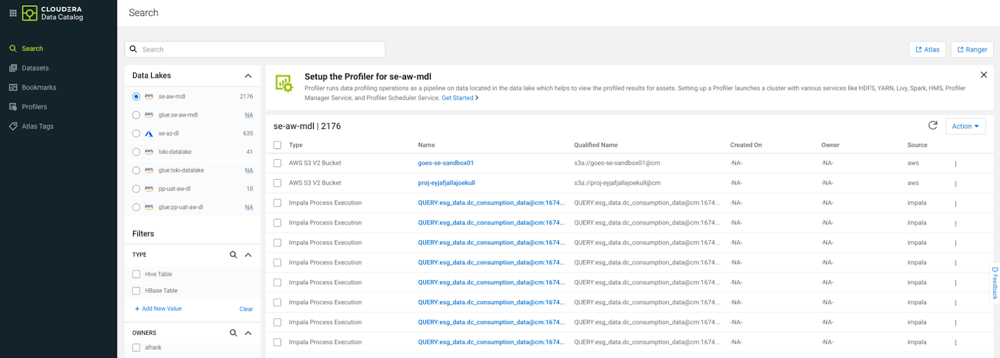
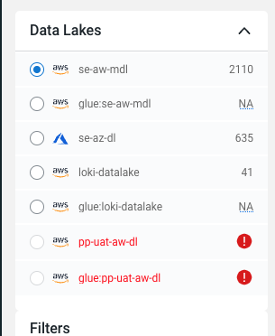
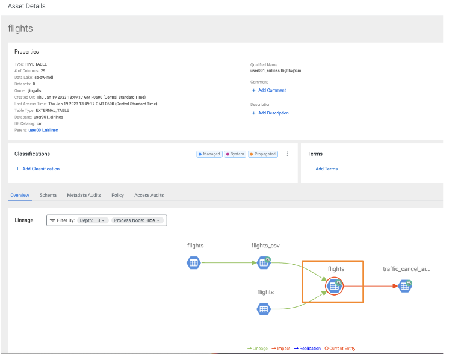
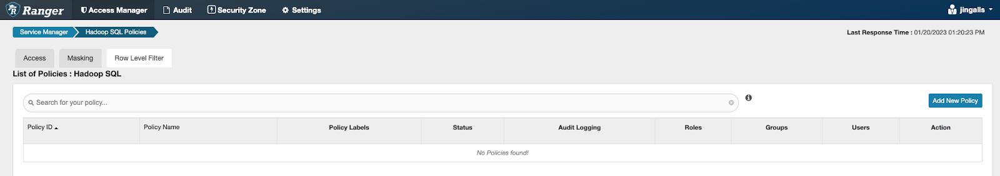
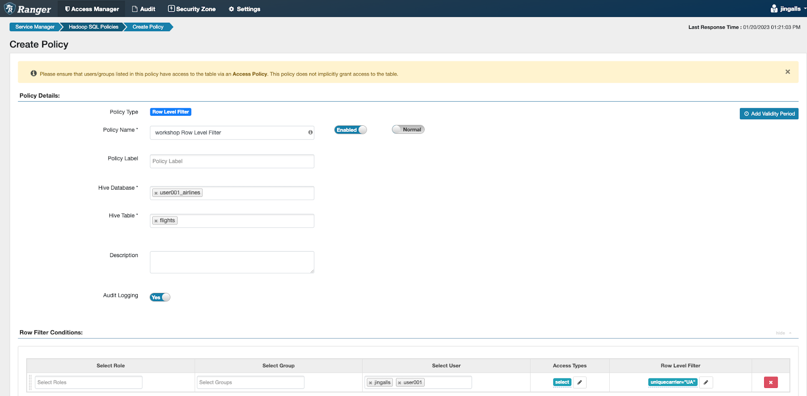
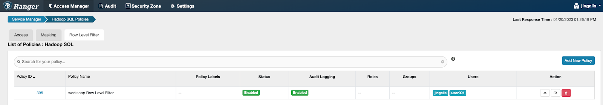
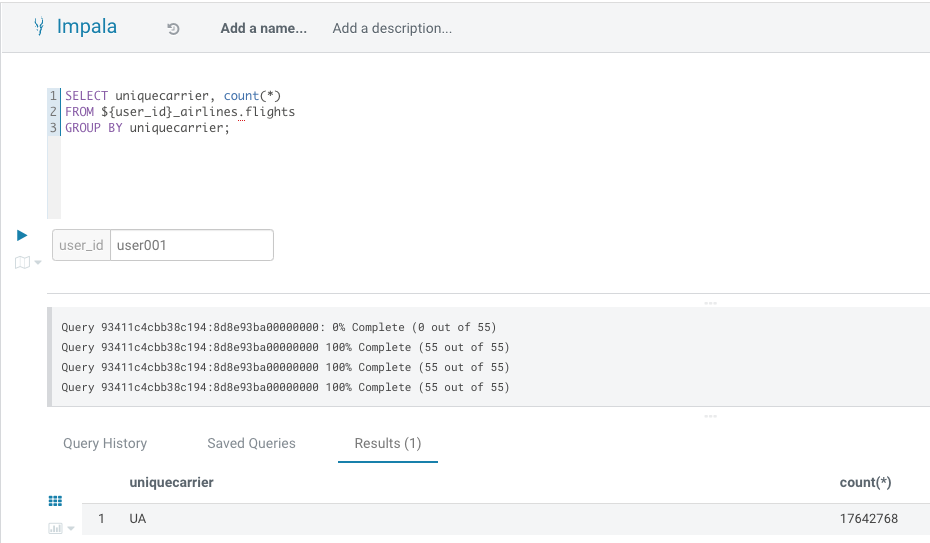

## Optional Lab 5 - Data Security & Governance 

In this lab, you will experience the combination of what the Data Warehouse and the Shared Data Experience (SDX) offers.  SDX enables you to provide Security and Governance tooling to ensure that you will be able to manage what is in the CDP Platform without having to stitch together multiple tools.

Robust Data Catalog (Governance) capability that:

- Enables you to understand, manage, secure, and govern data assets across

- Provides a 360-degree view of Assets - Lineage, Metadata, and Security Policy applied to the asset

  - There are many assets - everything created in CDP is captured as an Asset
  - For this Workshop we have been working with Assets, like - databases, views, tables, etc.

Powerful Security features like:

- Rule-based masking columns based on a user’s role 
- Group association or rule-based row filters
- Attribute-Based Access Control a.k.a. Tag-based security policies

### Data Catalog - Governance (Lineage, Metadata, etc.)

1. On the left navigation menu click the  next to Data Warehouse

 [](images/244.png)

2. Right-click on the Data Catalog and select the `Open Link in New Tab` option

    

3. Open the browser tab that just opened - the tab with `Data Catalog` in the tab title

    

4. To the left, under **Data Lakes**, ensure the Data Lake provided in Lab Setup radio button is selected

    

5. Filter for Assets we created - below the Data Lakes on the left of the screen under **Filters**, select a **TYPE** of `Hive Table`. The right side of the screen will update to reflect this selection.

    

6. Under **DATABASE**, click `+Add New Value`. In the box that appears start typing your `<user_id>` when you see the `<user_id>_airlines` database pop up, select it.

                              

7. You should now see the tables and materialized views that have been created in the `<user_id>_airlines` database. Click on flights under the **Name** column to view more details on the flights table.

    

8. This page shows information about the flights table such as: the table owner, when the table was created, when it was last accessed, and other properties. Below the summary details is the **Overview** tab which shows the lineage.

    - Hover over the flights click on the “i” icon that appears to see more detail on this table

    

    - The lineage shows 

        - **[blue box]** flights data file residing in an s3 folder
  
        - **[purple box]** is showing how the `flights_csv` Hive table is created, this table was created and points to the data location of flights’ (blue box) s3 folder 
  
        - **[orange box]** is showing the flights Iceberg table and how it is created, it uses data from flights\_csv Hive table (CTAS) 
        
    - `Traffic_cancel_airlines` is a Materialized View that uses data from the flights Iceberg table.

    

9. Click on the Schema Tab to see Metadata on this table. The Metadata includes basic information from the table such as column names and column data types. You can also run Profilers that come as part of CDP:

    - **Hive Table Profiler** - allows you to gather additional information from the table including Min/Max values in the column, # records with Null Values in a column, etc.

    - **Sensitivity Profiler** - identifies columns that may contain sensitive information such as PII data, SSN, credit card numbers, ID numbers, etc. These items will be “Tagged” in the Classification column of the Schema page.

    

10. Click on the Policy tab to see what security policies have been applied on this table.  There are 2 policies that have been defined to allow some users & groups access via policy “all - database, table, column” and another policy “all - database, table” access.

    - The Access Audits tab allows Administrators to be able to see who, when, where, why either accessed this table or was denied access to this table. Feel free to switch to this tab to take a look and switch back to the Policy tab.

    

11. Click on the  next to the “all - database, table” - to modify this policy or create a new policy

    

### Security (Ranger) - Modify and create security policies for the various CDP Data Services.

For this portion of the lab, we will restrict access to a subset of data available in the “flights” table.

1. View the Policy details and click the `CANCEL` button at the bottom.

    

2. Click on the Hadoop SQL link in the upper left corner - to view the security policies in place for CDW.  For this Workshop we will stick to the CDW related security features

    

3. This screen shows the general Access related security policies - who has access to which Data Lakehouse databases, tables, views, etc. Click on the **Row Level Filter** tab to see the policies to restrict access to portions of data.

    

4. There are currently no policies defined. Click on the `Add New Policy` button

    

5. Fill out the form as follows. For this policy, let’s say you are an Gate Agent for United Airlines and should not be able to see data for any other Airline. To setup the policy we need to apply a filter that is applied to any query that is run for your `<user\_id>` so you only see rows for flights run by United Airlines.

    - **Policy Name:** `<user_id> Workshop Row Level Filter`

    - **Hive Database:** `<user_id>_airlines` (Tip: Start typing; once you see this database in the list, select it)

    - **Hive Table:** flights (start typing, once you see this table in the list, select it)

    **Row Filter Conditions**

    - **Select User:** `<user_id>` (Tip: Start typing; once you see this user in the list, select it)
    
    - **Row Level Filter:** `uniquecarrier="UA"`
    
        - For this you could have any number of filter conditions (for this Lab we will only create 1) with many different filter configurations

    - Click the  button to accept this Policy

    

    - The new policy is added to the “Row Level Filter” policies (as below)

    

6. Test the policy is working. Open HUE for the CDW **Impala** Virtual Warehouse - airlines-impala-vw and execute the following query

    ```
    SELECT uniquecarrier, count(*)

    FROM ${user_id}_airlines.flights

    GROUP BY uniquecarrier;
    ```

    - You should now only see 1 row returned for this query - after the policy was applied you will only be able to access uniquecarrier = “UA” and no other carriers:

        