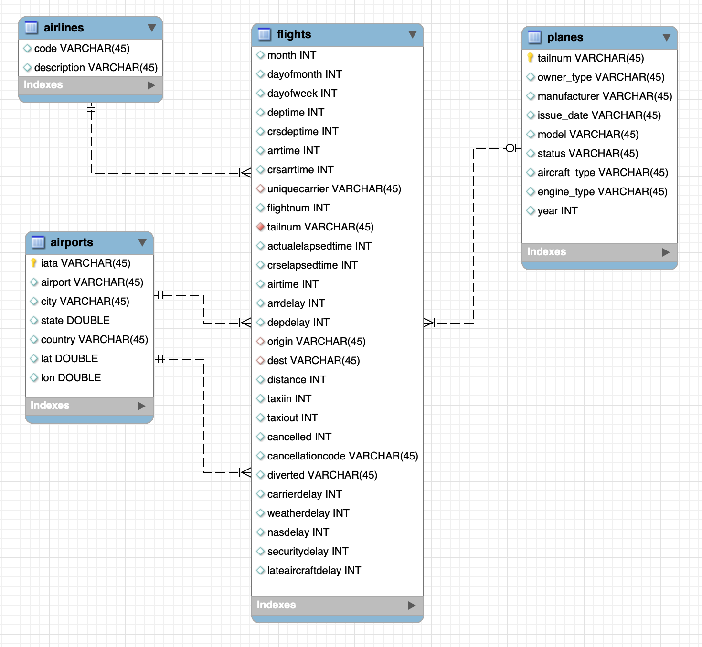

# cdw-2hrs2innovation-hol

## Cloudera Data Warehouse (CDW) - Open Data Lakehouse powered by Apache Iceberg

Cloudera Data Platform (CDP) 2 Hours to Innovation Hands On Lab for CDW featuring Iceberg

### Business Use Case

The following Labs will take you through a Self-Service Analytics example.  We will use a fictitious company named, Special Marketing Group (SMG).  A little company background on SMG is that they are a marketing data aggregator company that is currently working closely with Duty-Free Shops in many airports throughout the U.S. and 20+ countries.  SMG is working with the Duty-Free Shop owners on an initiative to drive additional revenue into the shops.  The duty-free shop owners want to partner with specific airlines to offer discounts through the airlines to their passengers who spend more time in an international terminal than warranted for their flight.

SMG believes that it can help drive more revenue by driving more traffic to the duty-free shops.  SMG realizes that they have some questions that need to be answered, such as:
   * Which airlines have the most passengers who have long layovers built into their tickets?
   * Which airlines have the most passengers who have delayed international legs in their itinerary causing an extended layover in their flight itinerary?
   * Which airlines have the most passengers who are displaced by a missed international connection, caused by a delay in their previous leg?

By answering these burning business questions SMG will be able to work with duty-free shop owners to develop campaigns that they can run to drive additional revenue.  Since, SMG also does quite a bit of business with many of the major airlines and believes that the analytics used to drive more revenue for duty-free shops could also help the airlines improve customer satisfaction during extended wait times, and duty-free shops can increase sales.

Our Labs today will walk through the steps to learn how SMG uses the power of Cloudera’s Data Warehouse Data Service to leverage the Self-Service capabilities to build out this new solution.  If/when the Business Analyst proves that this new data will work to solve the need, they can turn it over to the admin team to “productionalize” it.

**GET STARTED**
   * Preparatory work for us to get ourselves oriented in CDW and ready to build out the use case
   * Login to CDP
   * Learn a little about Cloudera Data Warehouse (CDW) Data Service

**SEE THE END RESULT (WHAT IS CREATED) (LAB 1)**
   * Explore the created Dashboard after it has been “productionalized”
      * Analyst first validates that the combination of data answers questions & builds initial Dashboard to start gaining insights on the data
      * Administrator picks up and formalizes the data ingestion for the new data, incorporates it into the Data Lakehouse, adds security, & completes the Dashboard

**BUSINESS ANALYST - SELF SERVICE TO VALIDATE NEW DATA ANSWERS QUESTIONS (LAB 2)**
   * Upload new data - passenger ticket manifest
      * See if new data can help to answer questions prior to undertaking a complete project
      * See how to upload data
   * Answer burning business questions to see if the new passenger data
      * Combine uploaded data with existing data warehouse
      * Start digging into the data - running a few queries to see if the new dataset can help with answering the burning questions
      * Visualize the data - modify existing Dashboard to add new content with the data just added

**ADMINISTRATOR - “PRODUCTIONALIZE” INTO OPEN DATA LAKEHOUSE (LAB 3)**
   * See “how the sausage was made” - how to take advantage of Apache Iceberg from end to end to deliver a modern Open Data Lakehouse solution
      * Migrate existing tables to Iceberg Table Format
      * Create a new Iceberg table
      * Load data
      * Some Key Features of Iceberg
         * Partition evolution
         * Time Travel
   * Monitor the Virtual Warehouses (compute) and watch as it scales up and down, suspends, etc.
   * Security & Governance before launching to the masses

**CONTINUE ON POST THIS WORKSHOP**

   Work with your Breakout SE to go thru these Labs after we wrap up

   * Cloudera Data Warehouse (CDW) Tour
   * “Make it Better” - Performance Improvements
      * Materialized Views - improve performance
      * Monitor, report, kill queries that run amuck, etc…
   * Develop Rich Visualizations for Analysts & Engineers to use insights - more on Cloudera Data Viz

## Introduction to the Lab Data

For the following Workshop Hands On Labs, we will dive into this Scenario to show Cloudera Data Warehouse (CDW) is used to enable SMG to gain a competitive advantage - and at the same time, it highlights the performance and automation capabilities that help ensure performance is maintained while controlling costs.

The Hands On Labs will take you through how to use the Cloudera Data Warehouse service to quickly explore raw data, create curated versions of the data for simple reporting and dashboarding, and then scale up usage of the curated data by exposing it to more users.

ER - Diagram of the demo Data Lakehouse: 

- **Fact table:** flights (86M rows) 
- **Dimension tables:** airlines (1.5k rows), airports (3.3k rows) and planes (5k rows)

Self Service data file - Passenger Ticket manifest: 

- This is a CSV file with 1,000 records
- Each record represents a unique Passenger Ticket with 2 Flight Legs
- It contains the following schema

ticketnumber BIGINT
leg1flightnum BIGINT
leg1uniquecarrier STRING
leg1origin STRING
leg1dest STRING\
leg1month BIGINT
leg1dayofmonth BIGINT
leg1dayofweek BIGINT
leg1deptime BIGINT
leg1arrtime BIGINT
leg2flightnum BIGINT
leg2uniquecarrier STRING
leg2origin STRING
leg2dest STRING
leg2month BIGINT
leg2dayofmonth BIGINT
leg2dayofweek BIGINT
leg2deptime BIGINT
leg2arrtime BIGINT

