
<strong>Cloudera Data Warehouse Workshop</strong> 

<strong>Self Service Hands On Lab</strong>

<strong>Index:</strong>

<a href="https://docs.google.com/document/d/1wdtnOMvqEpb0fl_7iXvd5UpBZYGOFGmz4cuC4638RrM/edit#heading=h.4co8bcuxf6kb"><strong>Business Use Case </strong><strong>3</strong></a>

<a href="https://docs.google.com/document/d/1wdtnOMvqEpb0fl_7iXvd5UpBZYGOFGmz4cuC4638RrM/edit#heading=h.okk6r21jjeq6"><strong>Introduction to the Lab Data </strong><strong>4</strong></a>

<a href="https://docs.google.com/document/d/1wdtnOMvqEpb0fl_7iXvd5UpBZYGOFGmz4cuC4638RrM/edit#heading=h.9l8xqeur7ve8"><strong>Lab Setup </strong><strong>6</strong></a>

<a href="https://docs.google.com/document/d/1wdtnOMvqEpb0fl_7iXvd5UpBZYGOFGmz4cuC4638RrM/edit#heading=h.ifhhblfnxp57"><strong>Get Started - Log into CDP </strong><strong>6</strong></a>

<a href="https://docs.google.com/document/d/1wdtnOMvqEpb0fl_7iXvd5UpBZYGOFGmz4cuC4638RrM/edit#heading=h.3b9y1a2qom3m"><strong>Lab 1 - Business Analyst: Explore Completed Dashboard </strong><strong>8</strong></a>

<a href="https://docs.google.com/document/d/1wdtnOMvqEpb0fl_7iXvd5UpBZYGOFGmz4cuC4638RrM/edit#heading=h.v7jbpz4a9fgo"><strong>Lab 2 - Business Analyst: Self Service (in CDW) </strong><strong>12</strong></a>

<a href="https://docs.google.com/document/d/1wdtnOMvqEpb0fl_7iXvd5UpBZYGOFGmz4cuC4638RrM/edit#heading=h.7eeugrot650n"><strong>Lab 3 - Administrator: “Productionalize” the Open Data Lakehouse </strong><strong>34</strong></a>

<a href="https://docs.google.com/document/d/1wdtnOMvqEpb0fl_7iXvd5UpBZYGOFGmz4cuC4638RrM/edit#heading=h.zbplwu9g5mrl"><strong>(Optional Bonus Material) </strong><strong>49</strong></a>

<a href="https://docs.google.com/document/d/1wdtnOMvqEpb0fl_7iXvd5UpBZYGOFGmz4cuC4638RrM/edit#heading=h.747qwikq91jm"><strong>Optional Lab 1 - CDW Tour </strong><strong>49</strong></a>

<a href="https://docs.google.com/document/d/1wdtnOMvqEpb0fl_7iXvd5UpBZYGOFGmz4cuC4638RrM/edit#heading=h.rt00z7rbmh9o"><strong>Optional Lab 2 - Self Service File Upload </strong><strong>50</strong></a>

<a href="https://docs.google.com/document/d/1wdtnOMvqEpb0fl_7iXvd5UpBZYGOFGmz4cuC4638RrM/edit#heading=h.cgofhkg5m9op"><strong>Optional Lab 3 - Performance Optimizations (Impala VW) </strong><strong>53</strong></a>

<a href="https://docs.google.com/document/d/1wdtnOMvqEpb0fl_7iXvd5UpBZYGOFGmz4cuC4638RrM/edit#heading=h.vq6ffohtl0n5"><strong>Optional Lab 4 - Data Visualization </strong><strong>57</strong></a>

<a href="https://docs.google.com/document/d/1wdtnOMvqEpb0fl_7iXvd5UpBZYGOFGmz4cuC4638RrM/edit#heading=h.oxmyi34wrz72"><strong>Optional Lab 5 - Data Security &amp; Governance </strong><strong>74</strong></a>

<a href="https://docs.google.com/document/d/1wdtnOMvqEpb0fl_7iXvd5UpBZYGOFGmz4cuC4638RrM/edit#heading=h.260favsmn54x"><strong>Optional Lab 6 - Iceberg Table Rollback </strong><strong>80</strong></a>

<h2></h2>
<h2></h2>
<h2>Business Use Case</h2>

The following Labs will take you through a Self-Service Analytics example.  We will use a fictitious company named, Special Marketing Group (SMG).  A little company background on SMG is that they are a marketing data aggregator company that is currently working closely with Duty-Free Shops in many airports throughout the U.S. and 20+ countries.  SMG is working with the Duty-Free Shop owners on an initiative to drive additional revenue into the shops.  The duty-free shop owners want to partner with specific airlines to offer discounts through the airlines to their passengers who spend more time in an international terminal than warranted for their flight.

SMG believes that it can help drive more revenue by driving more traffic to the duty-free shops.  SMG realizes that they have some questions that need to be answered, such as:

<ul>
<li>Which airlines have the most passengers who have long layovers built into their tickets?</li>
<li>Which airlines have the most passengers who have delayed international legs in their itinerary causing an extended layover in their flight itinerary?</li>
<li>Which airlines have the most passengers who are displaced by a missed international connection, caused by a delay in their previous leg?</li>
</ul>

By answering these burning business questions SMG will be able to work with duty-free shop owners to develop campaigns that they can run to drive additional revenue.  Since, SMG also does quite a bit of business with many of the major airlines and believes that the analytics used to drive more revenue for duty-free shops could also help the airlines improve customer satisfaction during extended wait times, and duty-free shops can increase sales.

Our Labs today will walk through the steps to learn how SMG uses the power of Cloudera’s Data Warehouse Data Service to leverage the Self-Service capabilities to build out this new solution.  If/when the Business Analyst proves that this new data will work to solve the need, they can turn it over to the admin team to “productionalize” it.

GET STARTED

<ul>
<li>Preparatory work for us to get ourselves oriented in CDW and ready to build out the use case</li>
<li>Login to CDP</li>
<li>Learn a little about Cloudera Data Warehouse (CDW) Data Service</li>
</ul>

SEE THE END RESULT (WHAT IS CREATED) (LAB 1)

<ul>
<li>

Explore the created Dashboard after it has been “productionalized”

</li>
<li>

Analyst first validates that the combination of data answers questions &amp; builds initial Dashboard to start gaining insights on the data

</li>
<li>Administrator picks up and formalizes the data ingestion for the new data, incorporates it into the Data Lakehouse, adds security, &amp; completes the Dashboard</li>
</ul>

BUSINESS ANALYST - SELF SERVICE TO VALIDATE NEW DATA ANSWERS QUESTIONS (LAB 2)

<ul>
<li>

Upload new data - passenger ticket manifest

</li>
<li>

See if new data can help to answer questions prior to undertaking a complete project

</li>
<li>

See how to upload data

</li>
<li>

Answer burning business questions to see if the new passenger data

</li>
<li>

Combine uploaded data with existing data warehouse

</li>
<li>Start digging into the data - running a few queries to see if the new dataset can help with answering the burning questions</li>
<li>Visualize the data - modify existing Dashboard to add new content with the data just added</li>
</ul>

ADMINISTRATOR - “PRODUCTIONALIZE” INTO OPEN DATA LAKEHOUSE (LAB 3)

<ul>
<li>

See “how the sausage was made” - how to take advantage of Apache Iceberg from end to end to deliver a modern Open Data Lakehouse solution

</li>
<li>

Migrate existing tables to Iceberg Table Format

</li>
<li>

Create a new Iceberg table

</li>
<li>

Load data

</li>
<li>

Some Key Features of Iceberg

<ul>
<li>Partition evolution</li>
<li>Time Travel</li>
</ul>
</li>
<li>

Monitor the Virtual Warehouses (compute) and watch as it scales up and down, suspends, etc.

</li>
<li>

Security &amp; Governance before launching to the masses

</li>
</ul>

CONTINUE ON POST THIS WORKSHOP

<em>Work with your Breakout SE to go thru these Labs after we wrap up</em>

<ul>
<li>

Cloudera Data Warehouse (CDW) Tour

</li>
<li>

“Make it Better” - Performance Improvements

</li>
<li>

Materialized Views - improve performance

</li>
<li>

Monitor, report, kill queries that run amuck, etc…

</li>
<li>

Develop Rich Visualizations for Analysts &amp; Engineers to use insights - more on Cloudera Data Viz

</li>
</ul>

<h2>Introduction to the Lab Data</h2>

For the following Workshop Hands On Labs, we will dive into this Scenario to show Cloudera Data Warehouse (CDW) is used to enable SMG to gain a competitive advantage - and at the same time, it highlights the performance and automation capabilities that help ensure performance is maintained while controlling costs.

The Hands On Labs will take you through how to use the Cloudera Data Warehouse service to quickly explore raw data, create curated versions of the data for simple reporting and dashboarding, and then scale up usage of the curated data by exposing it to more users.

ER - Diagram of the demo Data Lakehouse: 

<ul>
<li><strong>Fact table:</strong> flights (86M rows) </li>
<li><strong>Dimension tables:</strong> airlines (1.5k rows), airports (3.3k rows) and planes (5k rows)</li>
</ul>

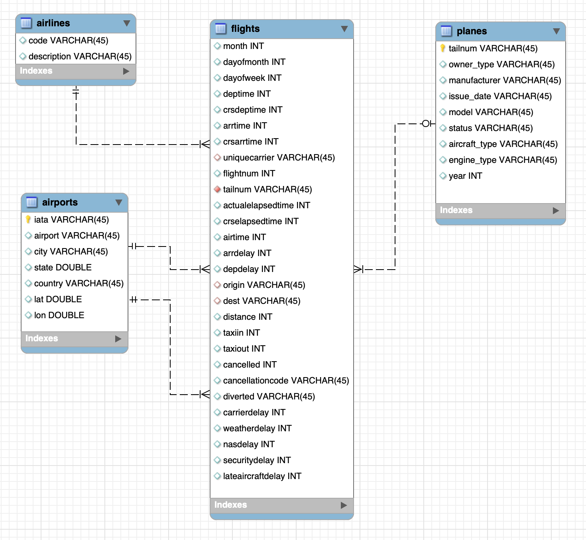

Self Service data file - Passenger Ticket manifest: 

<ul>
<li>This is a CSV file with 1,000 records</li>
<li>Each record represents a unique Passenger Ticket with 2 Flight Legs</li>
<li>It contains the following schema</li>
</ul>

ticketnumber BIGINT

leg1flightnum BIGINT

leg1uniquecarrier STRING

leg1origin STRING

leg1dest STRING\
leg1month BIGINT

leg1dayofmonth BIGINT

leg1dayofweek BIGINT

leg1deptime BIGINT

leg1arrtime BIGINT

leg2flightnum BIGINT

leg2uniquecarrier STRING

leg2origin STRING

leg2dest STRING

leg2month BIGINT

leg2dayofmonth BIGINT

leg2dayofweek BIGINT

leg2deptime BIGINT

leg2arrtime BIGINT

<h2>Lab Setup</h2>

Workshop Attendees will be provided with a Login.  Please enter your details below for reference throughout these lab exercises.

<ul>
<li>

Lab Group #: ________________ (this will be your breakout room number)

</li>
<li>

You will use this to replace the “<strong>#</strong>” within the lab exercises with the number you enter here

</li>
<li>

URL: _____________________________________ 

</li>
<li>

Use Incognito Browser window

</li>
<li>

Login: 

</li>
<li>

<strong>User:</strong> _____________________________________

</li>
<li><strong>Password:</strong> _____________________________________</li>
</ul>

In the labs when you see:

<ul>
<li>${user_id} or \<user\_id> - this will indicate to use your User (Workload User) provided for you to login to CDP</li>
<li>${bucket} - this will indicate to use the bucket provided to you</li>
</ul>
<h2>Get Started - Log into CDP</h2>

In this Lab you will login to CDP and complete your user setup.

<ol>
<li>

Log in to CDP - open a browser and open the URL from the Lab Setup section

</li>
<li>

When prompted use the Login details from the Lab Setup section for the User/PW

</li>
<li>

On the HOME page of CDP you will see all of the Services available to you

</li>
</ol>

<ul>
<li>

Multi-function analytics - Data Services; today we’ll just focus on the Cloudera Data Warehouse Data Service

</li>
<li>

There are other Data Services that usually are part of an Analytic use case 

</li>
<li>

Data Flow - for data ingestion needs

</li>
<li>Data Engineering - for ELT/ETL, transformations, data wrangling, etc.</li>
<li>

Machine Learning - for Data Science teams to collaboratively build and productionalize ML/AI applications and models for the Enterprise

</li>
<li>

However, Cloudera provides other services such as Data Catalog, Replication Manager, Workload Manager, and Management Console provide continuity and functionality throughout the platform.

</li>
</ul>

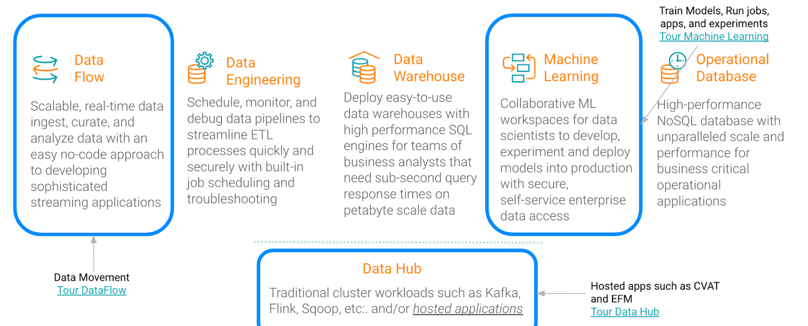

Note: The platform removes the necessity to spend unnecessarily on integration tax, where other solutions combine various pieces together in the ability to provide continuity and functionality throughout an end-to-end use case but this is difficult because it introduces many moving parts.

<h2></h2>
<h2>Lab 1 - Business Analyst: Explore Completed Dashboard</h2>

In this Lab you will explore the Dashboard that will be created as the result of the Self-Service Labs you will complete shortly.

<ol>
<li>

Open Cloudera Data Visualization, which is part of the Cloudera Data Warehouse Data Service

</li>
<li>

First let’s open Cloudera Data Warehouse (CDW) - 

<ul>
<li>Click on the Cloudera Data Warehouse (CDW) tile</li>
</ul>
</li>
</ol>

<ul>
<li>We’ll come back to this screen in Lab 2 for more details</li>
</ul>

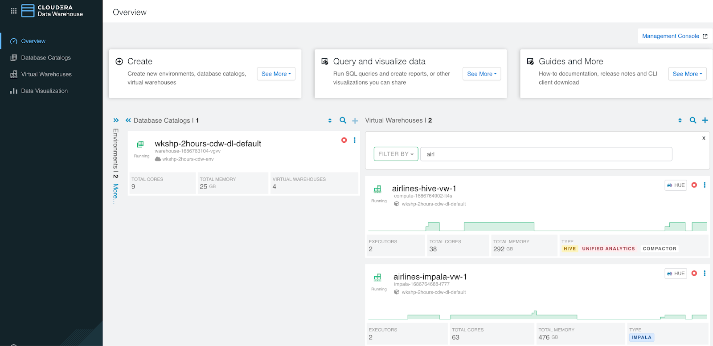

<ul>
<li>

Now let’s open Cloudera Data Visualization (CDV) - to explore the finished product

</li>
<li>

Open Cloudera Data Visualization (CDV or Data Viz)

<ul>
<li>On the left navigation panel click “Data Visualization” - this will open a new browser tab</li>
<li>On the row with <strong>airlines-dataviz-#</strong>, to the right, click the Data VIZ button</li>
</ul>
</li>
</ul>

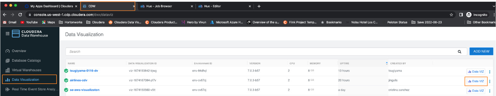

<ul>
<li>If you see the “What’s New” page, you can read it, or click on the GOT IT button</li>
</ul>
<!---->

<ul>
<li>Cloudera Data Visualization (CDV) Home page</li>
</ul>

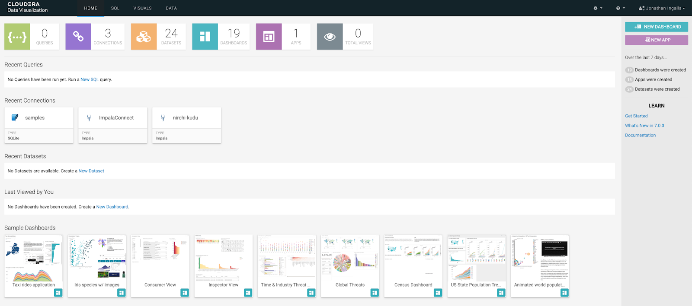

<ul>
<li>

There are 4 areas of CDV - HOME, SQL, VISUALS, DATA - these are the tabs at the top of the screen in the black bar to the right of the Cloudera Data Visualization banner

</li>
<li>

HOME - this is the starting point; it shows some statistics at the top, followed by some quick access details to recent content - Queries, Connections, Datasets, and Dashboards

</li>
<li>SQL - allows you to manually build queries against data to perform quick discovery against the data.  Below is an example of a query that was built and Run</li>
</ul>

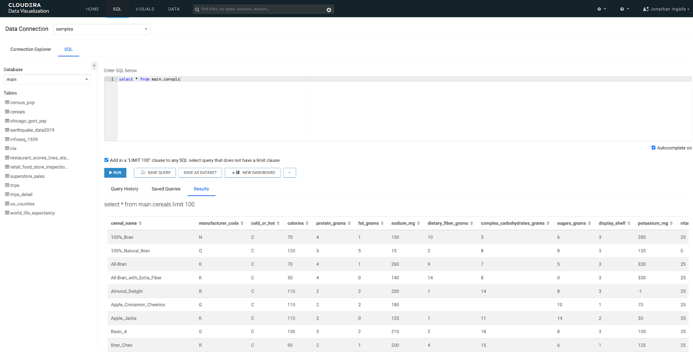

<ul>
<li>VISUALS - an area for viewing/building/modifying visuals, dashboards, and applications</li>
</ul>

<ul>
<li>DATA - interface for access to datasets (aka: metadata model) image below, connections, and the Connection Explorer</li>
</ul>

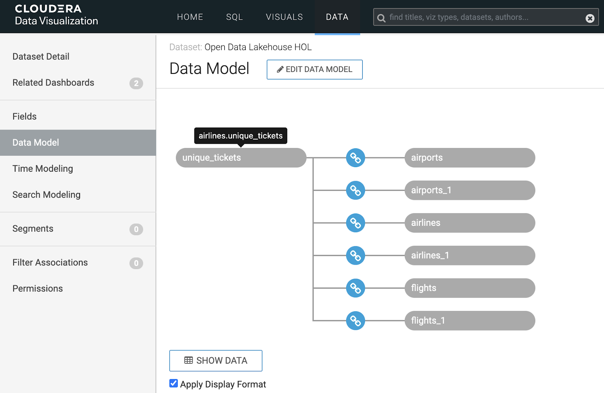

<ul>
<li>Click on the VISUALS tab at the top of the screen (in black banner)</li>
</ul>

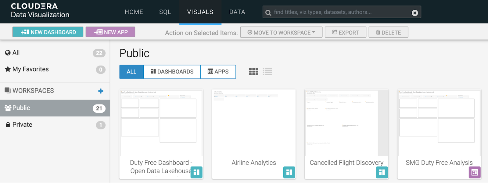

<ul>
<li>On the left side of the page make sure you have the All or Public Workspace selected</li>
</ul>
<!---->

<ul>
<li>

Click on the tile “SMG Duty Free Analysis” to open the Application (in the bottom right of the tile you will see a purple  icon  identifying an Application)

</li>
<li>

Click the drop-down arrow next to the “Planned Layover” prompt and change it from “All Passengers” to “30+ Minutes” - since the initial questions SMG was interested in pursuing were related to passengers with “Long” planned layovers - select “90+ Minutes”.

</li>
<li>

Next, click the drop-down arrow next to “Connection Airport” - Select a few of the Airports that are interested in this new business program

<ul>
<li>Scroll (or search) and click the checkbox next to - ATL, LGA, and ORD</li>
<li>Each time you select another query is being executed against the Open Data Lakehouse database tables - shows the performance of Apache Iceberg</li>
</ul>
</li>
<li>

From these filters (prompt selections) you gain considerable insights - look at the “Planned Layovers Greater than 90 Minutes by Carrier” visual and the answer to the question seems clear as to “Which Carriers should we partner?”.

</li>
</ul>

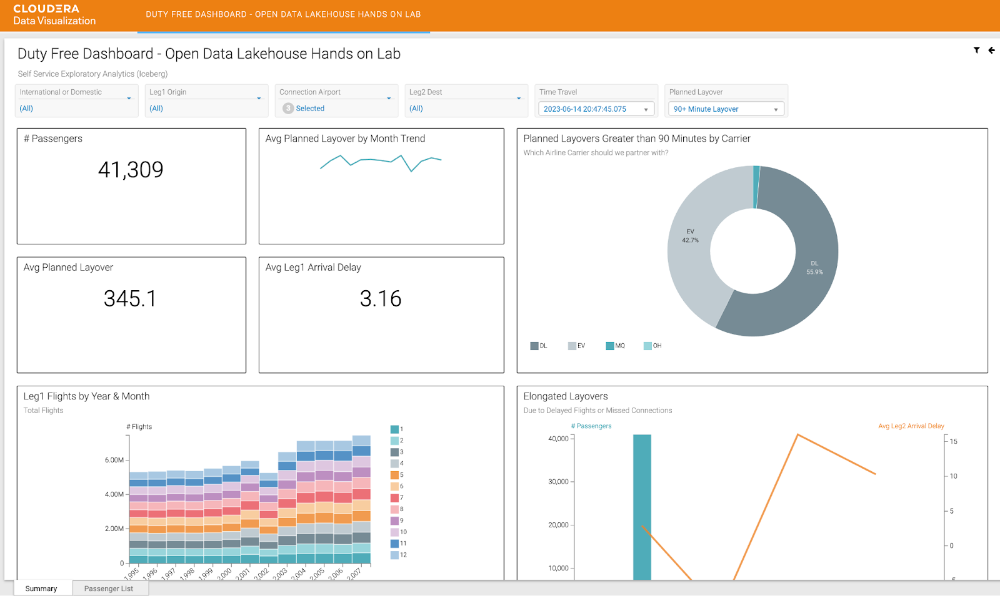

<ul>
<li>From this you can see what Airlines (Carriers) that we could partner with due to Long Planned Layovers and see that Delta Airlines (DL) &amp; Atlantic Southeast (EV) have combined planned layovers  for over 95% of Passengers with Planned Layovers of over 90 minutes</li>
</ul>
<!---->

<ul>
<li>What if I wanted to see the flight details from a previous data load?  Click the drop-down arrow below “Time Travel” and select the middle value.  You will see the chart titled “Leg1 Flights by Year &amp; Month”.</li>
</ul>

Before:   

After (no 2008):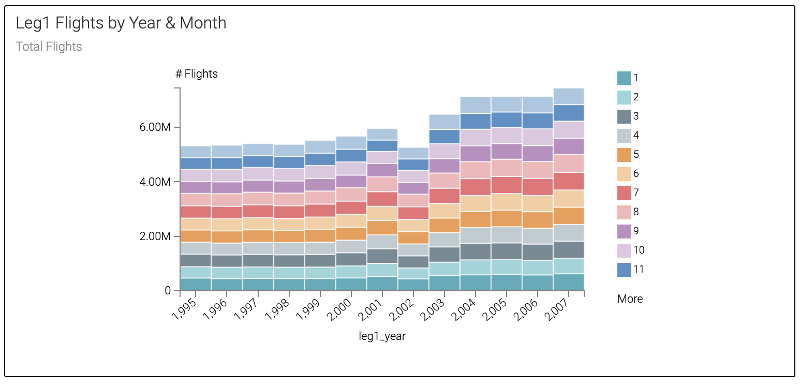

<ul>
<li>You’ll see that after you make the selection, you should see the stacked bar for year 2008 is removed from the visual.  Meaning this data was not yet loaded at the selected point in time.</li>
<li>You’ve just performed your first <strong><em>Time Travel</em></strong> without even knowing.  Time Travel is a key feature of Apache Iceberg.</li>
</ul>
<!---->

<ul>
<li>

Please go on to the next lab but feel free if you have time to leave this tab open and come back to explore more if you have time after completing the remaining labs.

</li>
<li>

You could do something like the following:

<ul>
<li>

At the bottom of the page click on the Passenger List page - now that we’ve filtered the data to a specific target set of Passengers that can be sent an offer, I’d like to take a look at the list of passengers who would be sent an offer.

</li>
<li>

Filter the list of passengers based on Layover Type - select the drop-down under “Elongated Layover Type” and select “Missed Connection”

</li>
<li>

Click on the checkbox next to “Exclude Selected”.  This will exclude those passengers who have missed their connection.  

<ul>
<li>For the Duty Free owner, this may not be a good target, so you might want to exclude them from the offer.  However, for partnering with the Airline, this might be something we could use to improve customer satisfaction for these 24 passengers and auto rebook these passengers for instance.</li>
</ul>
</li>
</ul>
</li>
</ul>

<h2>Lab 2 - Business Analyst: Self Service (in CDW)</h2>

In this Lab you will take advantage of the Self Service capabilities within CDW to upload a data file and combine it with an existing Data Lakehouse.  You will then perform analytics (SQL &amp; Visualizations) on the combined data to ensure that the burning business questions can first be answered before “productionalizing” the new data source.

<ol>
<li>

Navigate back to CDW Overview

</li>
<li>

Click on the browser tab where CDW is open - 

</li>
<li>Click on Overview in the left navigation</li>
</ol>

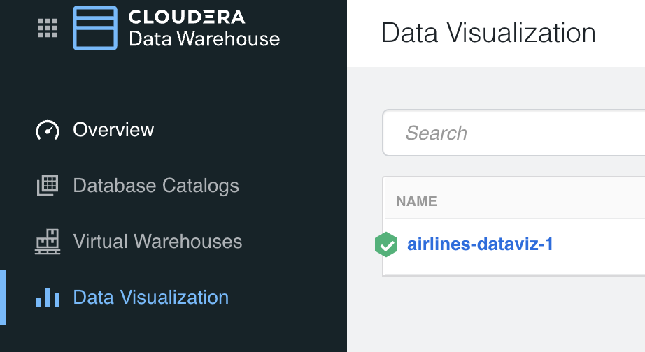

<ol>
<li>The following is a quick explanation of the CDW User Experience so that you have a basic knowledge of the data service.  The CDW Data Service allows you to create independent, self-service data warehouses and data marts that autoscale up and down to meet your varying workload demands. It provides isolated compute instances for each data warehouse/mart, has built-in automatic optimization, and ultimately enables you to meet SLAs - at the same time save costs.</li>
</ol>

<ul>
<li>

There are 2 areas on this screen - Database Catalogs (DBC), and Virtual Warehouses (VW), for today’s lab, we will just concentrate on Virtual Warehouses or VW for short

</li>
<li>

Database Catalogs (DBC) - is a logical collection of table and view metadata, security permissions, and other information.  As you create databases, tables, views, etc. in the Data Warehouse, it collects the metadata.  When you activate an Environment for CDW, the CDW service will automatically create a default DBC associated with this Environment.

<ul>
<li>DBCs are in the middle column</li>
</ul>
</li>
</ul>

<ul>
<li>Virtual Warehouses (VW) - is a set of compute resources running in Kubernetes to execute the queries.  This is something that can allow for Self Service capabilities or can be controlled by Administrators.  A VW binds compute and storage to execute secured queries that access tables and views of your data via the DBC.  A VW can scale automatically to ensure performance even with high concurrency, and can auto-scale down in situations of low demand.  Tools that access data via JDBC/ODBC can connect to VWs to run queries</li>
</ul>

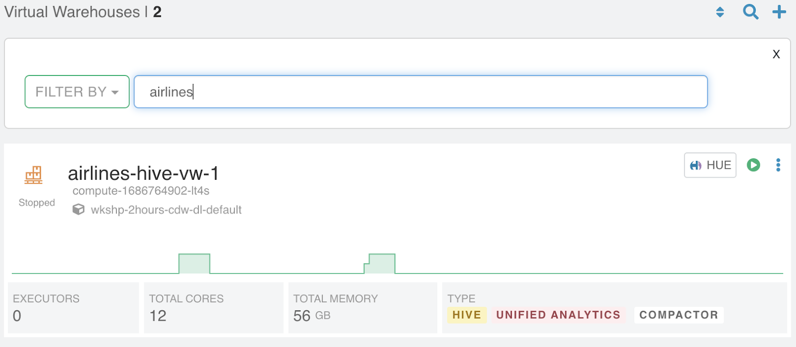

<ul>
<li>See options available for a VW - click on the 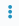 button on the top right corner of tile airlines-hive-vw-# </li>
</ul>

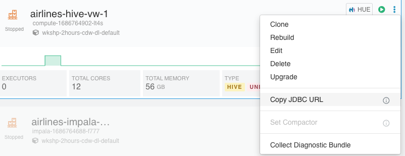

The list of options will vary slightly depending on whether this is a Hive or Impala VW.  This is also where you would go to get the JDBC URL and Driver to use to connect your Business Intelligence software to this VW, and when a new version is released you could Upgrade this VW to the latest release without having to upgrade all VWs at the same time. 

<ul>
<li>

<strong><em>Click on the airlines-hive-vw-# tile</em></strong> -  this will highlight the Environment and DBCs that are associated with this VW.  In fact when you click on any tile within any column, it will do the same thing by showing you what it is related to, for easy understanding of the interdependence of these items.

</li>
<li>

These tiles will display information about current workload on a VW.  Below you will see items indicating when a VW is idle and has auto scaled so nothing is running for this VW; and where the VW needed to auto-scale up to handle incoming SQL requests handling concurrency

</li>
</ul>

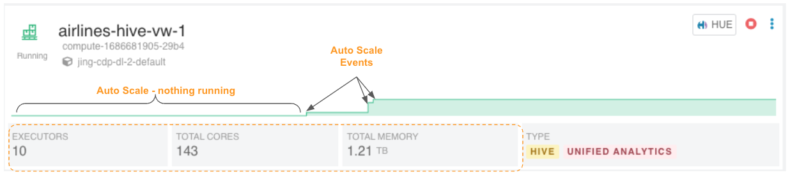

<ul>
<li><strong><em>Click on the airlines-hive-vw-# tile</em></strong> - In the upper right corner click on the HUE button to enter into the SQL Editor</li>
</ul>

<ol>
<li>

Explore the Data Lakehouse

</li>
<li>

You will be using HUE for the <strong><em>airlines-hive-vw-# Virtual Warehouse</em></strong> until you get to Step 13

</li>
</ol>

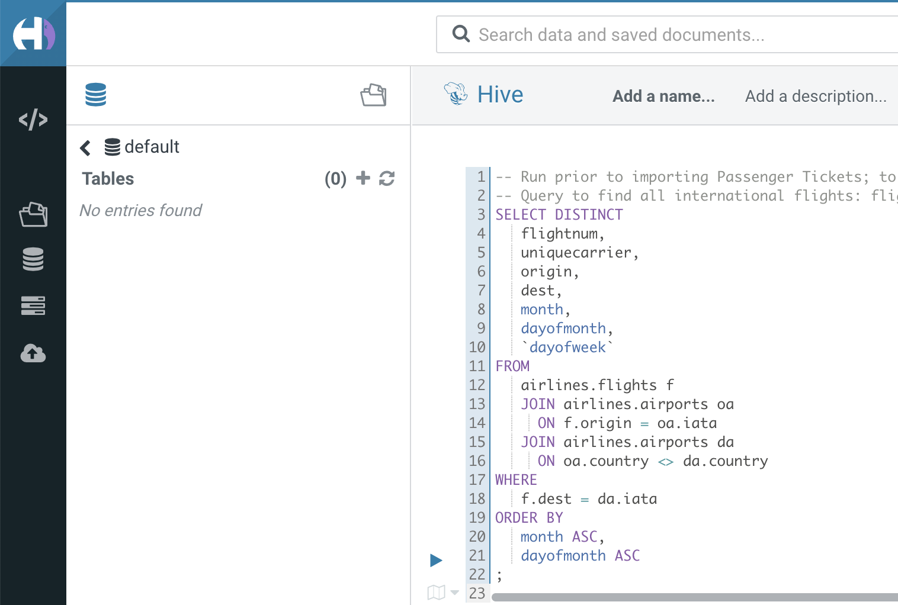

<ul>
<li>Copy &amp; paste the following SQL into the query Editor window</li>
</ul>

|                                                                                                                                                                                                                                                                                                                                                                                                                                                                                                                                                        |
| ------------------------------------------------------------------------------------------------------------------------------------------------------------------------------------------------------------------------------------------------------------------------------------------------------------------------------------------------------------------------------------------------------------------------------------------------------------------------------------------------------------------------------------------------------ |
| -- Run prior to importing Passenger Tickets; to ensure correct access and that everything is good to go-- Query to find all international flights: flights where destination airport country is not the same as origin airport countrySELECT DISTINCT    flightnum,    uniquecarrier,    origin,    dest,    month,    dayofmonth,    `dayofweek`FROM    airlines.flights f    JOIN airlines.airports oa ON f.origin = oa.iata   JOIN airlines.airports da ON oa.country &lt;&gt; da.countryWHERE f.dest = da.iata ORDER BY   month ASC, dayofmonth ASC  ; |

<ul>
<li>

Click on the to the bottom left of the SQL window to run this SQL command to test and ensure you have access to the Data Lakehouse

</li>
<li>

You should see the something similar to the following in the Results tab

</li>
</ul>

<ul>
<li>

This validates that you have the correct permissions via the SDX security to access the Data Lakehouse

</li>
<li>

Upload Passenger Ticket data file - <strong><em>already completed</em></strong> for you and shown as part of the main presentation

</li>
<li>

If you’d like to give it a try this can be found in the Post Lab section - work with your Breakout Room moderator to set up time.

</li>
<li>Below are some images that highlight the 3 steps to upload this file: 1) Open the Importer, 2) Pick a file &amp; options for the file upload, 3) Name the table, specify table options, and provide the table metadata (column names, data types, etc.)</li>
</ul>

1) 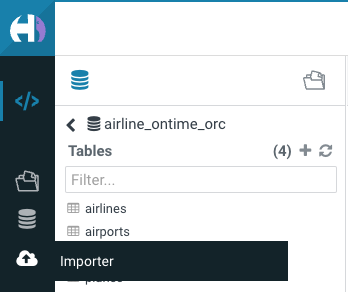    2) 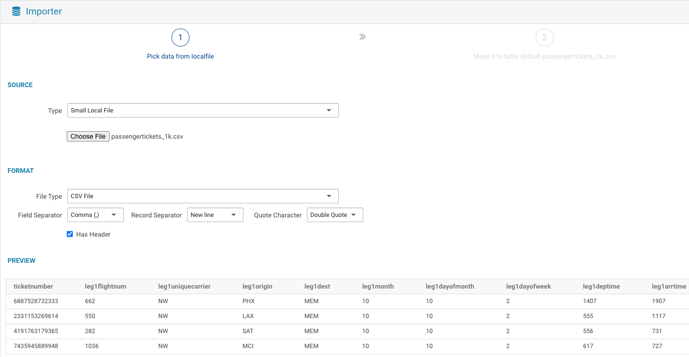  

3) 

<ul>
<li>

Since the data is already uploaded we will use the table <strong>airlines.unique_tickets_1k</strong> 

</li>
<li>

Explore the Data Lakehouse and Passenger Tickets (unique_tickets) data to see if it can answer the burning questions.  The Data Analyst can use a SQL Editor to perform this task by executing queries against this data.

</li>
<li>

Delete the current query from the SQL Window

</li>
<li>Copy &amp; paste the following SQL into the SQL Editor window</li>
</ul>
<!---->

<pre><code>-- Run after Uploading the Passenger Tickets data to see if we can answer the "burning questions" to support Duty Free Stores

-- Number of passengers on the airline that have long, planned layovers for a flight (good target to send promotion to)

SELECT

   a.leg1uniquecarrier as carrier,

   count(a.leg1uniquecarrier) as passengers

FROM

   airlines.unique_tickets_1k a

where

   a.leg2deptime - a.leg1arrtime &gt; 90

group by

   a.leg1uniquecarrier

;
</code></pre>
<ul>
<li>

Execute the Query by clicking on the  button

</li>
<li>

Review the output to see the number of passenger with a long planned layover (&gt; 90 minutes) by Airline Carrier - one of the questions we wanted to answer

</li>
</ul>

<ul>
<li>Delete the current query from the SQL Window</li>
<li>Copy &amp; paste the following SQL into the SQL Editor window</li>
</ul>
<!---->

<pre><code>-- Number of passengers on airlines that have elongated layovers for a flight caused by delayed connection (potential customer satisfaction issue)

SELECT

   a.leg1uniquecarrier as carrier,

   count(a.leg1uniquecarrier) as passengers

FROM

   airlines.unique_tickets_1k a

   JOIN airlines.flights o

     ON a.leg1flightnum = o.flightnum

        AND a.leg1uniquecarrier = o.uniquecarrier

        AND a.leg1origin = o.origin

        AND a.leg1dest = o.dest

        AND a.leg1month = o.month

        AND a.leg1dayofmonth = o.dayofmonth

        AND a.leg1dayofweek = o.`dayofweek`

   JOIN airlines.flights d

     ON a.leg2flightnum = d.flightnum

        AND a.leg2uniquecarrier = d.uniquecarrier

        AND a.leg2origin = d.origin

        AND a.leg2dest = d.dest

        AND a.leg2month = d.month

        AND a.leg2dayofmonth = d.dayofmonth

        AND a.leg2dayofweek = d.`dayofweek`

WHERE o.depdelay &gt; 60

group by

   a.leg1uniquecarrier

;
</code></pre>
<ul>
<li>

Execute the Query by clicking on the  button

</li>
<li>

Review the output to see that we can answer another burning question

</li>
</ul>

<ul>
<li>Note: this query combines both Hive table format (unique_tickets_1k) with Iceberg table format (flights).  Allows you to migrate to Iceberg over time</li>
</ul>
<!---->

<ul>
<li>

Now that we’ve validated that we can answer the business questions, it’s time to visualize the data to see the insights we can gain from combining this data

</li>
<li>

Visualize the Data Lakehouse and Passenger Ticket data to gain insights and communicate what we are trying to accomplish with the Admin team.

</li>
<li>

Click on the browser tab where CDV is open - 

</li>
<li>

To create visualization in Cloudera Data Visualization (CDV), the Business Analyst would have to do the following:

<ul>
<li>Create a Dataset (aka: Metadata Layer or Data Model) that will join the uploaded Passenger Tickets (unique_tickets_1k) table with the existing Data Lakehouse tables</li>
<li>Create Visualizations create visuals that present information so that users can gain insights to make better decisions.  A single Dashboard can have any number of visuals on it.</li>
<li>Make the Visualization available to the appropriate stakeholders - by default Dashboards will first be created and edited in the user’s “Private” Workspace.  Once the Dashboard is ready, it is move to a Workspace that the appropriate users can view and interact with the Dashboard(s)</li>
</ul>
</li>
<li>

Create a Dataset (Metadata Layer)

<ul>
<li>The first step is to create a Metadata layer that joins the Data Lakehouse tables and Passenger Tickets table (unique_tickets_1k).  To do this we’ll create what we call a Dataset.</li>
<li>On the top banner click on the DATA tab</li>
</ul>
</li>
</ul>

<ul>
<li>Make sure the “Airlines Open Data Lakehouse” connection on the left navigation menu is selected</li>
</ul>

<ul>
<li>

For today’s labs we’ll fast forward to a Dataset that has already been created to save time. 

</li>
<li>

<strong><em>If you’d like to go through this process, please work with your Breakout Room Moderator to schedule time to walk through the Lab in the Optional Lab section</em></strong>

</li>
<li>

Click on “Lab 2 Self Service Open Data Lakehouse” to open the Dataset that was already created

</li>
</ul>

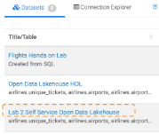

<ul>
<li>Dataset Detail page - provides information about this Metadata Model, such as the connection, tables referenced, option settings, and date information (created/updated).  Where you see the pencil icon, indicates that you can make changes.</li>
</ul>

<ul>
<li>Clone Dataset - click the CLONE DATASET button at the top of the page</li>
</ul>

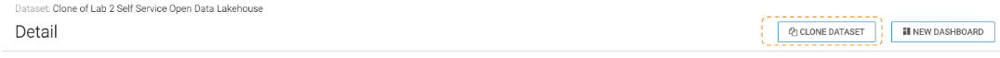

<ul>
<li>Click the to the right of Dataset to Rename this Dataset</li>
</ul>

<ul>
<li>Replace the “Clone of” with “<strong>\<user-id></strong>“ (use your user id in place of \<user-id>)</li>
</ul>

<ul>
<li>Click the SAVE button</li>
<li>You now have created your own copy of the Dataset that can now be modified for today’s lab</li>
</ul>
<!---->

<ul>
<li>Data Model - click on Data Model in the left navigation menu to what tables are in this Dataset</li>
</ul>

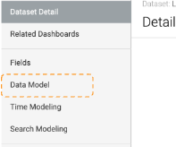

Shows the tables, and relationships between tables in this Dataset

Tables are dark gray and relationships (joins) are identified by the blue 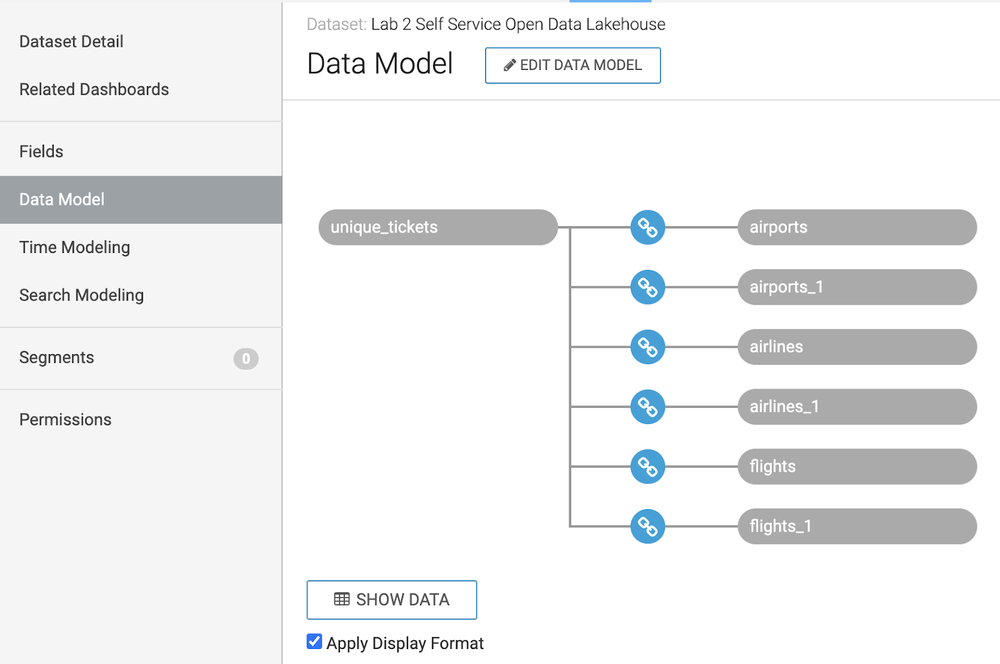

<ul>
<li>In this Data Model you can see that the unique_tickets table has already been joined to several other tables that are part of the Data Lakehouse (airports, airlines, flights, etc), but there is one more relationship that needs to be defined for this to be complete - we need to get the Leg2 Airline Carrier details</li>
</ul>
<!---->

<ul>
<li>Click the EDIT DATA MODEL button at the top of this page</li>
</ul>

<ul>
<li>Click the “+” in the gray oval to the right of unique_tickets - to add a table join</li>
<li>Click the drop down below Database Name and select “airlines”</li>
<li>Click the drop down below Table Name and select the “airlines” table</li>
</ul>

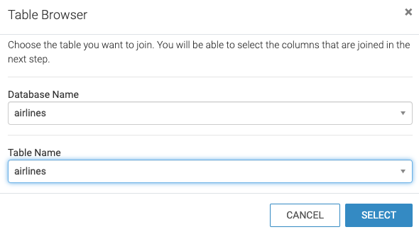

<ul>
<li>Click on the SELECT button to add this table</li>
</ul>
<!---->

<ul>
<li>You will be presented with the Edit Join definition window (if not click thebutton between unique_tickets &amp; airlines_1)</li>
</ul>

<ul>
<li>Click the drop down below airlines.unique_tickets and select leg2uniquecarrier</li>
<li>Click the drop down below airlines_1 and select code</li>
</ul>

<ul>
<li>Click the APPLY button</li>
</ul>
<!---->

<ul>
<li>This will create a join between the unique_tickets table and the airlines table in your user database.</li>
</ul>

<ul>
<li>To view or edit the join that was created click on  between unique_tickets and airlines (at the bottom) Source/Target column </li>
</ul>

This will show the join type and allow you to make changes.  You can see by default it created a Left outer join which you can change by selecting any of the other types such as Inner, Outer, or Right.  This Join is exactly what we need, so no need to make any changes

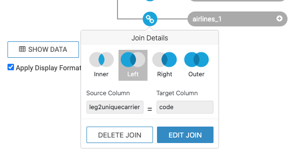

<ul>
<li>Click on the SHOW DATA button to see a preview of the data - this will run a query to combine the data from our Data Lakehouse with the data we uploaded to make sure that the data looks good.  Scroll to the right to look at all of the data from each table, and scroll down to see more data</li>
</ul>

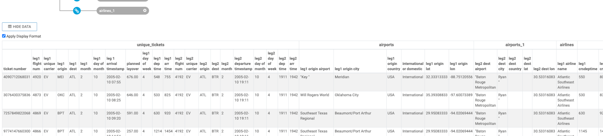

<ul>
<li>At the top of the page click the SAVE button</li>
</ul>
<!---->

<ul>
<li>Fields - on the left navigation menu select Fields</li>
</ul>

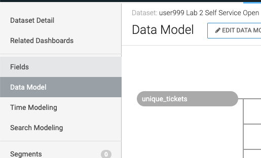

<ul>
<li>Click the EDIT FIELDS button at the top of the page</li>
</ul>

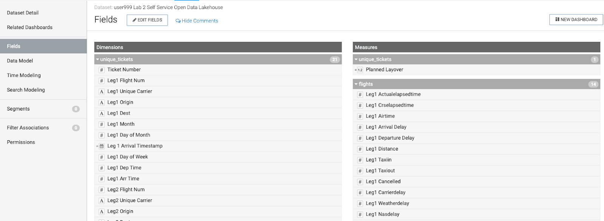

<ul>
<li>Under Dimensions - scroll down to the airlines_1 header</li>
</ul>

This is what was added from adding the airlines.airlines table to this Dataset.  From here we can apply business rules and context to this Dataset.

<ul>
<li>

Rename a Field - Description to Leg2 Airline Carrier

</li>
<li>

Click on the button to the right of Description

</li>
</ul>

<ul>
<li>In the Display Name text box change this to Leg2 Airline Carrier</li>
</ul>

<ul>
<li>Click the APPLY button</li>
</ul>
<!---->

<ul>
<li>

Hide a Field

</li>
<li>

The airlines_1 code is the same values as the leg2uniquecarrier field, so no need to have this twice

</li>
<li>Click the  and select Hide</li>
</ul>

<ul>
<li>Select Hide</li>
<li>The airlines_1 section should look like this</li>
</ul>

<ul>
<li>

Click the SAVE button at the top of the page

</li>
<li>

There is so much more you can do with a Dataset, including adding calculated fields, assigning default aggregations, apply formatting, and strong data types to help with building visualizations quickly.

</li>
</ul>
<!---->

<ul>
<li>Create a Dashboard - click the NEW DASHBOARD button in the top right corner</li>
</ul>

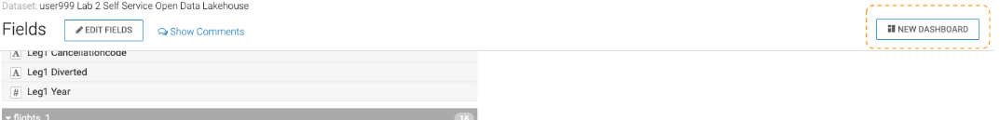

<ul>
<li>This will automatically build a default visual for you like this</li>
</ul>

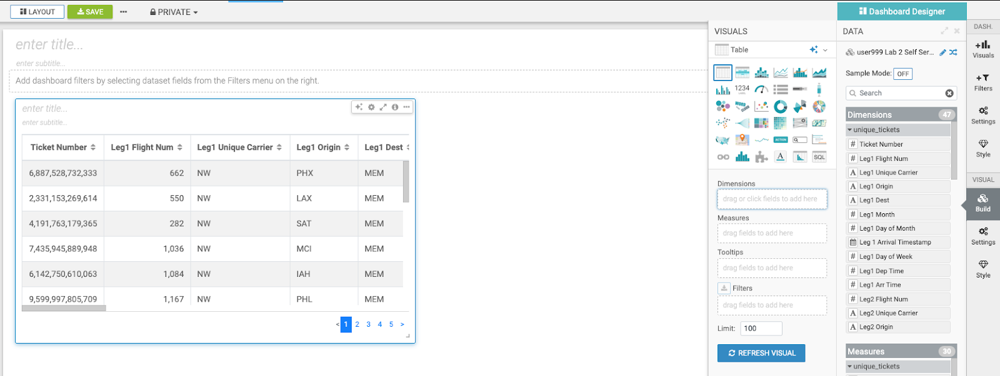

<ul>
<li>

Let’s change this to answer one of the burning questions - which airline carrier should we partner with

</li>
<li>

Toward the right of the screen under VISUALS and select the Pie Chart visual (3rd row in the middle)

</li>
</ul>

<ul>
<li>

Under VISUALS click on the box under Dimensions - this is called a Shelf.  To add items to a Shelf you can drag and drop or in this case select it from the far right of the screen from the Dataset we just created

</li>
<li>

On the far right of the screen under DATA click on Leg1 Unique Carrier

</li>
</ul>

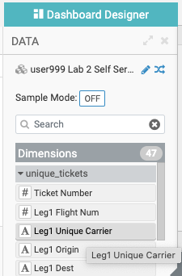

<ul>
<li>This will add this to the Dimension Shelf</li>
</ul>

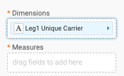

<ul>
<li>On the far right of the screen, drag &amp; drop Record Count from under DATA &gt; Measures &gt; unique_tickets to the box below Measures</li>
</ul>

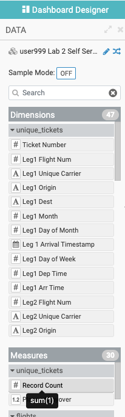

<ul>
<li>It should look like the following screen.  This will combine data from the unique_tickets table (file upload) and the existing Data Lakehouse to display the number of passengers by each Airline</li>
</ul>

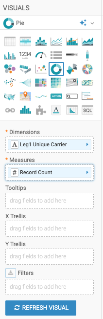

<ul>
<li>Click the REFRESH VISUAL button</li>
</ul>
<!---->

<ul>
<li>On the left of the screen the visual is updated to this</li>
</ul>

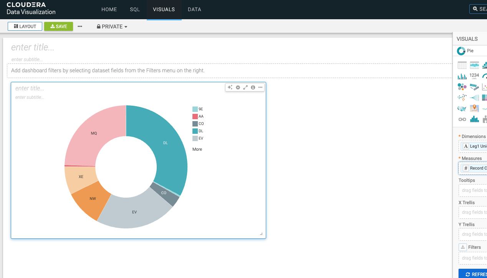

<ul>
<li>Add a title to the chart by clicking on “enter title…” above the chart.  Change it to “Airlines to Partner” and press enter</li>
</ul>

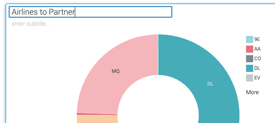

<ul>
<li>Add a title (name) for the Dashboard - at the top of the visualization click on “enter title…”</li>
</ul>

<ul>
<li>Type in “<strong>\<user-id></strong> Self Service Dashboard“ (replace \<user-id> with your user id) and press enter</li>
</ul>

<ul>
<li>Press the SAVE button at the top of the Dashboard - you have now created a Dashboard combining the uploaded data and the existing Data Lakehouse</li>
<li>Click on the VISUALS tab at the top of the page</li>
</ul>

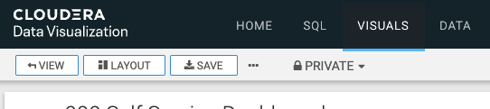

<ul>
<li>On the right of the screen make sure you have Private selected to see the Dashboard you just created</li>
</ul>

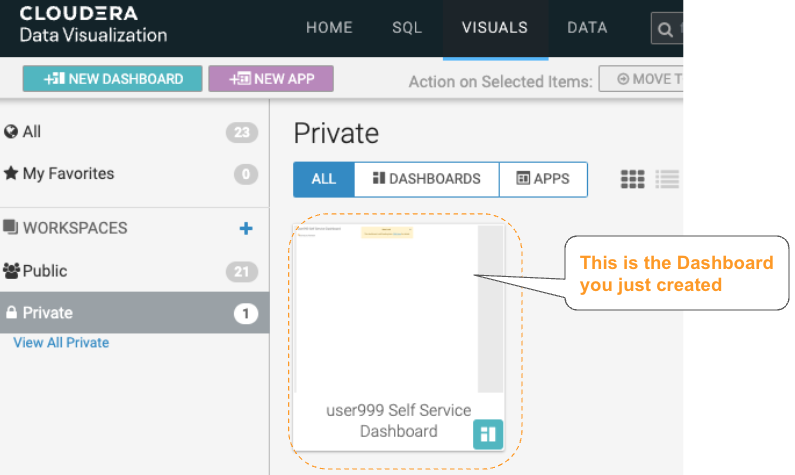

<strong><em>[OPTIONAL]</em></strong>

<ul>
<li>

Add another Visual to the Dashboard you just created  using Natural Language Search

</li>
<li>

Instead of having to create a visual manually let’s take a look at another way to add visuals.  Using Natural Language Search to create visuals and then add them to Dashboards eliminates the step to manually configure a visual and allows users to do this in a much more simplified way

</li>
<li>Click on the SEARCH button in the top right corner of the banner</li>
</ul>

<ul>
<li>

For this I’d like to see which Airports have the highest number of flights this year and I’m interested in the visual being displayed on a Map of some sorts.  For this let’s

</li>
<li>

In the Search box start entering - Flights by “Origin Lat” and “Origin Lon”

</li>
</ul>

<ul>
<li>You’ll see below will show some helpful details to help with finishing your search.  Under Flights select the entry - Flights by “Origin Lat” and “Origin Lon” as Interactive Map this year</li>
</ul>

This visualization shows what was asked for.  From here you can continue to change what is displayed, Bookmark it to share or return to, or just continue on.

<ul>
<li>This is displaying what I was interested in and this would be a good addition to the Dashboard.</li>
<li>In the top right corner of the visual - click on thebutton and select Add to Dashboard </li>
</ul>

<ul>
<li>Click on “<strong>\<user-id></strong> Lab 2 Self Service Open Data Lakehouse” to expand this section (for \<user-id> look for your user id)</li>
</ul>

<ul>
<li>Click on the Dashboard you previously created</li>
</ul>

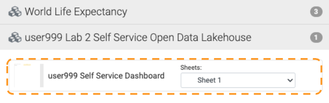

<ul>
<li>You should get a message indicating that this visualization was added to your dashboard</li>
</ul>
<!---->

<ul>
<li>Click on the CLOSE button in the bottom right corner of the Search window</li>
</ul>
<!---->

<ul>
<li>

Now let’s view the updated Dashboard 

</li>
<li>

Click on the “\<user-id> Self Service Dashboard” tile

</li>
</ul>

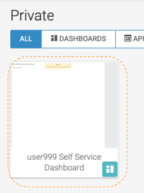

<ul>
<li>You should now see the following - we just now asked a question and created a Dashboard from it</li>
</ul>

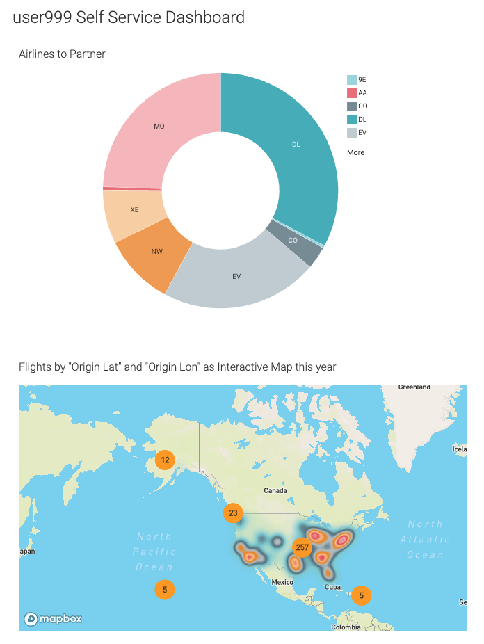

<h2>Lab 3 - Administrator: “Productionalize” the Open Data Lakehouse</h2>

In this Lab you will be an Administrator and will use CDW to create and build an Open Data Lakehouse and take advantage of some of the key features with this approach.

Execute the following SQL/DDL/DML statements.

<ol>
<li>

Stay in HUE for the CDW <strong>Hive</strong> Virtual Warehouse - <strong>airlines-hive-vw-#</strong>

<ul>
<li>

There should be an open CDW Browser tab, open the browser tab

</li>
<li>

Create a user Database to store all of the tables you will create in the following lab steps

</li>
<li>

In the SQL Editor window create a database for the remaining lab exercises, execute the following.

<ul>
<li>Delete the current query from the SQL Window</li>
<li>Copy &amp; paste the SQL below</li>
</ul>
</li>
</ul>
</li>
</ol>
<!---->

<pre><code>CREATE DATABASE ${user_id}_airlines;
</code></pre>
<ul>
<li>The “${...}” notation is a hint to HUE to create a parameter.  As you copy/paste in this you will  see that HUE determined that there is a parameter that needs to be entered.</li>
<li>In the “user_id” parameter box, enter your user id (see Lab Setup section)</li>
</ul>

<ul>
<li>Execute the Query by clicking on the  button</li>
</ul>
<!---->

<ul>
<li>

Check to see if the Database was created

</li>
<li>

Delete the current query from the SQL Window

</li>
<li>Copy &amp; paste the SQL below</li>
</ul>
<!---->

<pre><code>SHOW DATABASES;
</code></pre>
<ul>
<li>Execute the Query by clicking on the  button to see that the database was created</li>
</ul>

|                                                                                                |
| ---------------------------------------------------------------------------------------------- |
| <strong>Results</strong><code>DATABASE_NAME``…``user001_airlines``…``&lt;user_id&gt;_airlines``…``user100_airlines``…</code> |

There may be many databases, scroll &amp; look for the one that starts with your \<user\_id>

<ul>
<li>Let’s simulate existing tables in our Data Lakehouse</li>
</ul>
<!---->

<ul>
<li>Create planes table in <em>Hive Table Format</em>, stored in Parquet file format</li>
</ul>
<!---->

<ul>
<li>Delete the current query from the SQL Window</li>
<li>Copy &amp; paste the SQL below</li>
</ul>
<!---->

<pre><code>-- CREATE HIVE TABLE FORMAT STORED AS PARQUET

drop table if exists ${user_id}_airlines.planes;

CREATE EXTERNAL TABLE ${user_id}_airlines.planes (

  tailnum STRING, owner_type STRING, manufacturer STRING, issue_date STRING,

  model STRING, status STRING, aircraft_type STRING,  engine_type STRING, year INT

)

STORED AS PARQUET

TBLPROPERTIES ('external.table.purge'='true');

INSERT INTO ${user_id}_airlines.planes

  SELECT * FROM airlines_csv.planes_csv;
</code></pre>
<ul>
<li>Select all of the content in the SQL Editor</li>
<li>Execute the Query by clicking on the  button</li>
</ul>

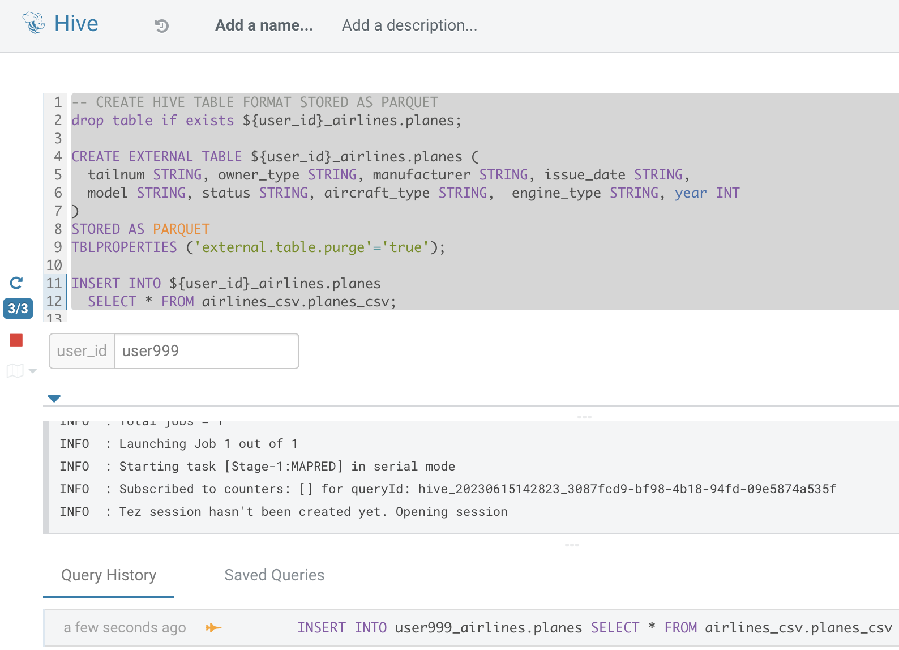

<ul>
<li>

Switch Database to the user Database

</li>
<li>

On the left side of the SQL Editor, click on the &lt; arrow next to default

</li>
</ul>

<ul>
<li>To the right of Databases click on the button to refresh the list of Databases</li>
</ul>

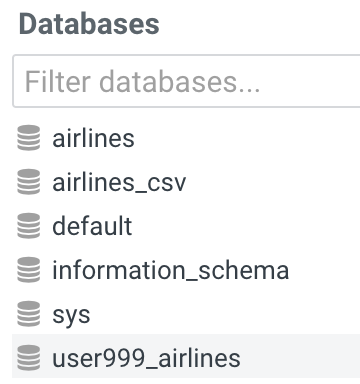

<ul>
<li>Click on your \<user-id>_airlines Database - this will allow you to track what has been created in your database through the next steps</li>
</ul>

<ul>
<li>Delete the current query from the SQL Window</li>
<li>Copy &amp; paste the SQL below</li>
</ul>
<!---->

<pre><code>DESCRIBE FORMATTED ${user_id}_airlines.planes;
</code></pre>
<ul>
<li>

Execute the Query by clicking on the  button

</li>
<li>

In the output look for the following fields - scroll down to look for the following properties: Location, Table Type, and SerDe Library (this value should reflect the ParquetHiveSerDe, indicating this is a Hive Table Format)

</li>
</ul>

<ol>
<li>

Build the Data Lakehouse

<ul>
<li>

Stay in HUE for the CDW Hive Virtual Warehouse - airlines-hive-vw.

</li>
<li>

Migrating Hive Table Format to Iceberg Table format - If you already have created a Data Warehouse using the Hive Table Format, but would like to take advantage of the features offered in the Iceberg Table Format, you have two (2) options: 1) Utilize the in-place table Migration feature; or 2) Use Create Table as Select (CTAS)

</li>
<li>

Option 1: Migrate the planes table in our Data Lakehouse from Hive Table Format to Iceberg Table Format using the Migration Utility.

<ul>
<li>Delete the current query from the SQL Window</li>
<li>Copy &amp; paste the SQL below</li>
</ul>
</li>
</ul>
</li>
</ol>
<!---->

<pre><code>ALTER TABLE ${user_id}_airlines.planes

SET TBLPROPERTIES ('storage_handler'='org.apache.iceberg.mr.hive.HiveIcebergStorageHandler');

DESCRIBE FORMATTED ${user_id}_airlines.planes;
</code></pre>
<ul>
<li>

Select all of the content in the SQL Editor

</li>
<li>

Execute the Query by clicking on the  button

</li>
<li>

This migration to Iceberg happened in-place, there was <strong>no</strong> rewriting of data that occurred as part of this process.  It retained the File Format of Parquet for the Iceberg table as well.  There was a Metadata file that is created, which you can see when you run the DESCRIBE FORMATTED.

</li>
<li>

In the output look for the following fields - scroll down to look for the following properties: look for the following (see image with highlighted fields) key values: Table Type, Location (location of where table data is stored), SerDe Library, and in Table Parameters look for properties MIGRATE_TO_ICEBERG, storage_handler, metadata_location, and table_type

</li>
<li>

Location - Data is stored in cloud storage in this case S3 in the same location as the Hive Table Format

</li>
<li>Metadata_location - Since there is no need to regenerate data files with in-place table migration, you save time generating Iceberg tables. Only metadata is regenerated, which points to source data files.  Removes Hive Metastore as bottleneck.</li>
<li>Table_type - indicates “ICEBERG” table format</li>
<li>Storage_handler &amp; SerDe Library - indicate what Serializer/Desearializer to use when reading/writing data in this case the “HiveIcebergSerDe”</li>
</ul>

<ul>
<li>

Option 2: Create airports table in <em>Iceberg Table Format</em>, using Create Table As Select (CTAS).  Notice the syntax to create an Iceberg Table within Hive is “<strong><em>Stored by Iceberg</em></strong>”

</li>
<li>

Delete the current query from the SQL Window

</li>
</ul>
<!---->

<ul>
<li>Copy &amp; paste the SQL below</li>
</ul>
<!---->

<pre><code>drop table if exists ${user_id}_airlines.airports;

CREATE EXTERNAL TABLE ${user_id}_airlines.airports

STORED BY ICEBERG AS

  SELECT * FROM airlines_csv.airports_csv;

DESCRIBE FORMATTED ${user_id}_airlines.airports;
</code></pre>
<ul>
<li>

Select all of the content in the SQL Editor

</li>
<li>

Execute the Query by clicking on the  button

</li>
<li>

In the output - look for the following key values (just like previously): Table Type, Location (location of where table data is stored), SerDe Library, and in Table Parameters look for properties MIGRATE_TO_ICEBERG, storage_handler, metadata_location, and table_type

</li>
<li>On the left you should see the airports table added to the list of Tables for your user Database</li>
</ul>
<!---->

<ul>
<li>

Slowly changing dimension table airlines

</li>
<li>

Iceberg is fully ACID compliant and can execute Insert, Update, Delete, and Merge Into statements

</li>
<li>Delete the current query from the SQL Window</li>
<li>Copy &amp; paste the SQL below</li>
</ul>
<!---->

<pre><code>-- SLOWLY CHANGING DIMENSION TABLE USE ACID CAPABILTIES OF ICEBERG

drop table if exists ${user_id}_airlines.airlines;

CREATE EXTERNAL TABLE ${user_id}_airlines.airlines (

code string,

description string

)

 STORED BY ICEBERG

 STORED AS PARQUET

 tblproperties('format-version'='2');

-- LOAD DATA

INSERT INTO ${user_id}_airlines.airlines

 SELECT * FROM airlines_csv.airlines_csv;

-- Check data to see a few records

SELECT *

FROM ${user_id}_airlines.airlines

WHERE code IN ("04Q", "05Q");
</code></pre>
<ul>
<li>

Select all of the content in the SQL Editor

</li>
<li>

Execute the Query by clicking on the  button

</li>
<li>

This will create the Iceberg Table, load initial data, and display a few rows that will be modified in the next step

</li>
<li>

Delete the current query from the SQL Window

</li>
</ul>
<!---->

<ul>
<li>Copy &amp; paste the SQL below</li>
</ul>
<!---->

<pre><code>-- SLOWLY CHANGING DIMENSION TABLE USE ACID CAPABILITIES OF ICEBERG

MERGE INTO ${user_id}_airlines.airlines AS t

  USING airlines_csv.airlines_csv s ON t.code = s.code

WHEN MATCHED AND t.code = "04Q" THEN DELETE

WHEN MATCHED AND t.code = "05Q" THEN UPDATE SET description = "Comlux Aviation"

WHEN NOT MATCHED THEN INSERT VALUES (s.code, s.description);

-- Check data to see records were deleted or updated

SELECT *

FROM ${user_id}_airlines.airlines

WHERE code IN ("04Q", "05Q");
</code></pre>
<ul>
<li>

Select all of the content in the SQL Editor

</li>
<li>

Execute the Query by clicking on the  button

</li>
<li>

The Merge Into statement will check to see if a record needs to be Deleted (when the record key matches and the code = 04Q), when a new record needs to be Inserted (key doesn’t match), and when an Update is needed (when the key matches and the code = 05Q

</li>
<li>Compare the output to see that only one record is returned with the description set to “Comlux Aviation”</li>
</ul>
<!---->

<ul>
<li>

Creating an Iceberg Table - for this step create a partitioned table, in Iceberg Table Format, stored in Parquet File Format.  Optionally, you could specify other File Formats, the supported formats for Iceberg are: Parquet, ORC, and Avro. 

</li>
<li>

Delete the current query from the SQL Window

</li>
<li>Copy &amp; paste the SQL below</li>
</ul>
<!---->

<pre><code>drop table if exists ${user_id}_airlines.flights;

CREATE EXTERNAL TABLE ${user_id}_airlines.flights (

 month int, dayofmonth int,

 dayofweek int, deptime int, crsdeptime int, arrtime int,

 crsarrtime int, uniquecarrier string, flightnum int, tailnum string,

 actualelapsedtime int, crselapsedtime int, airtime int, arrdelay int,

 depdelay int, origin string, dest string, distance int, taxiin int,

 taxiout int, cancelled int, cancellationcode string, diverted string,

 carrierdelay int, weatherdelay int, nasdelay int, securitydelay int,

 lateaircraftdelay int

)

PARTITIONED BY (year int)

STORED BY ICEBERG

STORED AS PARQUET

tblproperties ('format-version'='2');

SHOW CREATE TABLE ${user_id}_airlines.flights;
</code></pre>
<ul>
<li>Select all of the content in the SQL Editor</li>
<li>Execute the Query by clicking on the  button</li>
</ul>
<!---->

<ul>
<li>Looking at the SHOW CREATE TABLE output, scroll down and notice the output is the unformatted version of the Describe Formatted as we would expect.  The main item to pay attention to here is the PARTITIONED BY SPEC, currently we’ve partitioned by just the “year” column</li>
</ul>

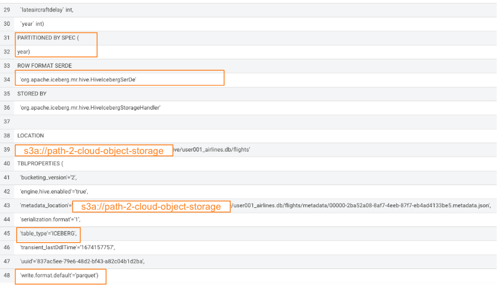

<ul>
<li>

When we insert data into this table it will write data together within the same partition (ie. all 2006 data is written to the same location, all 2005 data is written to the same location, etc.)

</li>
<li>

Delete the current query from the SQL Window

</li>
<li>Copy &amp; paste the SQL below</li>
</ul>
<!---->

<pre><code>INSERT INTO ${user_id}_airlines.flights

 SELECT * FROM airlines_csv.flights_csv

 WHERE year &lt;= 2006;

SELECT year, count(*)

FROM ${user_id}_airlines.flights

GROUP BY year

ORDER BY year desc;
</code></pre>
<ul>
<li>

Select all of the content in the SQL Editor

</li>
<li>

Execute the Query by clicking on the  button

</li>
<li>

The Insert will insert data from years 1995 to 2006

</li>
<li>Notice that each of the years have a range of data within a few million flights (each record in the flights table counts as a flight)</li>
</ul>

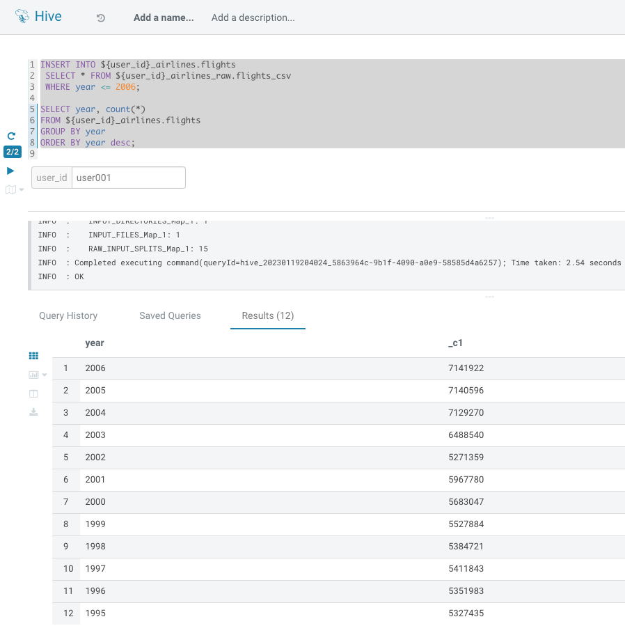    

<ol>
<li>

Performance improvements 

<ul>
<li>Check that you created the tables for the Data Lakehouse - on the list of tables to the left of the Editor window you should see the following tables</li>
</ul>
</li>
</ol>

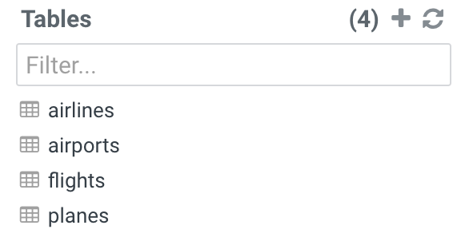

<ul>
<li>

Iceberg in-place Partition Evolution [Performance Optimization]

</li>
<li>

One of the key features for Iceberg tables is the ability to evolve the partition that is being used over time

<ul>
<li>Delete the current query from the SQL Window</li>
<li>Copy &amp; paste the SQL below</li>
</ul>
</li>
</ul>
<!---->

<pre><code>ALTER TABLE ${user_id}_airlines.flights

SET PARTITION spec ( year, month );

SHOW CREATE TABLE ${user_id}_airlines.flights;
</code></pre>
<ul>
<li>

Select all of the content in the SQL Editor

</li>
<li>

Execute the Query by clicking on the  button

</li>
<li>

This was an in-place Partition Evolution, meaning that the existing data is not rewritten as part of the ALTER TABLE execution.  What will happen is the next data that is loaded will use the new Partition definition.

</li>
<li>

In the output scroll to see the PARTITIONED BY SPEC to see that it is now both year and month\
    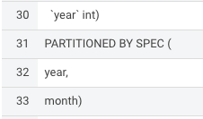

</li>
<li>

Performance Improvements - Open HUE for the CDW <strong>Impala</strong> Virtual Warehouse - airlines-impala-vw.  

<ul>
<li>

There should be an open CDW Browser tab, open the browser tab

</li>
<li>

Click on the airlines-impala-vw-# tile

</li>
<li>

In the upper right corner click on the HUE button to enter into the SQL Editor

</li>
</ul>
</li>
</ul>

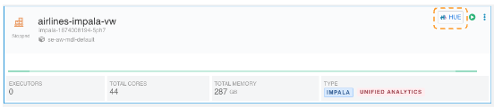

<ul>
<li>Load new data into the flights table using the NEW partition definition - this will load new data to take advantage of the new partition specification.  This also shows how Iceberg also supports multiple engines by allowing both Hive &amp; Impala to create, load, query, and or modify Iceberg tables.</li>
<li>Copy &amp; Paste the following in the SQL Editor window</li>
</ul>
<!---->

<pre><code>INSERT INTO ${user_id}_airlines.flights

SELECT * FROM airlines_csv.flights_csv

WHERE year = 2007;
</code></pre>
<ul>
<li>

Execute the Query by clicking on the  button

</li>
<li>

Run Explain Plans against some typical analytic queries we might run to see what happens with this new Partition definition.

</li>
<li>

In Impala we are in another engine which is another key feature of Iceberg - multi-function (or multiple engine) analytics.  No need to copy the data or do more work to allow access to the same data.

</li>
<li>Copy/paste the following in the Editor, but do not execute the query</li>
</ul>
<!---->

<pre><code>SELECT year, month, count(*)

FROM ${user_id}_airlines.flights

WHERE year = 2006 AND month = 12

GROUP BY year, month

ORDER BY year desc, month asc;
</code></pre>
<ul>
<li>In the “user_id” parameter box, enter your user id (see Lab Setup section)</li>
</ul>

<ul>
<li>Instead select (highlight) the statement click the 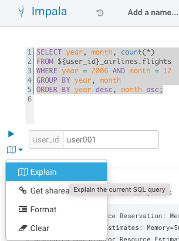 button, which is right below the Execute () button and select Explain</li>
</ul>

<ul>
<li>In the output notice the amount of data that needs to be scanned for this query (it would represent the volume of 1 years worth of data - about 139MB).  Up to this point the data was loaded using the Partition of just a year.</li>
</ul>

<ul>
<li>Copy/paste the following in the Editor, but do not execute the query</li>
</ul>
<!---->

<pre><code>SELECT year, month, count(*)

FROM ${user_id}_airlines.flights

WHERE year = 2007 AND month = 12

GROUP BY year, month

ORDER BY year desc, month asc;
</code></pre>
<ul>
<li>Instead select (highlight) the statement click the button, which is right below the Execute () button and select Explain</li>
</ul>
<!---->

<ul>
<li>In the output notice the amount of data that needs to be scanned for this query, about 10MB, is significantly less than that of the first, 138MB.  This shows an important capability, Partition Pruning.  Meaning that much less data is being scanned for this query and only the selected month of data is being scanned vs scanning the entire year of data.  This should result in much faster query execution times.</li>
</ul>

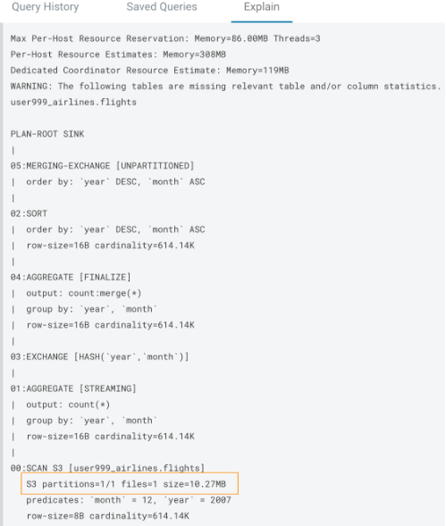

<ul>
<li>

Iceberg Snapshots Time Travel - in the previous steps we have been loading data into the flights Iceberg table. 

</li>
<li>

Each time data was changed in our Iceberg tables, a Snapshot is automatically captured.  This is important for many reasons but the main point of the Snapshot is to ensure eventual consistency and allow for multiple reads/writes concurrently (from various engines or the same engine).

</li>
<li>

Show snapshots

<ul>
<li>Delete the current query from the SQL Window</li>
<li>Copy &amp; paste the SQL below</li>
</ul>
</li>
</ul>
<!---->

<pre><code>DESCRIBE HISTORY ${user_id}_airlines.flights;
</code></pre>
<ul>
<li>Execute the Query by clicking on the  button</li>
</ul>

In the output there should be 2 Snapshots, in the example below there are 3 snapshots as this example shows that data was also loaded vie Impala and not just Hive.  Also, keep in mind we have been reading/writing data from/to the Iceberg table from both Hive &amp; Impala which is indicated by the () in the callouts below.  This is important aspect of Iceberg Tables is that they support multi-function analytics - ie. many engines can work with Iceberg tables (Cloudera Data Warehouse [Hive &amp; Impala], Cloudera Data Engineering [Spark], Cloudera Machine Learning [Spark], Cloudera DataFlow [NiFi], and DataHub Clusters)

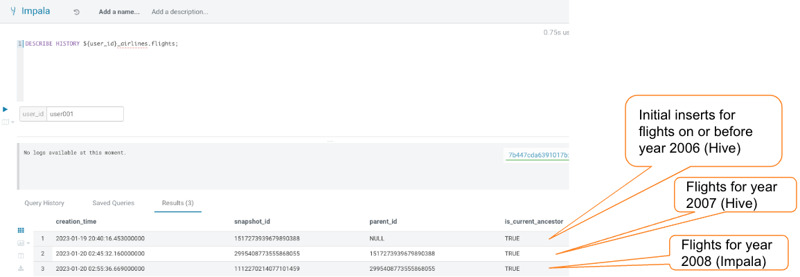

<ul>
<li>Get Details for Snapshots - open a text editor/notepad</li>
</ul>


Text Editor - copy in a couple creation_time’s and snapshot_id’s

<ul>
<li>

Iceberg Time Travel [Table Maintenance] - copy/paste the following data into the Impala Editor, but do not execute.  

</li>
<li>

Delete the current query from the SQL Window

</li>
<li>Copy &amp; paste the SQL below</li>
</ul>
<!---->

<pre><code>-- SELECT DATA USING TIMESTAMP FOR SNAPSHOT

SELECT year, count(*)

FROM ${user_id}_airlines.flights

  FOR SYSTEM_TIME AS OF '${create_ts}'

GROUP BY year

ORDER BY year desc;

-- SELECT DATA USING TIMESTAMP FOR SNAPSHOT

SELECT year, count(*)

FROM ${user_id}_airlines.flights

  FOR SYSTEM_VERSION AS OF ${snapshot_id}

GROUP BY year

ORDER BY year desc;
</code></pre>
<ul>
<li>Once you copy this SQL into the Editor you will see 2 new parameters - create_ts and snapshot_id</li>
</ul>

<ul>
<li>

The first SELECT statement will use the create_ts

</li>
<li>

In the create_ts parameter box enter a date/time (this can be relative or specific timestamp).  From your Text Editor copy the second entry under creation_time, paste it into the create_ts parameter.  For this Time Travel you can use relative time periods and don’t have to enter the specific timestamp for the Snapshot.

</li>
<li>Highlight the first SELECT statement, and execute it</li>
</ul>

   

<ul>
<li>This returned the the data as it was in our initial load </li>
</ul>
<!---->

<ul>
<li>

The second SELECT statement will use the snapshot_id

</li>
<li>

From your Text Editor copy the second entry under snapshot_id, paste it into the snapshot_id parameter box

<ul>
<li>Highlight the second SELECT statement, and execute it</li>
</ul>
</li>
</ul>

    

<ul>
<li>This returns the data for the specific Snapshot ID that was specified in the query which was the data for the initial insert for data up to year 2006 and the insert for data for year 2007</li>
</ul>
<!---->

<ul>
<li>

Security &amp; Governance - Now that performance has been optimized, we are almost ready to release this to the users.  Before we do that we need to apply security - Security is always on and can be defined with fine grained access control.  <strong><em>To learn more about Security &amp; Governance in CDP - work with your Breakout Room Moderator to schedule time to go thru the Optional Lab at the end of this document</em></strong>

</li>
<li>

A security policy has already been created.  This is how it is defined

</li>
</ul>


<ul>
<li>Delete the current query from the SQL Window</li>
<li>Copy &amp; paste the SQL below Select all of the content in the SQL Editor</li>
<li>Execute the Query by clicking on thebutton</li>
</ul>

<ul>
<li>You will see that the “tailnum” column is masked so you are unable to see the actual plane’s tail number, instead you see the Hashed value of the tailnum</li>
</ul>

<h2>(Optional Bonus Material)</h2>
<h2>Optional Lab 1 - CDW Tour</h2>

In this Lab you will explore how to take advantage of CDW.

<ol>
<li>Click on the “Get Started with a Tour” at the top of the CDP Home screen</li>
</ol>

<ol>
<li>[Optional] Watch the “Test Drive” Video on the CDP Home screen (video is \~3 minutes)</li>
</ol>


<ol>
<li>Click on the “Let’s go” button at the bottom of the video, you can take tours of any of the Data Services</li>
<li>Click on the Data Warehouse tour tile</li>
</ol>


<ul>
<li>Here you see the content you can take advantage of - there are 3 tiles where you can watch videos on an area of interest, you will see a “&gt; Video” link on the tile if this is a video, and there is also a tour.</li>
</ul>


<ul>
<li>

Click on the “Data Warehouse Overview” tile, this is a click through tour of CDW

</li>
<li>

Perform all of the actions for this click through tour (\~5 minutes)

</li>
<li>

Once completed click on the “X” in the top right corner to close the window 

</li>
<li>

On the Product Tours screen, explore the various topics to learn mover about Cloudera Data Warehouse

</li>
</ul>

<h2>Optional Lab 2 - Self Service File Upload</h2>

In this lab you will learn how to upload a small file to run SQL queries against where you could join to existing data in your Data Lakehouse.

<ol>
<li>

Upload Passenger Ticket data file

<ul>
<li>Below highlights the 3 steps to upload this file: 1) Open the Importer, 2) Pick a file &amp; options for the file upload, 3) Name the table, specify table options, and table metadata (column names, data types, etc.)</li>
</ul>
</li>
</ol>

1)     2)   3) 

<ul>
<li>On the left navigation menu click the  button, and select Importer</li>
</ul>

<ul>
<li>

On the “Pick Data from Local File” page

</li>
<li>

In the Select Type, choose “Small Local File”, it should be the default value

</li>
</ul>


<ul>
<li>Click thebutton, and browse to the “passengertickets_1k.csv” file</li>
</ul>

Ensure that the PREVIEW looks good.  You could make changes to the CSV options or import other file types like JSON using this Importer

<ul>
<li>Click the  button</li>
</ul>
<!---->

<ul>
<li>

On the “Move it to table \<table-name>” page

</li>
<li>

Under DESTINATION, change Name to <strong>\<user-id></strong>_airlines.unique_tickets (replace \<user-id> with your user id you logged in with)

</li>
</ul>

<ul>
<li>Under FIELDS, change data types with “bigint” to “int” for all the fields except the “ticketnumber” field, it can remain a bigint data type</li>
</ul>


<ul>
<li>The final fields section should look like the following:</li>
</ul>


<ul>
<li>Click the button - this will create a new table in your database named unique_tickets in a Hive table format.  Later in the labs you will learn how to migrate this to an Iceberg table.  You will be taken to the Table Browser and see a status like the following screen (top right):</li>
</ul>


<ul>
<li>Once the table is created click on thetab of the Table Browser to see the table type and other information on this table.  The following highlighted pieces of information show that this table is a Managed Table that is in using a SerDe that shows this is an ORC File Format &amp; in Hive Table Format</li>
</ul>


<ul>
<li>You can also view a sample of the data in this table by clicking on the tab</li>
</ul>

<h2>Optional Lab 3 - Performance Optimizations (Impala VW)</h2>

In this Lab we will take a look at some of the performance optimization and table maintenance tasks that can be performed to ensure the best possible TCO, while ensuring the best performance.

<ol>
<li>

Materialized Views [Performance Optimization] - this can be used for both Iceberg tables and Hive Tables to improve performance

<ul>
<li>Open HUE for the CDW <strong>Hive</strong> Virtual Warehouse - airlines-hive-vw.  Copy/paste the following, make sure to highlight the entire block, and execute the following</li>
</ul>
</li>
</ol>
<!---->

<pre><code>SET hive.query.results.cache.enabled=false;

drop table  if exists ${user_id}_airlines.airlines;

CREATE EXTERNAL TABLE ${user_id}_airlines.airlines (code string, description string) STORED BY ICEBERG STORED AS ORC TBLPROPERTIES ('format-version' = '2');

INSERT INTO ${user_id}_airlines.airlines SELECT * FROM ${user_id}_airlines_raw.airlines_csv;

SELECT airlines.code AS code,  MIN(airlines.description) AS description,

          flights.month AS month,

          sum(flights.cancelled) AS cancelled

FROM ${user_id}_airlines.flights flights , ${user_id}_airlines.airlines airlines

WHERE flights.uniquecarrier = airlines.code

group by airlines.code, flights.month;
</code></pre>
<ul>
<li>Hive has built in performance improvements, such as a Query Cache that stores results of queries run so that similar queries don’t have to retrieve data, they can just get the results from the cache.  In this step we are turning that off using the “SET” statement, this will ensure when we look at the query plan we will not retrieve the data from the cache.</li>
<li>Note: with this query you are combining an Iceberg Table Format (flight table) with a Hive Table Format (airlines_orc table) in the same query.</li>
</ul>


<ul>
<li>

Let’s take a look at the Query Plan that was used to execute this query

</li>
<li>

On the left menu select Jobs

</li>
</ul>


<ul>
<li>This will take you to the Jobs Browser, select the Queries tab to the right of the Job Browser header </li>
</ul>


<ul>
<li>This is where an Admin will go when - a query has run amok and then figures out what to do next.  In our case for this lab we’d like to look at the query we just executed to see how it ran and the steps taken to execute the query.  Administrators would also be able to perform other monitoring and maintenance tasks for what is running (or has been run).  Monitoring and maintenance tasks could include: cancel (kill) queries, see what is running, analyze whether queries that have been executed are optimized, etc.</li>
</ul>


<ul>
<li>Hoover over and click on the Query we just executed (it should be the first row)</li>
</ul>


<ul>
<li>This is where you can analyze queries at a deep level.  For this lab let’s take a look at the Explain details, click on Visual Explain tab</li>
</ul>


<ul>
<li>This plan shows that this query needs to Read flights (86M rows) and airlines (1.5K rows) with hash join, group and sort.  This is a lot of data processing and if we run this query constantly it would be good to reduce the time this query takes to execute.</li>
</ul>


<ul>
<li>Click on the \</> button on the left menu, and click Editor, to return the Editor Window</li>
</ul>


<ul>
<li>Create Materialized View (MV) - queries will transparently be rewritten, when possible, to use the MV instead of the base tables.  Copy/paste the following, highlight the entire block, and execute</li>
</ul>
<!---->

<pre><code>DROP MATERIALIZED VIEW IF EXISTS ${user_id}_airlines.traffic_cancel_airlines;

CREATE MATERIALIZED VIEW ${user_id}_airlines.traffic_cancel_airlines

as SELECT airlines.code AS code,  MIN(airlines.description) AS description,

          flights.month AS month,

          sum(flights.cancelled) AS cancelled,

          count(flights.diverted) AS diverted

FROM ${user_id}_airlines.flights flights JOIN ${user_id}_airlines.airlines airlines ON (flights.uniquecarrier = airlines.code)

group by airlines.code, flights.month;

-- show MV

SHOW MATERIALIZED VIEWS in ${user_id}_airlines;
</code></pre>
<ul>
<li>The Materialized View traffic_cancel_airlines will be displayed in Results and in the left table/view list with a (View) icon to the left of the MV</li>
</ul>


<ul>
<li>Run Dashboard Query again to see usage of the MV - Copy/paste the following, make sure to highlight the entire block, and execute the following.  This time an Order By was added to make this query have to do more work.</li>
</ul>
<!---->

<pre><code>SET hive.query.results.cache.enabled=false;

SELECT airlines.code AS code,  MIN(airlines.description) AS description,

          flights.month AS month,

          sum(flights.cancelled) AS cancelled

FROM ${user_id}_airlines.flights flights , ${user_id}_airlines.airlines airlines

WHERE flights.uniquecarrier = airlines.code

group by airlines.code, flights.month

order by airlines.code;
</code></pre>
<ul>
<li>

Let’s take a look at the Query Plan that was used to execute this query

</li>
<li>

On the left menu select Jobs

</li>
<li>On the Jobs Browser - select the Queries tab to the right of the Job Browser header</li>
<li>Hoover over &amp; click on the Query just executed (should be the first row)</li>
<li>Click on Visual Explain tab - With query rewrite the <strong>materialized view</strong> is used and the new plan just reads the MV and sorts the data vs. reading flights (86M rows) and airlines (1.5K rows) with hash join, group and sorts.  This results in significant reduction in run time for this query.</li>
</ul>


<ul>
<li>Materialized views also support incremental refreshes when the data from the tables used for the MVs is updated.  Please visit the CDW documentation for more information.</li>
</ul>
<!---->

<ul>
<li>Return to Query Editor - click on the \</> button on the left menu, and click Editor, to return the Editor Window</li>
</ul>

<h2>Optional Lab 4 - Data Visualization</h2>

In this lab you will build a Logistics Dashboard using Cloudera Data Visualization.  The Dashboard will include details about flight delays and cancellations.  This will be a completely new use case independent of the SMG Use Case, the analysis could be a catalyst to lead to a Data Science application to predict the probability of a flight being canceled or not.

<ol>
<li>

Open Cloudera Data Visualization (CDV or Data Viz)

<ul>
<li>Go to browser tab with CDW open</li>
<li>On the left navigation panel click “Data Visualization”</li>
<li>On the row with airlines-cdv, click the Data VIZ button</li>
</ul>
</li>
</ol>

<ul>
<li>

If you see the “What’s New” page, you can read it, or click on the GOT IT button

</li>
<li>

Home page

</li>
</ul>

<ul>
<li>

There are 4 areas of CDV - HOME, SQL, VISUALS, DATA - these are the tabs at the top of the screen in the black bar to the right of the Cloudera Data Visualization banner

</li>
<li>

Home - this is the starting point; it shows some statistics at the top, followed by some quick access details to recent content - Queries, Connections, Datasets, and Dashboards

</li>
<li>SQL - allows you to manually build queries against data to perform quick discovery against the data.  Below is an example of a query that was built and Run</li>
</ul>


<ul>
<li>Visuals - an area for viewing/building/modifying visuals, dashboards, and applications</li>
</ul>


<ul>
<li>

Data - interface for access to datasets, connections, and the Connection Explorer

</li>
<li>

Build a Dataset (aka. Metadata Layer or Data Model) - click on DATA in the top banner.  A Dataset is a Semantic Layer where you can create a business view on top of the data - data is not copied; this is just a logical layer

</li>
</ul>


<ul>
<li>Create a connection - click on the NEW CONNECTION button on the left menu</li>
</ul>


<ul>
<li>Connection type - select CDW Impala</li>
<li>Name - <strong>\<user\_id></strong>-airlines-lakehouse</li>
<li>CDW Warehouse - select drop down and pick the airlines-impala-vw</li>
<li>For this lab each participant will create their own connection in the same Data Viz instance, this would not be normal, you would only have to create a single connection to the same Virtual Warehouse</li>
<li>Click on the Advanced tab  in the middle of the screen, you can see that the details are already populated, there is nothing more to do.  If certain settings were required you could change them here.</li>
<li>Click CONNECT button, to create the Connection</li>
<li>You will see your connection in the list of connections on the left menu</li>
</ul>


<ul>
<li>On the right side of the screen you will see Datasets and the Connection Explorer</li>
</ul>


<ul>
<li>

Create a new Dataset (aka. Metadata Layer or Data Model)

</li>
<li>

Click on NEW DATASET button

</li>
</ul>


<ul>
<li>Dataset title - <strong>airline_logistics</strong></li>
<li>Dataset Source - select From Table (however, you could choose to directly enter a SQL statement instead)</li>
<li>Select Database - <strong>\<user\_id></strong>_airlines</li>
<li>Select Table - flights</li>
<li>Click CREATE</li>
</ul>


<ul>
<li>Edit the Dataset - click on airline_logistics on the right of the screen.  This will open the details page, showing you information about the Dataset, such as connection details, and options that are set</li>
</ul>


<ul>
<li>On the left menu click on Fields - let’s quickly see what was created by adding the flights table to the Dataset.  When this table was added it took the table’s metadata and add the columns as Fields.  (we’ll come back to this later)</li>
</ul>

     

<ul>
<li>Click on Data Model - for our Dataset we need to join additional data to the flights table including the planes, airlines, and airports tables</li>
<li>Click on EDIT DATA MODEL button</li>
</ul>


<ul>
<li>Join planes - click the “+” button next to flights</li>
</ul>


Database Name - <strong>\<user\_id></strong>_airlines

Table Name - planes

Click SELECT button


Click the  (JOIN) between flights and planes to see the join that was created

Click EDIT JOIN to modify the join as there is an extra join of year=year

Click on the - to the right of the year=year join and click the APPLY button

 should be &gt;&gt;&gt; 

<ul>
<li>Join airlines - click the “+” button next to flights</li>
</ul>


Database Name - <strong>\<user\_id></strong>_airlines

Table Name - airlines

Click SELECT button

 &gt;&gt;&gt; 

Click the  (JOIN) between flights and airlines to see the join that was created

Click EDIT JOIN to modify the join

Click on uniquecarrier under flights &amp; code under airlines and click the APPLY button

<ul>
<li>Join airports (origin airport) - click the “+” button next to flights</li>
</ul>


Database Name - <strong>\<user\_id></strong>_airlines

Table Name - airports

Click SELECT button


Click the  (JOIN) between flights and airports to see the join that was created

Click EDIT JOIN to modify the join

Click on origin under flights &amp; iata under airports and click the APPLY button

<ul>
<li>Join airports (destination airport) - click the “+” button next to flights</li>
</ul>


Database Name - <strong>\<user\_id></strong>_airlines

Table Name - airports

Click SELECT button


Click the  (JOIN) between flights and airports_1 to see the join that was created

Click EDIT JOIN to modify the join

Click on the dest under flights &amp; iata under airports and click the APPLY button

<ul>
<li>The final Data Model will look like the following…</li>
</ul>


<ul>
<li>Click on the SHOW DATA button to preview the data that will be returned by the model created so far</li>
</ul>


<ul>
<li>Click on the SAVE button</li>
</ul>
<!---->

<ul>
<li>Modify Fields - click on Fields in the left menu</li>
</ul>


<ul>
<li>Click on the EDIT FIELDS button; you will see this new tool bar</li>
</ul>


<ul>
<li>Click on the TITLE CASE button to format the display names of the fields</li>
<li>Under the Measures section, click on the Mes button next to month.  This changes this to a Dimension.</li>
</ul>


<ul>
<li>Each Field is assigned a Category (Measure or Dimension) - this is important because the type is used when creating visuals.  CDV will use the data type to determine this Category.  Make sure that Fields fall into the correct Category.  This is important because this is used when creating visuals.  The way to look at choosing the Category is to use this simple method - if you need to Aggregate (sum, average, etc.) then the Field should be a Measure.  The quickest way to change the Category is to use the toggle</li>
</ul>
<!---->

<ul>
<li>

Under the Measures section, click on the Mes button next to the following Fields:

</li>
<li>

Under Measures &gt; flights

<ul>
<li>Dayofmonth</li>
<li>Dayofweek</li>
<li>Deptime</li>
<li>Crsdeptime</li>
<li>Arrtime</li>
<li>Crsarrtime</li>
<li>Flightnum</li>
<li>Year</li>
</ul>
</li>
<li>

All Fields under Measures &gt; planes

</li>
<li>

All Fields under Measures &gt; airports

</li>
<li>

All Fields under Measures &gt; airports_1

</li>
<li>

<strong>Note:</strong> Normally, we would make sure that all Fields fall into the correct Category, instead let’s move ahead

</li>
<li>

Edit a Field

</li>
<li>

Click the pencil next to Depdelay under the Measures section to edit the field

</li>
</ul>
<!---->

<ul>
<li>Change the Display Name to Dep Delay &amp; change the Default Aggregation to Average</li>
</ul>


<ul>
<li>

Click on the Display Format tab

</li>
<li>

Select Category of Integer and click on Use 1000 separator

</li>
</ul>


<ul>
<li>Click APPLY button to save the changes</li>
</ul>
<!---->

<ul>
<li>

Add a new Field

</li>
<li>

Clone the Origin Field - click the down arrow next to Origin, select Clone

</li>
</ul>


<ul>
<li>Click the pencil next to Clone of Origin to edit the field</li>
<li>Change Display Name to Route</li>
<li>Click on the Expression tab - enter the following into the Expression window</li>
</ul>
<!---->

<pre><code>concat([Origin], '-', [Dest])
</code></pre>


<ul>
<li>Click APPLY - since the “Save expression only after validation succeeds” is checked the Field will first be validated to ensure there are no errors then if it is valid will be saved</li>
</ul>
<!---->

<ul>
<li>

Click the SAVE button

</li>
<li>

Create Dashboard - in the top right corner click on the NEW DASHBOARD button

</li>
</ul>


New Dashboard

<ul>
<li>

Quick Overview the the interface

</li>
<li>

On the right side of the screen there will be a VISUALS menu.  At the top of this menu, there is a series of Visual Types to choose from.  There will be 30+ various visuals to choose from.  Below the Visual Types you will see what are called Shelves.  The Shelves that are present depend on the Visual Type that is selected.  Shelves with a “*” are required, all other Shelves are optional.  On the far right of the page there is a DATA menu, which identifies the Connection &amp; Dataset used for this visual.  Underneath that is the Fields from the Dataset broken down by Dimensions and Measures.  With each of these Categories you can see that it is subdivided by each Table in the Dataset.

</li>
</ul>

|                                                                                                                                                                                                                   |                                                                                                                                                                                                              |                                                                                                                                                                                                                                                                                                                                                                                                             |
| ----------------------------------------------------------------------------------------------------------------------------------------------------------------------------------------------------------------- | ------------------------------------------------------------------------------------------------------------------------------------------------------------------------------------------------------------ | :---------------------------------------------------------------------------------------------------------------------------------------------------------------------------------------------------------------------------------------------------------------------------------------------------------------------------------------------------------------------------------------------------------: |
| <strong>Visual Types</strong> | <strong>Shelves</strong> | <strong>DATA</strong>  |

<ul>
<li>

1st Visual - Top 25 Routes by Avg Departure Delay; are there certain Routes with excessive Delays

</li>
<li>

CDV will add a Table visual displaying a sample of the data from the Dataset as the default visualization when you create a new Dashboard or new Visuals on the Dashboard (see New Dashboard screen above).  The next step is to modify (Edit) the default visualization to suit your needs.  

</li>
<li>Pick the Visual Type - select the Stacked Bar chart visual</li>
</ul>


<ul>
<li>Edit the Shelves (two (2) ways to add items to a Shelf, you will use both here; for the remainder of this lab you can pick &amp; choose which you use)</li>
</ul>


<ul>
<li>

Option 1: Add Route to the X Axis

</li>
<li>

Click in the X Axis Shelf to select it

</li>
<li>

In the DATA menu find Route under Dimensions &gt; fights

</li>
<li>

Option 2: Add Dep Delay to the Y Axis

</li>
<li>

In the DATA menu find Dep Delay under Measures &gt; flights, Drag &amp; Drop this Field in the Y Axis Shelf

</li>
<li>

So the two (2) options for adding items to Shelves is 1) select Shelf and click to add Field; or 2) Drag &amp; Drop Field to Shelf

</li>
</ul>
<!---->

<ul>
<li>Modify Properties for Dep Delay - click on the &gt; in the Y Axis Shelf to the right of avg(Dep Delay) to access the Properties for this Shelf</li>
</ul>


<ul>
<li>Click on the down arrow to the left of Aggregates - in CDV you have control over any behavior, in the Dataset we set the default aggregation for this Field to be Average, however, on any visual you can override this by changing it here.  For now, leave this alone.</li>
</ul>


<ul>
<li>Click the down arrow to the left of Order and Top K - to show the 25 Routes with the highest Average Dep Delay enter 25 into the box for “Top K”</li>
</ul>


<ul>
<li>Click the down arrow to the left of Alias - to change the display name for this Field.  In the box enter Avg Dep Delay</li>
</ul>


<ul>
<li>The finished Y Axis Shelf should look like this</li>
</ul>


<ul>
<li>Click the  button to update the Visual</li>
</ul>


<ul>
<li>

Change the Title &amp; Subtitle for this Visual

</li>
<li>

Click in the enter Title above the chart and enter - Routes with Highest Avg Departure Delays, hit enter

</li>
<li>Click in the Subtitle and enter - In Minutes, hit enter</li>
</ul>


-

<!---->

<ul>
<li>

Add Title &amp; Subtitle for the Dashboard

</li>
<li>

Click in the enter Title right below the banner and enter - <strong>\<user\_id></strong> Logistics Dashboard

</li>
<li>Click in the Subtitle and enter - CDW Workshop</li>
</ul>


<ul>
<li>Click on the SAVE button to save this Dashboard, this Dashboard is now named <strong>\<user\_id></strong> Logistics Dashboard</li>
</ul>
<!---->

<ul>
<li>

2nd Visual - Relationship between flight Cancellation reason and Carrier; are there Carriers or Reasons that need to be addressed?

</li>
<li>

Click on +Visuals - on the far right of the screen you will see the DASH. menu.  This menu allows you to add new visuals and change settings for the Dashboard or Visual such as formatting, style, and anything related to the presentation of the data.

</li>
</ul>


<ul>
<li>Under ADD VISUALS - leave the  (Connection) as \<user\_id>-airlines-lakehouse and  (Dataset) as airlines_logistics.  However, a Dashboard can have any number of connections and Datasets for various visuals on a Dashboard.</li>
</ul>


<ul>
<li>This will add a default visual to the canvas</li>
<li>Click on the  button, next to the Table .  Instead of manually building this visual, we will use the Visual helper</li>
</ul>


<ul>
<li>Select Uniquecarrier and Cancellationcode under Dimensions; select Cancelled under Measures.  As you select items from the Fields you will see the Possible Visuals change - helping you quickly select the visual based on what you have selected.</li>
</ul>


<ul>
<li>Click on SEE ALL VISUALS&gt; button - to preview the Possible Visuals with actual data plotted</li>
<li>Click on the Correlation flow visual - Scroll thru until you see the Correlation flow visual tile</li>
</ul>
<!---->

<ul>
<li>

Drag &amp; Drop Cancelled from DATA menu under Measures &gt; flights to the Filter Shelf - There are several ways to apply filters to visuals within the Dashboard, this is one

</li>
<li>

When the dialog box comes up

</li>
</ul>


<ul>
<li>This will filter this chart to only return flights that have been cancelled, and will not return any other data</li>
<li>Click the REFRESH VISUAL button</li>
</ul>


<ul>
<li><strong>NOTICE</strong>: Since there is a security policy still in effect, you will only see “UA” showing up in this visual.  To see all of the Carriers, you could disable the security Policy and Refresh the Visual.</li>
</ul>
<!---->

<ul>
<li>Click in the bottom right corner of the Correlation flow visual and drag it down to resize this chart (make it a bit larger to your liking)</li>
</ul>


<ul>
<li>Click the enter Title and enter Cancellation Correlation, and hit enter</li>
<li>Click the SAVE button to save the Dashboard</li>
</ul>
<!---->

<ul>
<li>

Add prompts - allow dashboard to be sliced &amp; diced; this is another way to filter on multiple charts at the same time in your Dashboard

</li>
<li>

On the DASH. menu (far right) click on +Filters button

</li>
</ul>


<ul>
<li>Click on Engine Type under Dimensions &gt; planes, to add this Field as a filter; you continue to select other Fields that you want to create Filters for and these will also be added</li>
</ul>

<ul>
<li>Click the drop down arrow next to Engine Type and select any value - the filter(s) are added to the Filter shelf for the Dashboard which is between the Dashboard Title and the Visuals you have been creating.  When you are selecting values from this Filter, the visuals will change to reflect information for just flights where this Engine Type was in the plane for the flight</li>
</ul>


<ul>
<li>Click the SAVE button to save the Dashboard</li>
</ul>
<!---->

<ul>
<li>

[optional] View Dashboard from Visuals page

</li>
<li>

Click Visuals in the top banner

</li>
<li>Dashboards can be shared with other users - use Workspaces to organize and secure content that is created</li>
<li>Create Applications - combine multiple Dashboards to produce an application that allows users to make better decisions</li>
</ul>

-

<h2>Optional Lab 5 - Data Security &amp; Governance</h2>

In this lab you will experience the combination of what the Data Warehouse and the Shared Data Experience (SDX) offers.  SDX enables you to provide Security and Governance tooling to ensure that you will be able to manage what is in the CDP Platform without having to stitch together multiple tools.

Robust Data Catalog (Governance) capability that:

<ul>
<li>

Enables you to understand, manage, secure, and govern data assets across

</li>
<li>

Provides a 360 degree view of Assets - Lineage, Metadata, Security Policy applied to the asset

</li>
<li>

There are many assets - everything created in CDP is captured as an Asset

</li>
<li>For this Workshop we have been working with Assets, like - databases, views, tables, etc. </li>
</ul>

Powerful Security features like:

<ul>
<li>Rule-based masking columns based on a user’s role </li>
<li>Group association or rule-based row filters</li>
<li>

Attribute-Based Access Control a.k.a. Tag-based security policies

</li>
<li>

Data Catalog - Governance (Lineage, Metadata, etc.)

<ul>
<li>On the left navigation menu click the next to Data Warehouse</li>
</ul>
</li>
</ul>

 

<ul>
<li>Right click on the Data Catalog and select “Open Link in New Tab” option</li>
</ul>


<ul>
<li>Open browser tab that just opened, should have Data Catalog in the tab title</li>
</ul>


<ul>
<li>To the left, under Data Lakes, ensure the Data Lake provided in Lab Setup radio button is selected</li>
</ul>


<ul>
<li>Filter for Assets we created - below the Data Lakes on the left of the screen under Filters, select TYPE of Hive Table.  The right side of the screen will update to reflect this selection</li>
</ul>


<ul>
<li>Under DATABASE, click +Add new Value.  In the box that appears start typing your <strong>\<user\_id></strong> when you see the <strong>\<user\_id></strong>_airlines database pop up select it</li>
</ul>

                          

<ul>
<li>You should now see the tables and materialized views that have been created in the <strong>\<user\_id></strong>_airlines database.  Click on flights in the Name column to view more details on the flights table.</li>
</ul>


<ul>
<li>This page shows information about the flights table such as the table owner, when the table was created, when it was last accessed, and other properties.  Below the summary details is the Overview tab which shows the lineage - hoover over the flights click on the “i” icon that appears to see more detail on this table</li>
</ul>


<ul>
<li>

The lineage shows 

</li>
<li>

[blue box] flights data file residing in an s3 folder

</li>
<li>[purple box] is showing how the flights_csv Hive table is created, this table was created and points to the data location of flights’ (blue box) s3 folder </li>
<li>[orange box] is showing the flights Iceberg table and how it is created, it uses data from flights_csv Hive table (CTAS) </li>
<li>Traffic_cancel_airlines is a Materialized View that uses data from the flights Iceberg table.</li>
</ul>


<ul>
<li>

Click on the Schema Tab to see Metadata on this table.  The Metadata includes basic information from the table such as: column names and data types for the columns.  You can also run Profilers that  come as part of CDP:

</li>
<li>

Hive Table Profiler - allows you to gather additional information from the table including Min/Max values in the column, # records with Null Values in a column, etc.

</li>
<li>Sensitivity Profiler - identifies columns that may contain sensitive information such as PII data, SSN, credit card numbers, ID numbers, etc.  These items will be “Tagged” in the Classification column of the Schema page.</li>
</ul>


<ul>
<li>

Click on the Policy tab to see what security policies have been applied on this table.  There are 2 policies that have been defined to allow some users &amp; groups access via policy “all - database, table, column” and another policy “all - database, table” access.

</li>
<li>

The Access Audits tab allows Administrators to be able to see who, when, where, why either accessed this table or was denied access to this table.  Feel free to switch to this tab to take a look and switch back to the Policy tab.

</li>
</ul>


<ul>
<li>Click on the  next to the “all - database, table” - to modify this policy or create a new policy</li>
</ul>

<ol>
<li>

Security (Ranger) - modify and create security policies for the various CDP Data Services.

<ul>
<li>View the Policy details and click the CANCEL button at the bottom.</li>
<li>For this portion of the Lab let’s restrict your access to a subset of data available in the “flights” table.</li>
</ul>
</li>
</ol>


<ul>
<li>Click on the Hadoop SQL link in the upper left corner - to view the security policies in place for CDW.  For this Workshop we will stick to the CDW related security features</li>
</ul>


<ul>
<li>This screen shows the general Access related security policies - who has access to which Data Lakehouse databases, tables, views, etc.  Click on the “Row Level Filter” tab to see the policies to restrict access to portions of data</li>
</ul>


<ul>
<li>There are currently no policies defined.  Click on the Add New Policy button</li>
</ul>


<ul>
<li>

Fill out the form as follows.  For this policy let’s say you are an Gate Agent for United Airlines and should not be able to see data for any other Airline.  To setup the policy we need to apply a filter that is applied to any query that is run for your <strong>\<user\_id></strong> so you only see rows for flights run by United Airlines.

</li>
<li>

Policy Name: <strong>\<user\_id></strong> Workshop Row Level Filter

</li>
<li>

Hive Database: <strong>\<user\_id></strong>_airlines (start typing, once you see this database in the list, select it)

</li>
<li>

Hive Table: flights (start typing, once you see this table in the list, select it)

</li>
<li>

Row Level Filtering Conditions

<ul>
<li>Select User - <strong>\<user\_id></strong> (start typing, once you see this user in the list, select it)</li>
<li>Row Level Filter - <strong>uniquecarrier="UA"</strong></li>
<li>For this you could have any number of filter conditions (for this Lab we will only create 1) with many different filter configurations</li>
</ul>
</li>
<li>

Click  button to accept this Policy

</li>
</ul>


<ul>
<li>The new policy is added to the “Row Level Filter” policies (as below)</li>
</ul>


<ul>
<li>Test the policy is working - Open HUE for the CDW <strong>Impala</strong> Virtual Warehouse - airlines-impala-vw and execute the following query</li>
</ul>
<!---->

<pre><code>SELECT uniquecarrier, count(*)

FROM ${user_id}_airlines.flights

GROUP BY uniquecarrier;
</code></pre>

You should now only see 1 row returned for this query - after the policy was applied you will only be able to access uniquecarrier = “UA” and no other carriers:


<h2>Optional Lab 6 - Iceberg Table Rollback</h2>

This lab will shows you how to do a Rollback to a specific Snapshot.  This is a key feature of Iceberg tables.  There are other Maintenance Tasks that you can perform on Iceberg tables.

<ol>
<li>Iceberg Rollback [Table Maintenance] - sometimes data can be loaded incorrectly, due to many common issues - missing fields, only part of the data was loaded, bad data, etc.  In situations like this data would need to be removed, corrected and reloaded.  Iceberg can help with the Rollback command to remove the “unwanted” data.  This leverages Snapshot IDs to perform this action by using a simple ALTER TABLE command as follows.  We <strong><em>will not</em></strong> run this command in this lab</li>
</ol>
<!---->

<pre><code>-- ALTER TABLE ${user_id}_airlines.flights EXECUTE ROLLBACK(${snapshot_id});
</code></pre>
<ol>
<li>Iceberg Expire Snapshots [Table Maintenance] - as time passes it might make sense to expire old Snapshots, instead of the Snapshot ID you use the Timestamp to expire old Snapshots.  You can do this manually by running a simple ALTER TABLE command as follows.  We <strong><em>will not</em></strong> run this command in this lab</li>
</ol>
<!---->

<pre><code>-- Expire Snapshots up to the specified timestamp

-- BE CAREFUL: Once you run this you will not be able to Time Travel for any Snapshots that you Expire ALTER TABLE ${user_id}_airlines.flights

-- ALTER TABLE ${user_id}_airlines_maint.flights EXECUTE expire_snapshots('${create_ts}');
</code></pre>

